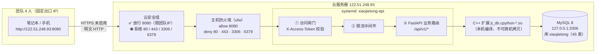
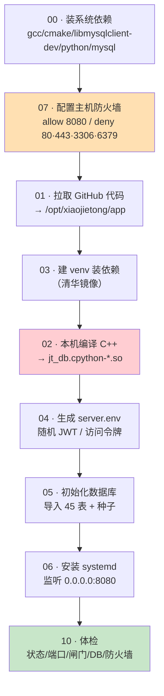

# 01 · 内部联调部署方案

> 版本：v1.0 ｜ 编制：成员3 ｜ 日期：2026-09-13
> **定位**：ICP 备案审核期间，**仅 4 人团队内部联调自测**。
> **不对外提供网站服务 · 不使用域名 · 不使用 80/443 · 不使用 HTTPS。**

---

## 1. 部署目标与边界

| 项 | 内容 |
|---|---|
| 服务器 | 国内云服务器（Ubuntu 22.04 LTS 推荐，2C4G+） |
| 公网 IP | `122.51.248.93`（**只记 IP，不绑域名**） |
| 访问方式 | `http://122.51.248.93:8080/api/v1` |
| 使用人数 | **4 人**（团队内部） |
| 服务形态 | FastAPI（uvicorn）+ C++ 数据层扩展（`jt_db`）+ 本机 MySQL |
| 部署方式 | **裸机 + systemd**（**不使用 Docker / 不使用 Nginx**） |
| 生命周期 | 备案通过后**整体替换**为正式上线方案（域名 + HTTPS） |

### 1.1 明确「不做」的清单

| 不做 | 原因 |
|---|---|
| ❌ 不使用 80 / 443 端口 | 备案未完成，对外提供网站服务属违规 |
| ❌ 不安装 Nginx / Apache | 本方案无反向代理需求（后端直接监听 8080） |
| ❌ 不绑定域名、不加 A 记录 | 本阶段只用 IP 访问 |
| ❌ 不申请 / 不安装 SSL 证书 | 不涉及 HTTPS |
| ❌ 不做内网穿透 / 隧道代理 | 属规避备案行为，禁止 |
| ❌ 不使用 Docker / docker-compose | 降低复杂度；现有 `deploy/` 容器化规划属**正式上线阶段** |
| ❌ 不暴露 3306 / 6379 | 数据库与缓存只绑 `127.0.0.1` |
| ❌ 不做公网推广 / 引流 | 严禁传播访问地址与令牌 |

---

## 2. 端口策略（硬约束）

| 端口 | 用途 | 策略 |
|---|---|---|
| **8080** | **后端 API（唯一对外入口）** | ✅ 监听 `0.0.0.0:8080`；安全组**仅放行团队 IP** |
| 22 | SSH 运维 | ✅ 保留；建议限制来源 IP |
| 3306 | MySQL | ⛔ **仅 `127.0.0.1`**；安全组**不放行** |
| 6379 | Redis（本阶段未启用） | ⛔ 安全组**不放行** |
| 80 / 443 | HTTP / HTTPS | ⛔ **显式拒绝**（`ufw deny`），安全组**不放行** |

> **代码级兜底**：`scripts/lib/common.sh` 中的 `assert_port_policy()`
> 会在任何监听端口不是 8080 时**直接终止脚本**，防止手工改错。

---

## 3. 架构



**关键点**：

1. **访问闸门在最外层**：陌生请求在进入限流与业务逻辑**之前**即被拒绝，不消耗限流配额。
2. **C++ 扩展必须服务器本机编译**：`jt_db` 与 Python ABI 绑定，产物不可跨机复用。
3. **数据库仅回环**：即使误配安全组，3306 也无法从公网连上。
4. **明文 HTTP 的取舍**：本阶段不涉及敏感数据、仅内部联调，故不引入 TLS；
   **不要**在此阶段传真实用户凭据 / 生产数据。

---

## 4. 服务器目录规划

```
/opt/xiaojietong/                       # APP_DIR
├── app/                                # 代码仓库（git clone 产物，属主 xjt）
│   ├── backend/
│   │   ├── .venv/                      # Python 虚拟环境
│   │   ├── .env -> ../shared/server.env   # 软链（便于手工调试）
│   │   └── app/db/native/
│   │       └── jt_db.cpython-3xx-x86_64-linux-gnu.so   # 本机编译产物
│   ├── db/cpp_driver/build/            # CMake 构建目录
│   └── deploy/internal-test/           # 本方案（脚本 + 文档）
└── shared/                             # 非仓库文件（部署状态）
    └── server.env                      # ⚠️ 权限 600，含 JWT/访问令牌/DB 密码
```

| 路径 | 属主 | 权限 | 说明 |
|---|---|---|---|
| `/opt/xiaojietong/app` | `xjt:xjt` | 755 | 代码；服务以 `xjt` 运行 |
| `/opt/xiaojietong/shared` | `xjt:xjt` | 750 | **含密钥，禁止其他用户读取** |
| `/opt/xiaojietong/shared/server.env` | `xjt:xjt` | **600** | 环境变量（systemd `EnvironmentFile`） |

**运行账号 `xjt`**：由 `01-pull-code.sh` 自动创建（`--system`，`shell=/usr/sbin/nologin`，**禁止登录**）。

---

## 5. 部署流程（7 步）



`08-deploy.sh` 把 `01 → 03 → 02 → 04 → 06` 串成一键执行（**05 数据库初始化需单独执行一次**）。

---

## 6. 组件清单与版本基线

| 组件 | 版本 / 说明 |
|---|---|
| OS | Ubuntu 22.04 LTS（Debian 11+ / Rocky 8+ 亦可） |
| Python | 3.10+（`python3-venv`） |
| CMake | ≥ 3.20 |
| g++ | 支持 C++17 |
| MySQL | 8.0（`libmysqlclient-dev` 提供 `mysql.h`） |
| FastAPI + uvicorn | 见 `backend/requirements.txt` |
| Ollama | **可选**（未安装则 AI 能力走规则兜底降级，不影响其它接口） |
| Nginx | ⛔ **不安装**（本阶段不需要） |

---

## 7. 与「正式上线方案」的关系

| 维度 | 本方案（内部联调） | 正式上线（备案通过后） |
|---|---|---|
| 访问入口 | `http://IP:8080` | `https://域名` |
| 端口 | 仅 8080 | 80（跳转）/ 443 |
| 域名 | ⛔ 不使用 | ✅ 必需（且需备案） |
| 证书 | ⛔ 不使用 | ✅ 必需（微信小程序强制 https） |
| 反向代理 | ⛔ 不用 Nginx | ✅ Nginx（SSE 需 `proxy_buffering off`） |
| 容器化 | ⛔ 裸机 systemd | 可选 `deploy/docker-compose.yml` |
| 文档 | **本文** | `deploy/README.md` + `docs/前端上线-域名与HTTPS方案.md` |

> ⚠️ **两套方案不可混用**。备案通过前，**禁止**把本方案的 8080 直接改到 80/443，
> 也**禁止**给服务器绑域名 —— 那属于「未备案提供网站服务」，是明确的合规风险。

---

## 8. 已知限制

| # | 限制 | 影响 / 说明 |
|---|---|---|
| 1 | **明文 HTTP** | 无 TLS；不要在联调期传真实敏感数据 |
| 2 | **单 worker**（`--workers 1`） | 限流计数、浏览量聚合、C++ 连接池均为进程内存；多 worker 会导致限流失真与重复计数 |
| 3 | **限流为单进程内存实现** | 重启后计数清零；非分布式限流 |
| 4 | **部署脚本未在本机做 `bash -n` 语法检查** | 开发机为 Windows 且无 bash/WSL；首次执行若报语法错误，请把报错行贴回群里 |
| 5 | **`XJT_ENV=dev`**（非 prod） | 因无微信凭据，prod 会拒绝启动；安全由「访问闸门 + 强随机 JWT」承担，**上线前必须切 prod** |
| 6 | **无自动备份** | MySQL 数据无定时备份；重要数据请手工 `mysqldump` |
| 7 | 无监控告警 | 仅 `/api/v1/health` 可用，未接告警系统 |

---

## 9. 相关文件

| 文件 | 作用 |
|---|---|
| [`02-部署操作手册.md`](02-部署操作手册.md) | 安全组 + 逐步命令 + 访问方式 |
| [`03-访问鉴权说明.md`](03-访问鉴权说明.md) | 访问闸门（防陌生人） |
| [`04-ICP备案风险提示.md`](04-ICP备案风险提示.md) | ⚠️ 合规风险与红线 |
| [`05-运维排障与验收清单.md`](05-运维排障与验收清单.md) | 排障、回滚、验收 |
| `../scripts/08-deploy.sh` | 一键部署 |
| `../../backend/app/core/access_gate.py` | 访问闸门实现 |
