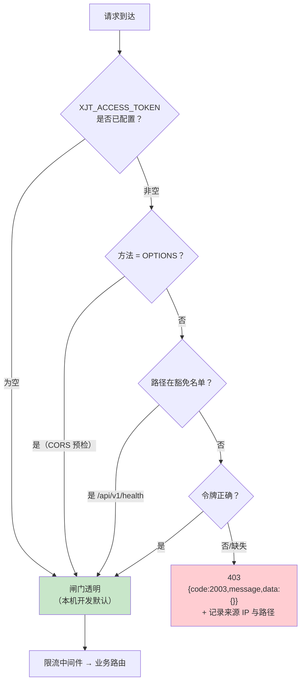

# 03 · 访问鉴权说明（简易接口鉴权）

> 目的：公网 IP 直接暴露后端时，**防止外网陌生人随意访问测试接口**。
> 实现：`backend/app/core/access_gate.py`（纯 ASGI 中间件）
> 配置：`XJT_ACCESS_TOKEN` / `XJT_ACCESS_GATE_EXEMPT`
> 验证：`tools/verify_access_gate.py`（实测 **12/12 通过**）

---

## 1. 为什么需要它

本阶段**没有** Nginx、**没有**域名、**没有** HTTPS，后端直接监听 `0.0.0.0:8080`。
虽然业务接口本身有 JWT 鉴权（`Authorization: Bearer`），但：

- 注册/登录、健康检查、错误信息等**匿名可达**的端点仍会被扫描器批量试探；
- 报错信息、接口结构会泄露给陌生人；
- 限流配额会被无关流量消耗。

因此在业务鉴权**之前**再加一道**整站门禁**（团队共享口令）。

> ⚠️ **它不是权限系统**：不区分用户、不替代 JWT。
> 它只回答一个问题 —— 「你是不是团队自己人」。

---

## 2. 工作机制



| 特性 | 实现 |
|---|---|
| 位置 | **最外层**（最后 `add_middleware`），陌生请求在进限流/业务前即被拒，**不消耗限流配额** |
| 比较方式 | `hmac.compare_digest` —— **常量时间**，避免通过响应耗时逐字节猜令牌 |
| 日志 | 记录来源 IP、路径、是否带令牌；**不记录令牌本身** |
| 预检 | `OPTIONS` 直接放行（CORS 预检不带自定义头，若拦截会导致前端报错难以定位） |
| 实现方式 | **纯 ASGI**（不用 `BaseHTTPMiddleware`）—— 后者会包一层内存流，对 SSE（`/chat/send` 逐字输出）有缓冲风险 |
| 关闭态 | 令牌为空 → **完全不挂载中间件**，行为与改造前逐字节一致（**零回归**） |

---

## 3. 配置

### 3.1 启用（服务器必须）

`/opt/xiaojietong/shared/server.env`：

```ini
# 团队共享访问令牌（04-configure-env.sh 自动生成 48 位随机串）
XJT_ACCESS_TOKEN=<48位随机串>

# 豁免路径：仅基础存活探针
# ⚠️ 刻意不豁免 health/detail 与 selfcheck —— 它们会回显数据库/连接池/Ollama 状态
XJT_ACCESS_GATE_EXEMPT=/api/v1/health
```

改完必须重启：

```bash
sudo systemctl restart xiaojietong-api
# 启动日志应出现：✅ 访问闸门已启用（豁免路径：/api/v1/health）
```

### 3.2 关闭（仅本机开发）

本机 `backend/.env` **不写** `XJT_ACCESS_TOKEN` 即可。启动日志会提示：

```
⚠️  访问闸门未启用（XJT_ACCESS_TOKEN 为空）。公网暴露场景下这会让任何人访问测试接口 —— 服务器部署必须设置该项。
```

### 3.3 豁免路径写法

| 写法 | 语义 |
|---|---|
| `/api/v1/health` | **精确匹配**（默认，推荐） |
| `/api/v1/health*` | 前缀匹配（尾部星号，**慎用**） |

> ⚠️ **踩过的坑（已修复）**：最初实现是「自动前缀匹配」，导致豁免 `/api/v1/health`
> **顺带放行了 `/api/v1/health/detail`**（匿名 HTTP 200），泄露数据库与连接池状态。
> 现已改为**默认精确匹配**。这正是 `verify_access_gate.py` 里「敏感探针」断言的功劳 ——
> **写安全测试一定要写"不该通过的也要断言"**。

### 3.4 健康检查的真实路径

⚠️ health 路由挂在 `XJT_API_PREFIX`（`/api/v1`）之下，完整路径是 **`/api/v1/health`**，
**不是** `/health`（直接请求 `/health` 会 404）。

---

## 4. 调用方式

| 方式 | 示例 | 建议 |
|---|---|---|
| **请求头**（推荐） | `curl -H "X-Access-Token: <令牌>" http://122.51.248.93:8080/api/v1/secondhand/items` | 不进 URL、不进访问日志 |
| 查询串（临时） | `http://122.51.248.93:8080/api/v1/secondhand/items?access_token=<令牌>` | 便于浏览器直接点开；**会进日志，仅临时用** |

```bash
TOKEN=$(grep -oP '(?<=^XJT_ACCESS_TOKEN=).*' /opt/xiaojietong/shared/server.env)

# 健康检查（豁免，无需令牌）
curl http://122.51.248.93:8080/api/v1/health

# 业务接口（需令牌 + 业务登录态）
curl -H "X-Access-Token: $TOKEN" http://122.51.248.93:8080/api/v1/secondhand/items
#   → {"code":2001,"message":"未登录",...}   ← 说明闸门已放行，是业务层在要求登录
```

**被拦截时的响应**（HTTP 403）：

```json
{"code": 2003, "message": "访问被拒绝：缺少或错误的访问令牌（请在请求头携带 X-Access-Token）", "data": {}}
```

---

## 5. 行为验证（部署后必跑）

```bash
python3 tools/verify_access_gate.py \
    --base http://127.0.0.1:8080 \
    --token "$TOKEN"
```

**实测结果：12/12 通过**，覆盖：

| 分组 | 断言 |
|---|---|
| ① 豁免路径 | `/api/v1/health` 无令牌可访问（HTTP 200） |
| ② **敏感探针** | `/api/v1/health/detail`、`/health/selfcheck` 匿名被拒（HTTP 403） |
| ③ 业务接口 | `/secondhand/items`、`/user/me`、`/topics` 匿名被拒（403） |
| ④ 响应契约 | 403 体符合 `{code,message,data}`，`code=2003` |
| ⑤ 错误令牌 | 同样被拒（403） |
| ⑥ 正确令牌 | 通过闸门（下游返回 2001） |
| ⑦ 查询串方式 | `?access_token=` 生效 |
| ⑧ 静态上传目录 | `/static/uploads/` 匿名被拒 |
| ⑨ 令牌强度 | 长度 ≥ 16 且非常见弱口令 |

**关闭态验证**（本机开发零回归）：

```bash
python3 tools/verify_access_gate.py      # 不传 --token
#  → 2/2 通过：业务接口未被闸门拦截（返回 2001 而非 403）
```

---

## 6. 令牌管理

| 事项 | 做法 |
|---|---|
| 生成 | `openssl rand -base64 48 \| tr -d '\n=+/' \| cut -c1-48`（`04` 脚本自动） |
| 分发 | **当面 / 私聊**发给 4 人；不要发公开群、不要截图 |
| 存放 | 前端放**本地私有配置**，不要提交进仓库 |
| 轮换 | 删掉 `server.env` 里的值 → 重跑 `04-configure-env.sh` → `09-restart.sh`；再通知全员更新 |
| 泄露处置 | **立即轮换**（旧令牌立刻失效）；排查 `journalctl` 中的拒绝记录来源 IP |
| 排查是否被扫 | `journalctl -u xiaojietong-api \| grep '访问闸门拒绝'` |

```bash
# 观察异常来源（若出现大量陌生 IP，说明安全组没限来源，应立即收紧）
journalctl -u xiaojietong-api --since '1 hour ago' | grep '访问闸门拒绝' | tail -n 50
```

---

## 7. 这个方案的边界（诚实说明）

| 限制 | 说明 |
|---|---|
| **共享口令，不可归因** | 4 人共用一个令牌，无法区分「谁」在访问；如需归因请用各自的业务账号 |
| **明文 HTTP 传输** | 令牌在网络上明文传输，理论上可被同链路窃听；本阶段仅内部联调，可接受 |
| **不能替代正式网关** | 备案通过、正式对外时应改为正规接入层（Nginx/WAF + 域名 + HTTPS） |
| **未做防爆破** | 未对错误令牌做计数封禁；依靠 `XJT_ACCESS_TOKEN` 的 48 位随机性（暴力不可行） |
