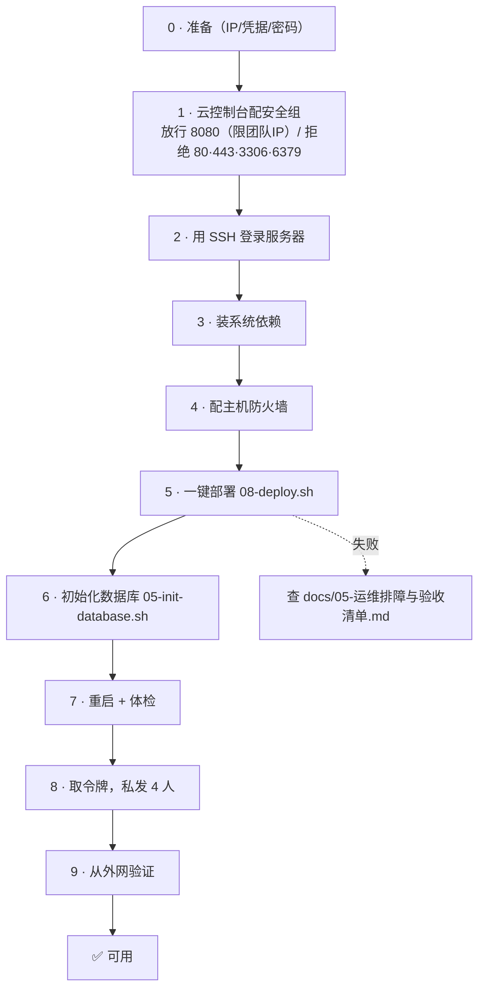

# 服务器后端部署 · 负责人手册

> **读者**：负责部署的那个人（持有服务器 root、知道数据库密码、负责发令牌）。
> **目标**：把后端跑到 `http://122.51.248.93:8080`，让另外 3 个人能访问。
> **前置**：读完 [`ICP备案期间守则-全员必读.md`](ICP备案期间守则-全员必读.md)（红线在这份里）。
>
> 本文是**操作手册**（照着做）；深入原理见 [`docs/01-部署方案.md`](docs/01-部署方案.md) 等附录。

---

## 0. 开始前必须准备好

| # | 需要什么 | 说明 |
|---|---|---|
| 1 | 服务器 root/sudo | Ubuntu 22.04 LTS 推荐，2C4G+ |
| 2 | 公网 IP | 本方案用 **122.51.248.93** |
| 3 | **云控制台访问权** | ⚠️ 安全组要在控制台配，脚本改不了 |
| 4 | GitHub 只读凭据 | 私有仓库需要：Fine-grained PAT（仅 `Contents: Read`）或 Deploy Key |
| 5 | MySQL root 密码 | 自己定一个；不要用 `jhq000000` 这类已泄露过的 |
| 6 | 30 分钟 + 保持 SSH 不断开 | 首次编译 C++ 约 2~5 分钟 |

> 💡 **顺序很重要**：**先配安全组（云控制台）→ 再配主机防火墙 → 最后部署**。
> 反过来做容易把自己锁在外面，或让 8080 裸奔一段时间。

---

## 1. 快速总览（一图看懂）



---

## 2. 逐步操作（9 步，每步含「做什么 / 命令 / 预期」）

### 步骤 1 · 云控制台配置安全组【必须先做】

**做什么**：把「谁能从公网连到哪些端口」钉死。

控制台 → 该实例 → 安全组 → 入方向，按下表加规则：

| 协议 | 端口 | 来源 | 动作 |
|---|---|---|---|
| TCP | **8080** | **团队 4 人出口 IP**（推荐）或 `0.0.0.0/0` | **允许** |
| TCP | **80** | `0.0.0.0/0` | **拒绝** |
| TCP | **443** | `0.0.0.0/0` | **拒绝** |
| TCP | **3306** | `0.0.0.0/0` | **拒绝** |
| TCP | **6379** | `0.0.0.0/0` | **拒绝** |
| TCP | 22 | 你的常用 IP | 允许 |

**团队出口 IP 怎么看**：让每人在自己电脑访问 `https://api.ipify.org`，把 4 个 IP 收集起来。

**预期**：安全组规则列表出现以上 6 条。
**失败**：找不到入口 → 查云厂商文档「安全组/防火墙 入方向规则」。

---

### 步骤 2 · SSH 登录服务器

```bash
ssh root@122.51.248.93
```

**预期**：进入服务器命令行。
**失败**：22 被拒 → 检查安全组是否放行了你当前 IP。

---

### 步骤 3 · 拿到代码（首次 clone）

```bash
apt-get update -y && apt-get install -y git curl
mkdir -p /opt && cd /opt
git clone --branch dev https://github.com/asuperj1/xiaojietong-project.git repo-tmp
```

> 私有仓库需要凭据，见步骤 5 的 `GITHUB_TOKEN`。
> 若不想先 clone，也可以直接把仓库里的 `deploy/` 目录内容拷到服务器 —— 但**后续所有脚本都假定仓库在 `/opt/xiaojietong/app`**，所以建议走到步骤 5 由脚本 clone。

**预期**：`/opt/repo-tmp/deploy/internal-test/` 存在。

---

### 步骤 4 · 装系统依赖

```bash
cd /opt/repo-tmp
sudo bash deploy/internal-test/scripts/00-install-system-deps.sh
```

**做什么**：装 `git / gcc / g++ / cmake / python3-dev / python3-venv / libmysqlclient-dev / mysql-server`，
并把 MySQL 的 `bind-address` 固定为 `127.0.0.1`。

**预期输出**（末尾会有版本确认表）：
```
  git      : git version 2.x
  cmake    : cmake version 3.2x
  g++      : g++ (Ubuntu ...) 
  python3  : Python 3.10.x
  mysql    : mysql  Ver 8.0.x
  mysql.h  : 存在
```

**失败**：`libmysqlclient-dev` 装不上 → 先 `apt-get update`，或换镜像源。

---

### 步骤 5 · 配主机防火墙

```bash
TEAM_IPS="1.2.3.4,5.6.7.8,9.10.11.12,13.14.15.16" \
  sudo -E bash deploy/internal-test/scripts/07-firewall.sh
```

**做什么**：
- ✅ 放行 `22`（先放行 SSH，防锁死）、`8080`（仅 `TEAM_IPS`）
- ⛔ **显式拒绝 `80` `443` `3306` `6379`**
- 默认入方向 `deny`

**预期**：脚本末尾打印 `ufw status`，能看到 `deny 80/tcp`、`deny 443/tcp`、`allow 8080`。

**校验**：
```bash
sudo ss -lntp | grep -E ':(80|443)\b'   # 期望：无输出
```

---

### 步骤 6 · 一键部署（核心步骤）

```bash
cd /opt/repo-tmp
export GITHUB_TOKEN=<你的只读 PAT>
sudo -E bash deploy/internal-test/scripts/08-deploy.sh
```

**这一步内部做了 6 件事**（脚本会分步打印）：

| 内部步骤 | 做什么 | 大约耗时 |
|---|---|---|
| 1/6 | 把代码 clone/更新到 `/opt/xiaojietong/app`，建运行账号 `xjt` | 10s |
| 2/6 | 建 venv 并装 Python 依赖（清华镜像） | 1~3 min |
| 3/6 | **本机编译 C++ 数据层** → `jt_db.cpython-*.so` | 2~5 min |
| 4/6 | 生成 `/opt/xiaojietong/shared/server.env`（**随机 48 位访问令牌**） | 1s |
| 5/6 | 安装 systemd 服务并启动（监听 `0.0.0.0:8080`） | 5s |
| 6/6 | 健康检查 + **匿名访问必须 403** 的闸门自检 | 5s |

**预期输出末尾**：
```
════════════════════ 部署成功（耗时 xxxs）════════════════════
   代码分支 : dev @ xxxxxxx
   服务状态 : active
   监听端口 : 8080（已校验无 80/443）
   访问地址 : http://122.51.248.93:8080/api/v1
   访问令牌 : <48位随机串>          ← ★ 记下来，第 8 步要用
```

**失败怎么办**：脚本会打印 journalctl 最后 40 行。对照 [`docs/05-运维排障与验收清单.md`](docs/05-运维排障与验收清单.md) §3 速查表。

---

### 步骤 7 · 初始化数据库（只做一次）

```bash
sudo bash /opt/xiaojietong/app/deploy/internal-test/scripts/05-init-database.sh '<MySQL root 密码>'
sudo bash /opt/xiaojietong/app/deploy/internal-test/scripts/09-restart.sh
```

**做什么**：建库 `xiaojietong` → 按 `00~13 / 99*` 顺序导入 **45 张表 + 种子数据** → 重启服务。

**预期输出**：
```
  → 00_database.sql                OK
  → 01_user.sql                    OK
  ...（共 19 个文件）
导入完成：xiaojietong 共 45 张表
```
> 表数不是 45 会告警（后续版本加过表则正常）。

⚠️ **重复执行会要求输入 `yes` 确认**（可能覆盖数据）。

---

### 步骤 8 · 体检 + 领取访问信息

```bash
bash /opt/xiaojietong/app/deploy/internal-test/scripts/10-status.sh
```

**预期**：6 组信息里关键三项：
- 服务 `active`
- **只有 8080 在监听**，无 80/443
- `匿名 业务接口 → 403`（闸门生效）

**取令牌 + 隐私验证**：
```bash
grep XJT_ACCESS_TOKEN /opt/xiaojietong/shared/server.env

# 闸门行为验证（12 项，全过才算好）
cd /opt/xiaojietong/app
python3 tools/verify_access_gate.py --base http://127.0.0.1:8080 \
    --token "$(grep -oP '(?<=^XJT_ACCESS_TOKEN=).*' /opt/xiaojietong/shared/server.env)"
# 期望：结果：12/12 通过
```

**然后私下发**给另外 3 人（**不要发群**）：
```
基地址： http://122.51.248.93:8080/api/v1
令牌：   X-Access-Token: <48位串>
```

---

### 步骤 9 · 从外网验证可用

让一台**不在服务器上**的机器（你自己的电脑）执行：

```bash
curl http://122.51.248.93:8080/api/v1/health
# 期望 {"status":"ok",...}

curl -H "X-Access-Token: <令牌>" http://122.51.248.93:8080/api/v1/secondhand/items
# 期望 {"code":2001,"message":"未登录",...}   ← 说明闸门放行、业务层要登录

curl http://122.51.248.93:8080/api/v1/secondhand/items
# 期望 {"code":2003,...}（403）             ← 说明闸门拦住了陌生人
```

**三条都对 = 部署完成** ✅

---

## 3. 访问信息汇总（发给自己存档）

| 项 | 值 |
|---|---|
| 公网 IP | `122.51.248.93` |
| 端口 | **8080**（固定） |
| 基地址 | `http://122.51.248.93:8080/api/v1` |
| 健康检查（免令牌） | `http://122.51.248.93:8080/api/v1/health` |
| 访问令牌 | `grep XJT_ACCESS_TOKEN /opt/xiaojietong/shared/server.env` |
| 配置文件 | `/opt/xiaojietong/shared/server.env`（权限 600） |
| 代码目录 | `/opt/xiaojietong/app` |
| 看日志 | `journalctl -u xiaojietong-api -f` |

---

## 4. 日常更新（改完代码后）

```bash
# 全量：拉最新代码 + 重编译 C++ + 重启
sudo bash /opt/xiaojietong/app/deploy/internal-test/scripts/08-deploy.sh

# 只改了 Python（没动 C++）→ 跳过编译，快很多
sudo bash /opt/xiaojietong/app/deploy/internal-test/scripts/08-deploy.sh --no-build

# 只重启（例如改了 server.env）
sudo bash /opt/xiaojietong/app/deploy/internal-test/scripts/09-restart.sh

# 换分支联调
sudo bash /opt/xiaojietong/app/deploy/internal-test/scripts/08-deploy.sh --branch feat/xxx
```

**改了 `server.env` 必须重启**（systemd 只在启动时读）。

---

## 5. 排障速查（只列最高频 6 条）

| 症状 | 处理 |
|---|---|
| 服务起不来，日志 `No module named 'celery'` | `sudo bash scripts/03-setup-python-env.sh` 后重启 |
| 日志 `jt_db C++ 扩展未编译` | `sudo bash scripts/02-build-cpp.sh` |
| `/health` 返回 404 | 正确路径是 **`/api/v1/health`**（少写 `/api/v1` 了） |
| 业务接口 403 | **预期行为** —— 加请求头 `X-Access-Token: <令牌>` |
| 外网访问超时 | **安全组**没放行 8080，或来源 IP 不在允许列表 |
| 外网 Connection refused | 主机防火墙拦了 或 服务没监听 `0.0.0.0` → `sudo ss -lntp \| grep 8080` |

完整表 + 回滚步骤见 [`docs/05-运维排障与验收清单.md`](docs/05-运维排障与验收清单.md)。

---

## 6. ⚠️ 你（负责人）独有的责任

| # | 责任 |
|---|---|
| 1 | **安全组必须限 8080 来源** —— 对全网开放等于把门敞开 |
| 2 | **令牌只私发给 4 人**，并记录「谁什么时候拿到的」（便于泄露时轮换） |
| 3 | 定期看 `journalctl -u xiaojietong-api \| grep '访问闸门拒绝'`，出现大量陌生 IP 说明安全组没生效 |
| 4 | **发现有人开了 80/443 / 装了 Nginx / 装了隧道工具 → 立即回滚**（见守则文档） |
| 5 | 重大变更前 `mysqldump` 备份 |
| 6 | 备案通过后，**单独立项**改造为域名 + HTTPS 方案，**不要**在本环境直接改端口 |

---

## 7. 已知限制（诚实说明）

| # | 限制 |
|---|---|
| 1 | 部署脚本**未在开发机做 `bash -n` 语法检查**（开发机是 Windows，无 bash/WSL）；首次执行若报语法错，把报错行贴群里即时修 |
| 2 | 未在真实云服务器完整跑过一轮，首次请预留 30 分钟 |
| 3 | **明文 HTTP**，不要在联调期传真实敏感数据 |
| 4 | 单 worker（`--workers 1`），**不能**靠加 worker 扩容（限流/浏览量/C++ 池都在进程内存） |
| 5 | 无自动备份、无监控告警 |
| 6 | `XJT_ENV=dev`（`prod` 会因无微信凭据拒绝启动）—— 安全靠「访问闸门 + 强随机 JWT」；**正式上线必须切 `prod`** |
