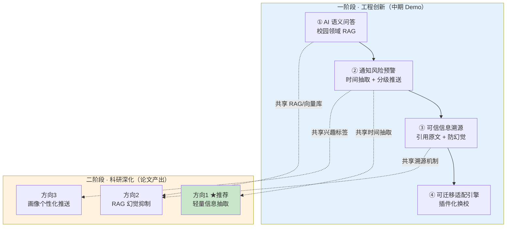

# 校捷通 · 两阶段科研创新迭代方案

> **来源**：`docs/校捷通后续两阶段科研创新.docx`
> **编制**：2026-09-12 ｜ 编制人：成员3
> **编制原则**：**先盘清现状基线，再给增量任务** —— 文档所列的 4 项一阶段能力与 3 个二阶段方向，
> 本项目**已有大量可复用基础**（RAG 框架、微调流水线、通知表、溯源字段等），
> 部分工作是从 0 到 1，部分只是从 60 分到 90 分。若不区分，会导致重复开发与排期失真。

---

## 一、总览：两阶段关系

**核心关系**：一阶段产出**工程能力与真实数据**，二阶段把其中一条链路**做深成科研贡献**。
两者不是并列关系，而是**同一系统的"广度"与"深度"**——这是省级评审最看重的"工程与科研绑定"。

---

## 二、现状基线（关键：先看清已有什么）

> 以下均为**已完成并经实测**的能力，不要重复开发。

| 一阶段需求 | 项目现有基础 | 完成度 | 还差什么 |
|---|---|---|---|
| ① 校园 RAG 问答 | `backend/app/services/rag.py`（分块→向量化→检索→降级关键词） `embedder.py`（bge-m3） `vector_store.py`（Chroma / numpy 双后端） `knowledge_doc` 表 + `/admin/knowledge/ingest` 入库接口 **已修** CAC-01（降级雪崩）、CAC-02（缓存击穿）、CAC-06（读写锁）、CAC-07（覆盖式重建） | **🟢 70%** | 知识库**语料量不足**（当前 18 篇）；检索质量未调优；无评测集 |
| ② 通知风险预警 | `notice` 表 + `/life/notices`、`/life/notice-feed` `agent/reminders`（提醒 CRUD） **`12_notice_delivery.sql`**（通知投递表，已建） Agent Function Call 可执行工具 | **🟡 40%** | **时间实体抽取未做**；重要度打分未做；分层推送（7 天/2 天）未接线 |
| ③ 可信信息溯源 | `rag.py` 的 `_format_hits()` **已返回 `source_url`** `build_system_prompt()` 已把来源拼进 prompt `knowledge_doc.source_url` 字段已有 | **🟡 50%** | 前端**未展示**引用来源；无溯源校验；无"一键跳原文" |
| ④ 可迁移适配引擎 | 无 | **🔴 0%** | 全新建设 |
| 二阶段·方向1 轻量抽取 | `ai/finetune/` 完整流水线（数据构建/QLoRA/GGUF/评测） **已产出 `xjt-3b`**（loss 4.30→0.11） `train_corpus` 表（B1~B5 已建） | **🟢 60%** | 无**标注数据集**；未做实体抽取任务；未做基线对比 |
| 二阶段·方向2 RAG 提升 | 同 ① | **🟡 40%** | 无动态切片；无可信度打分；**无评测集** |
| 二阶段·方向3 个性化 | `user` 表（`major`/`grade`/`campus`） `user/tags` 接口（**已就绪未接入前端**） | **🟡 30%** | 无画像模型；无兴趣标签体系；无冷启动策略 |

**结论**：**一阶段已有约 55% 基础，二阶段方向 1 已有约 60% 基础** —— 应优先选**方向 1**（与现有微调能力直接复用）。

---

## 三、一阶段迭代方案（工程创新 · 中期 Demo）

### 3.1 模块① AI 语义问答（校园领域 RAG）

**创新点表述**（对评审）：不是套壳通用大模型，而是**构建校园私有知识库**做领域检索增强。

| 任务 | 具体内容 | 负责 | 验收标准 |
|---|---|---|---|
| ①-1 语料扩充 | 知识库从 18 篇 → **≥120 篇**（大创/奖学金/竞赛/教务/图书馆/校医院），来源：官网 HTML + 公众号推文 + PDF | 成员4 采集 + 成员2 入库 | `SELECT COUNT(*) FROM knowledge_doc WHERE status=1` ≥ 120 |
| ①-2 文档解析器 | 新增 HTML / PDF / Markdown 解析（当前仅支持纯文本入库） | 成员2 | 三种格式均可 `POST /admin/knowledge/ingest` 入库 |
| ①-3 检索调优 | 切片参数（当前 600/100）按**通知类短文本**特点调优；引入**重排**（可用 bge-reranker 或关键词加权） | 成员3 | 20 条人工标注问题上，**Top-3 命中率 ≥ 80%** |
| ①-4 问答效果对比 | 对比「通用模型直接答」vs「RAG 增强答」，产出量化报告 | 成员3 | 报告含准确率对比表 |
| ①-5 前端接入 | `chat` 页展示引用来源卡片（与模块③合并做） | 成员1 | 回答下方可展开来源列表 |

### 3.2 模块② 通知智能风险预警（进阶亮点）

**创新点表述**：对公告做**时间/事件实体抽取 + 重要度打分**，到期前 7 天/2 天**分层推送**。

| 任务 | 具体内容 | 负责 | 验收标准 |
|---|---|---|---|
| ②-1 时间实体抽取 | 从通知正文抽出**截止时间**（"9月30日前""本周五"等相对/绝对表述） | 成员3 | 测试集上**准确率 ≥ 85%** |
| ②-2 重要度打分 | 规则 + 模型混合：关键词（大创/奖学金/竞赛）+ 时间紧迫度 → 1~5 分 | 成员3 | 打分结果可解释（附命中依据） |
| ②-3 分层推送接线 | 使用**已建的 `notice_delivery` 表**，D-7 / D-2 两个节点触达 | 成员2 | 到期前 7 天与 2 天各收到一次提醒 |
| ②-4 前端入口 | 通知列表按重要度排序 + 倒计时标签 | 成员1 | 高重要度通知置顶并显示"还剩 N 天" |
| ②-5 定时任务 | 每日扫描通知表计算剩余天数（`ARCH-04` 任务队列） | 成员2 | 无人工干预自动触发 |

> ⚠️ **依赖**：②-5 需要引入定时任务能力（当前无 Celery/APScheduler），属 `ARCH-04`。

### 3.3 模块③ 可信信息溯源（校园场景独有的安全设计）

**创新点表述**：所有 AI 回答**强制附带原文引用与来源链接**，可一键跳转原文，**从机制上抑制幻觉**。

| 任务 | 具体内容 | 负责 | 验收标准 |
|---|---|---|---|
| ③-1 来源结构化返回 | 后端 `retrieve()` 已返回 `source_url`，需补 `doc_title` / `chunk_seq` / `snippet`（含高亮片段） | 成员3 | `sseRequest` 的 `sources` 事件含 `url/title/snippet` |
| ③-2 前端来源卡片 | `chat` 页把 `sources` 渲染为可展开卡片，点击跳原文 | 成员1 | 回答下方可见来源，点击可 `wx.navigateTo` 或复制链接 |
| ③-3 溯源校验 | 回答生成后**反向校验**：引用的片段是否真在检索结果中（防模型编造引用） | 成员3 | 编造引用被标记/剔除 |
| ③-4 无依据兜底 | 检索为空时明确回复"知识库暂无相关信息，建议咨询官方"，**不编造** | 成员2 | 空检索场景不产生幻觉回答 |

### 3.4 模块④ 可迁移高校适配引擎（拔高推广价值）

**创新点表述**：把信息采集/解析拆成**可配置插件**，换高校只改配置不改代码，证明**全省可推广**。

| 任务 | 具体内容 | 负责 | 验收标准 |
|---|---|---|---|
| ④-1 配置抽象 | 新建 `backend/app/adapters/`：学校基本信息（名称/校区/部门）、通知源（URL 列表 + CSS 选择器）、术语映射 | 成员3 | 配置文件可描述一所学校 |
| ④-2 通用采集器 | 按配置抓取通知源并入库（尊重 robots.txt、限速） | 成员2 | 配置新源后无需改代码即可入库 |
| ④-3 术语映射 | 各校术语差异（如"教务处"vs"教务部"）通过映射表归一 | 成员3 | 同一意图跨校可检索 |
| ④-4 第二所高校验证 | 用配置方式接入**另一所高校**（哪怕是模拟数据） | 全员 | 演示"改配置即可迁移" |

> 💡 **评审价值**：这是**最能体现"省级"高度**的一项 —— 若时间紧张，④-1/④-3/④-4 可最小化（配置文件 + 1 所验证校），但**必须有可演示的证据**。

---

## 四、二阶段迭代方案（科研深化 · 论文产出）

### 4.1 三个方向对比

| 方向 | 科研问题 | 现有基础 | 工作量 | 产出确定性 | 评审观感 |
|---|---|---|---|---|---|
| **方向 1** 轻量信息抽取 | 异构通知文本的实体抽取（事件/截止时间/材料清单/对象） | 🟢 **60%**（微调流水线 + `xjt-3b`） | **中** | **高**（有数据有指标） | 扎实，标准应用类论文 |
| 方向 2 RAG 幻觉抑制 | 校园场景 RAG 的幻觉率降低与溯源校验 | 🟡 40% | **较大**（需评测集） | 中 | **前沿**，加分高 |
| 方向 3 个性化推送 | 冷启动友好的校园通知推荐 | 🟡 30% | 中 | 低（依赖用户样本量） | 偏推荐系统 |

### 4.2 推荐：**方向 1（轻量信息抽取）**

**推荐理由（三条）**：

1. **与现有能力完全复用** —— 项目的 `ai/finetune/` 已跑通 QLoRA 全流程并产出 `xjt-3b`，
   方向 1 只需**换数据集和任务**，不需要新建基础设施；
2. **产出确定性最高** —— 有数据集、有基线、有指标（P/R/F1），是**标准计算机应用类论文**，
   中期即可完成数据集构建与基线实验，不至于后期来不及；
3. **工程与科研天然绑定** —— 抽出的实体**直接服务模块②**（通知风险预警），
   论文写的是模型，代码跑的是产品，形成"一份工作两份产出"。

### 4.3 方向 1 详细计划

**论文选题**：《面向高校异构公告文本的轻量实体抽取方法研究》

#### 创新点 1：构建吉大校园公告领域私有数据集 ⭐ 核心贡献

> 数据集本身就是科研成果（可单独发布/申请软著）

| 步骤 | 内容 | 规模目标 |
|---|---|---|
| 数据采集 | 官方通知网 + 公众号推文 + 教务 PDF（**遵守 robots.txt**） | 原始 ≥ **500** 条 |
| 标注体系 | 定义实体类型：`事件名称` / `截止时间` / `材料清单` / `通知对象` | 4 类 |
| 标注方式 | 先用模型预标注 → 人工校对（降低标注成本，本身可作为"提示工程优化"的佐证） | 精标 ≥ **300** 条 |
| 数据划分 | 训练/验证/测试 = 7:1:2 | — |
| 质量校验 | 双人标注一致性（Cohen's Kappa ≥ 0.8） | — |

#### 创新点 2：小样本微调轻量模型

| 步骤 | 内容 | 基线 |
|---|---|---|
| 候选模型 | Qwen-1.8B / Qwen2.5-1.5B / bert-tiny（**轻量，可在小程序端/边缘部署**） | — |
| 微调方式 | LoRA / QLoRA（**复用 `ai/finetune/` 现有流水线**） | — |
| 对比基线 | ① 通用模型零样本 ② 通用模型 few-shot ③ 已微调的 `xjt-3b` | — |
| 评价指标 | 实体级 **Precision / Recall / F1**（按实体类型分列 + 宏平均） | — |
| 目标 | 相对通用模型零样本，**F1 提升 ≥ 15 个百分点** | — |

#### 创新点 3：低资源提示工程优化

| 步骤 | 内容 |
|---|---|
| 对比 | 不同 prompt 模板（含/不含示例、含/不含实体类型定义）对抽取效果的影响 |
| 目标 | 证明**优化 prompt 可减少标注需求**（如 100 条标注 + 优化 prompt ≈ 300 条标注 + 朴素 prompt） |
| 价值 | 直接回应"低资源校园场景如何落地" |

#### 工程落地（与一阶段②绑定）

| 步骤 | 内容 |
|---|---|
| 模型服务化 | 抽取模型封装为 Python 服务或 Ollama 模型，供后端调用 |
| 接入通知解析 | `notice` 入库时自动调用抽取 → 填充 `deadline` / `materials` / `target` 字段 |
| 驱动风险预警 | 抽出的截止时间 → 模块②的分层推送 |

### 4.4 备选：方向 2 的最小可行路径

若团队更看重"前沿性"而选方向 2，建议**最小化评测集**以控制工作量：

| 步骤 | 内容 |
|---|---|
| 评测集 | **≥100 条**校园问答对（含标准答案 + 标准引用来源） |
| 幻觉率定义 | 回答中出现"知识库无依据的内容"即为幻觉（人工判定 + 规则辅助） |
| 方法 | 动态切片（按通知语义边界而非固定长度）+ 检索可信度打分 + 强制引用校验 |
| 指标 | 幻觉率对比（朴素 RAG vs 改进 RAG）、引用准确率 |
| 论文 | 《面向校园事务问答的 RAG 幻觉抑制与信息溯源方法》 |

---

## 五、排期与里程碑

假设当前处于**中期节点**，向后 16 周：

| 周次 | 一阶段 | 二阶段（方向1） | 里程碑 |
|---|---|---|---|
| W1-W2 | ①-1 语料扩充至 120 篇 ①-2 解析器（HTML/PDF） | 数据采集 ≥300 条 | **语料就绪** |
| W3-W4 | ①-3 检索调优 + ①-4 效果对比 | 标注体系定义 + 预标注 | **检索达标（Top-3 ≥80%）** |
| W5-W6 | ③-1/③-2 溯源（后端 + 前端） | 人工校对 ≥150 条 + Kappa 校验 | **数据集 v1** |
| W7-W8 | ②-1 时间抽取 + ②-2 重要度打分 | 基线实验（零样本/few-shot） | **一阶段 Demo 可演示** |
| W9-W10 | ②-3 分层推送 + ②-4 前端入口 | QLoRA 微调 + 指标对比 | **中期检查** |
| W11-W12 | ④-1/④-3 适配引擎配置抽象 | 提示工程对比实验 | — |
| W13-W14 | ④-2 通用采集器 + ④-4 第二校验证 | 数据集扩至 300 条精标 | **推广性证据** |
| W15-W16 | 一阶段整体验收 + 文档 | 论文初稿 + 工程落地接入 | **论文投稿** |

---

## 六、与现有文档体系的衔接

| 现有文档 | 本方案的衔接点 |
|---|---|
| `docs/技术方向待处理问题.md` | 本方案的新任务应**登记为 `FEAT-07`（一阶段）与 `FEAT-08`（二阶段）** |
| `docs/成员任务单260910.md` | F1~F9 为**现有前端任务**，本方案的模块①③需要前端配合（来源卡片、通知排序） |
| `docs/项目审计报告260910序2-技术专项.md` | ①-5 的问答效果依赖已修复的 CAC-01/02/06/07（RAG 稳定性） |
| `docs/前端上线-域名与HTTPS方案.md` | 一阶段 Demo 若需真机/发布，**必须解决 https 与备案**（7~20 天，需尽早启动） |
| `ai/finetune/README.md` | 二阶段方向 1 **直接复用**其流水线（`build_dataset.py` / `train.py` / `eval.py`） |
| `db/sql/12_notice_delivery.sql` | 模块②-3 的分层推送**已建表**，直接接线即可 |
| `db/sql/10_ai_train.sql` | 二阶段方向 1 的语料可先落 `train_corpus` |

---

## 七、风险与依赖

| 风险 | 影响 | 缓解 |
|---|---|---|
| **备案耗时 7~20 天** | 一阶段 Demo 无法真机/发布 | **立刻启动备案**（详见 HTTPS 方案文档），开发用开发者工具不受影响 |
| **数据采集合规** | 爬取通知可能违反 robots.txt 或版权 | 遵守 robots.txt + 限速 + 仅用于科研；标注数据注意脱敏（`ARCH-02`） |
| **标注工作量被低估** | 300 条精标可能超预期 | 先用模型预标注 + 人工校对；必要时降到 200 条 |
| **②-5 定时任务无基础设施** | 分层推送无法自动触发 | 先用手动脚本验证，再排 `ARCH-04`（任务队列） |
| **8 项前端待修问题未闭环** | 一阶段模块①③的前端配合会叠加在新问题上 | **先清 `FEAT-06` 的 P1 项**（合计约 20 行，成本极低） |
| **②-4 与 ①-5 需前端工时** | 成员1 已是瓶颈 | 两个模块的前端工作可**合并为一次改动** |

---

## 八、优先级建议（若资源有限）

按"**性价比 = 评审价值 ÷ 工作量**"排序：

| 顺序 | 事项 | 理由 |
|---|---|---|
| **P0** | ①-1 语料扩充 + ①-3 检索调优 | **一阶段的地基**，且二阶段方向 2 也依赖它 |
| **P0** | ③-1 + ③-2 溯源 | **校园场景独有的安全设计**，评审一眼能懂，工作量小 |
| **P1** | ②-1 + ②-2 时间抽取与打分 | 进阶亮点，且是二阶段方向 1 的**前置** |
| **P1** | 二阶段方向 1 数据集构建 | **论文核心贡献**，越早启动越好，不受其他任务阻塞 |
| **P2** | ④ 适配引擎（最小化版） | 推广性叙事需要，但可后置 |
| **P2** | ②-3 分层推送接线 | 依赖定时任务基础设施 |
| **P3** | 二阶段方向 2/3 | 作为备选，视方向 1 进展决定 |

---

## 附：一页纸摘要（可直接用于答辩/评审）

> **校捷通**在校园 AI 服务上分两步走：
>
> **一阶段（工程创新）** 构建**校园领域私有 RAG 知识库**，实现自然语言问答；
> 在此基础上做**通知风险预警**（抽取截止时间、重要度打分、到期前 7 天/2 天分层推送）；
> 并建立**可信信息溯源机制** —— AI 回答强制附带原文引用与来源链接，可一键跳转，
> 从机制上抑制幻觉，这是**校园场景独有的安全设计**。
> 同时把采集解析拆成**可配置插件**，更换高校只需改配置，具备**全省推广**潜力。
>
> **二阶段（科研深化）** 聚焦**高校异构公告文本的轻量信息抽取**：
> 构建**吉大校园公告私有数据集**（本科论文核心贡献），
> 基于**小样本微调轻量 LLM** 抽取事件/截止时间/材料清单/通知对象，
> 并研究**低资源提示工程优化**以降低标注成本。
> 模型直接服务校捷通的通知解析模块，**工程与科研完全绑定**，
> 形成"一份工作、两项产出（系统 + 论文）"的闭环。
