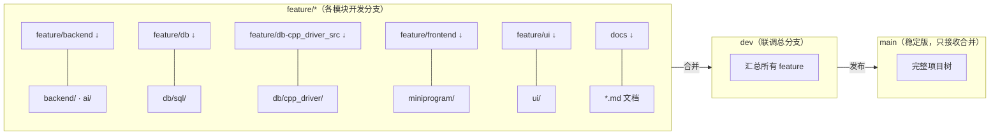

# 校捷通 · 分支规划与文件归属

> 用途：团队分支结构与"哪个分支管哪些文件"的唯一速查。
> 模式：**完整树模式**（沿用 `docs/BRANCH_STRATEGY.md` 团队约定）——每个分支都包含完整项目，靠"分支→目录归属"规范约束改动范围。
> 更新：2026-09-07 已把全部本地分支与最新 `main` 对齐，从任一分支开工都不会缺最新规范/文档。

---

## 1. 结论速览（先读这段）

- 仓库已存在并规划好 8 个分支：`main` / `dev` / `docs` / `feature/backend` / `feature/db` / `feature/db-cpp_driver_src` / `feature/frontend` / `feature/ui`。
- 所有文件**物理上不搬动**，它们始终在每个分支的完整树里；"归属"由下表约束：**某文件该在哪个分支改、就只在该分支改**。
- 各分支已全部快进对齐到 `main`（`d8e4133`），起点一致、工作树干净。
- 队友开工 = 切 `feature/xxx`（或从 `dev` 拉临时分支 `feat/用户名-功能`）→ 只改自己目录 → 提交 → **PR 合并进 `dev`**（Squash and merge）→ `dev` 稳定后合 `main`。
- **Commit / PR / 分支保护 / 冲突处理 / 禁止清单以 `docs/团队Git合作协议.md` 为权威规范**（2026-09-08 生效），本文件只管"目录归属"。

---

## 2. 分支总览（本地与远端现状）

| 分支 | 用途 | 谁管 | 负责人 | 当前状态 |
|---|---|---|---|---|
| `main` | 稳定正式版，禁止直改代码 | — | 全体 | ✅ 最新，含全部规范 |
| `dev` | 联调总分支 | 汇总各 feature | 全体 | ✅ 与 main 对齐 |
| `docs` | 文档（*.md） | 全部文档 | 成员4 | ✅ 与 main 对齐 |
| `feature/backend` | FastAPI 后端 + AI（backend/ ai/） | 后端 + AI | 成员2 | ✅ 与 main 对齐 |
| `feature/db` | 业务数据库脚本（db/sql/） | 数据库 | 成员4 | ✅ 与 main 对齐 |
| `feature/db-cpp_driver_src` | C++ 数据驱动层（db/cpp_driver/） | C++ | 成员3 | ✅ 与 main 对齐 |
| `feature/frontend` | 微信小程序前端（miniprogram/） | 前端 | 成员1 | ✅ 与 main 对齐 |
| `feature/ui` | UI 素材（ui/） | UI 资源 | 成员4 协助 | ✅ 与 main 对齐 |

> 远端：代码同时镜像到 **gitee(`origin`)** 与 **github(`github`)** 两处，分支同名。
> ⚠️ gitee 上遗留旧名 `feature/db-cpp_driver`（无 `_src`），与现行命名 `feature/db-cpp_driver_src` 重复，建议删除，避免混淆。

---

## 3. 文件归属矩阵（核心：哪个文件 → 哪个分支）



| 目录 / 文件 | 归属分支 | 说明 |
|---|---|---|
| `backend/` | `feature/backend` | FastAPI 业务代码 + RAG/Agent 服务 |
| `ai/` | `feature/backend` | AI 随"后端 + AI"（成员2），含 rag/finetune/eval/edge |
| `db/sql/` | `feature/db` | 建表 SQL 与种子数据（业务数据库脚本） |
| `db/cpp_driver/` | `feature/db-cpp_driver_src` | C++ 连接池/DAO/pybind11（**勿与 feature/db 混淆**） |
| `miniprogram/` | `feature/frontend` | 微信小程序前端页面 |
| `ui/` | `feature/ui` | 图片/图标/静态资源（只放资源，不写业务逻辑） |
| `docs/` | `docs` | 架构/接口契约/开发手册/分支规范/团队文档 |
| `deploy/` | `feature/backend` | 部署规划（Docker/Nginx），随服务端走 |
| `README.md` | `docs` | 项目首页（根级文档） |
| `.github/` | `docs` | Copilot 指令/工作流（属文档类配置） |
| `.vscode/` | `docs` | 开发配置（任务/构建/调试） |
| `.gitignore` | `docs` | 根级忽略规则 |

> 例外约定：README「里程碑/目录结构」这类跨模块文档虽在 `docs` 维护，但为保持首页同步，历史上有直接提交 `main` 的记录——凡涉及根级首页改动，统一由文档负责人提交后合并进 `main` 即可。

---

## 4. 队友日常怎么用（示例）

```bash
# ① 前端成员开工：切到自己的分支（它已含完整项目 + 最新规范）
git checkout feature/frontend

# ② 只改 miniprogram/ 下的文件，禁止动其它目录
#    （要看接口契约：docs/api.md 只是"看"，别在这里改）

# ③ 每日开工前同步队友进度
git checkout dev && git pull          # 拉最新联调
git checkout feature/frontend && git merge dev   # 把自己分支更新到最新

# ④ 提交到自己的分支
git add miniprogram/ && git commit -m "feat(frontend): 登录页"

# ⑤ 完成后合并进 dev 联调（或开 GitHub PR: feature/frontend → dev）
git checkout dev && git merge feature/frontend
```

```mermaid
gitGraph
    commit id: "base(main e2bbfbb)"
    branch feature/backend
    branch feature/frontend
    branch feature/db
    branch feature/db-cpp_driver_src
    branch feature/ui
    branch docs
    checkout feature/frontend
    commit id: "前端: 登录页"
    checkout feature/backend
    commit id: "后端: Agent FC"
    checkout dev
    merge feature/frontend
    merge feature/backend
    checkout main
    merge dev
```

## 5. 提交合并铁律

1. `feature/*` 只改自己模块目录（按第 3 节矩阵），不得跨目录改动。
2. 各 feature 定期从 `dev` 合并（`git merge dev`），避免长期分叉。
3. `dev` 每周五合并一次做整体联调，通过后才合 `main`。
4. `main` 受保护：只从 `dev` 合并，禁止直接 push 代码。
5. 文档改动走 `docs` 分支，别混进业务代码分支。

---

## 6. 若将来真要改成"隔离树"（每分支只留自己的文件）——不建议，仅记录

完整树是团队已确认的模式；若确有需求改为隔离树，逻辑是：在每分支删除不属于自己的目录并提交。命令示意（**破坏性、会与 dev/main 产生大量删除冲突**，需全体一致同意再动）：

```bash
# 例：feature/frontend 只保留 miniprogram/ 与根文件
git checkout feature/frontend
git rm -r --cached backend db ai ui deploy docs   # 仅示例，勿直接执行
# ……再补 .gitignore 规则，并同步改写 BRANCH_STRATEGY.md
```

> 结论：不建议。完整树模式下 PR 可用路径过滤（GitHub 可限定 PR 只看某目录 diff），隔离收益 < 协作成本。

---

## 7. 待办清单

| # | 事项 | 操作人 | 命令 |
|---|---|---|---|
| 1 | 把各分支最新状态推到远端 | 负责人 | `git push github --all` / `git push origin --all` |
| 2 | 清理 gitee 旧分支名 | 负责人 | `git push origin --delete feature/db-cpp_driver` |
| 3 | 各成员 clone 后切自己分支 | 全体 | 见第 4 节 |
| 4 | 更新 README「仓库结构」同步本表 | 成员4 | 改 README → docs 流程 |

---

## 8. 与《团队Git合作协议》的关系

- 本文件只定义**文件 → 分支归属**与分支树速览；Commit / PR / 合并 / 保护 / 冲突等协作规则一律执行 `docs/团队Git合作协议.md`（含短期临时分支 `feat/用户名-功能` 等）。
- `feature/*` 是**模块长驻分支**（协议 §1.2），与协议共存：负责人常规开发在模块分支，跨模块/临时任务走协议临时分支，均 PR 到 `dev`。
