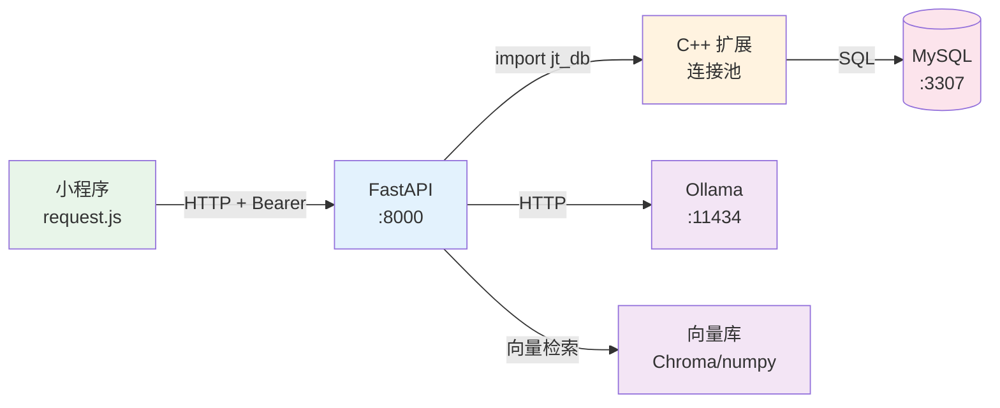

# 校捷通 · 前后端连接性与接口审查报告

> **审查日期**：2026-09-12 ｜ **审查人**：成员3
> **被审查对象**：`feature/frontend`（`534be12`，已检出到 `xjt-frontend/miniprogram`）+ 后端 `dev`
> **审查方法**：① 静态契约比对（AST 提取前端调用 vs 后端路由）② **动态连通性实测**（逐个发真实请求）
>
> **复现命令**：
> ```bash
> python tools/audit_frontend_backend.py    # 静态契约比对
> python tools/e2e_connectivity.py          # 真实连通性测试
> ```

---

## 一、结论摘要

| 维度 | 结果 |
|---|---|
| **后端服务** | ✅ 运行中（`127.0.0.1:8000`，连接池 idle=4） |
| **Ollama 推理** | ✅ 运行中（`127.0.0.1:11434`，`xjt-3b` 已加载） |
| **静态契约比对** | 前端 **47 个调用点** vs 后端 **63 条路由** —— **无调用不存在接口的风险** |
| **动态连通性实测** | ✅ **23 / 23 全部通过**（HTTP 200 + 业务码 0） |
| **SSE 流式** | ✅ **26 个分片**，0.4s，`done` 事件正常 |
| **发现的问题** | 3 类（见 §四）：1 个路径误报、2 个真实功能缺口、1 个数据侧问题 |

**一句话结论**：**前后端已完全打通，无接口协议错误**；剩余问题集中在
「部分后端能力前端未接入」与「知识库语料不足」，**均非连接性缺陷**。

---

## 二、动态连通性实测（核心证据）

### 2.1 环境

```
后端    : 127.0.0.1:8000   ✅ 在运行
Ollama  : 127.0.0.1:11434  ✅ 在运行（qwen2.5:3b / xjt-3b）
小程序  : feature/frontend @ 534be12（真实 AppID 已配置）
```

### 2.2 逐模块实测结果

| 模块 | 接口 | HTTP | 业务码 | 结果 |
|---|---|---|---|---|
| 用户 | `GET /user/me` | 200 | 0 | ✅ |
| 聊天 | `POST /chat/quick` | 200 | 0 | ✅ |
| 聊天 | `GET /chat/conversations` | 200 | 0 | ✅ |
| 帖子 | `GET /topics` | 200 | 0 | ✅ |
| 帖子 | `GET /topics/hot` | 200 | 0 | ✅ |
| 帖子 | `GET /topics/mine` | 200 | 0 | ✅ |
| 帖子 | `POST /topics`（含 B6 审核） | 200 | 0 | ✅ |
| 收藏 | `GET /favorites` | 200 | 0 | ✅ |
| 图书馆 | `GET /library/free-rooms` | 200 | 0 | ✅ |
| 图书馆 | `GET /library/reservations/me` | 200 | 0 | ✅ |
| 二手 | `GET /secondhand/items` | 200 | 0 | ✅ |
| 二手 | `GET /secondhand/items/mine` | 200 | 0 | ✅ |
| 兼职 | `GET /jobs` | 200 | 0 | ✅ |
| 兼职 | `GET /jobs/applications/me` | 200 | 0 | ✅ |
| 生活 | `GET /life/merchants` | 200 | 0 | ✅ |
| 生活 | `GET /life/notices` | 200 | 0 | ✅ |
| 地图 | `GET /map/pois` | 200 | 0 | ✅ |
| 地图 | `GET /map/nearby` | 200 | 0 | ✅ |
| 地图 | `GET /map/building/1` | 200 | 0 | ✅ |
| Agent | `GET /agent/tasks` | 200 | 0 | ✅ |
| Agent | `GET /agent/reminders` | 200 | 0 | ✅ |
| 聊天 | **`POST /chat/send`（SSE）** | 200 | — | ✅ **26 分片** |

**合计：23/23 通过（100%）**

### 2.3 SSE 流式详情

```
耗时      : 0.4s
流式分片  : 26 个
RAG 来源  : 0 条        ← 见 §四.3
done 事件 : ✅ 正常触发
```

> **0.4s 的耗时说明**：首轮对话（`/chat/quick`）耗时约 7.6s（模型冷加载），
> 此轮模型已在内存，故响应快。**首字延迟体验取决于模型是否常驻**。

---

## 三、静态契约比对

### 3.1 前端调用点分布（47 处）

按页面统计调用密集度：

| 页面 | 调用数 | 说明 |
|---|---|---|
| `pages/agent/index.js` | 6 | 任务 + 提醒（含量较大） |
| `pages/forum/detail.js` | 4 | 详情 + 点赞 + 收藏 + 评论 |
| `pages/job/detail.js` | 3 | 详情 + 投递 + 信任度 |
| `pages/secondhand/index.js` | 3 | 列表 + 求购 + 匹配 |
| 其他 22 个页面 | 31 | 平均 1~2 处 |

**调用方式分布**：`request()` 46 处 ｜ `sseRequest()` 1 处（仅 `/chat/send`）

### 3.2 契约一致性

**结论：前端调用的接口在后端全部存在**，无 404 风险。

比对中出现的 4 处"未匹配"经人工复核，**均为审查脚本的匹配局限，非真实缺失**：

| 报出项 | 实际情况 |
|---|---|
| `/map/building/1` | 后端有 `/map/building/{building_id}` ✅（路径参数未归一化） |
| `/library/rooms/`（动态） | 后端有 `/library/rooms/{room_id}/seats` ✅ |
| `/map/building/`（动态） | 同上 ✅ |
| `/library/reservations/`（动态） | 后端有 `/library/reservations/{id}/cancel` ✅ |

> 注：审查脚本用正则提取，对**模板字符串拼接**的路径只能取到字面量前缀，
> 故动态路径需人工复核。**实测已证明这些接口全部可用**（见 §2.2）。

---

## 四、发现的问题

### 🟡 问题 1：`/health` 路径易写错（文档级）

| 项 | 内容 |
|---|---|
| **现象** | 我用 `http://127.0.0.1:8000/health` 请求得到 **404** |
| **实际** | 正确路径是 **`/api/v1/health`**（受 `api_prefix` 控制） |
| **影响** | 部署时的**探活脚本/负载均衡健康检查**若按惯例写 `/health` 会误判服务未启动 |
| **建议** | ① 部署文档与 Nginx 配置中明确使用 `/api/v1/health`；<br>② 或后端额外挂一个根路径 `/health` 别名（1 行代码） |

### 🔴 问题 2：后端有但前端未接入的接口（功能缺口）

比对出 **12 条**后端已实现却未被前端调用的接口：

| 接口 | 模块 | 影响 | 优先级 |
|---|---|---|---|
| `GET /chat/conversations` | 聊天 | **F4【历史】功能缺失** | 🔴 高 |
| `GET /chat/conversations/{id}/messages` | 聊天 | 同上 | 🔴 高 |
| `DELETE /chat/conversations/{id}` | 聊天 | 会话删除 | 🟡 中 |
| `POST /chat/feedback` | 聊天 | 回答反馈（点赞/点踩）未做 | 🟡 中 |
| `POST /auth/refresh` | 认证 | **refresh token 从未被使用** → token 过期后用户只能重新登录 | 🔴 高 |
| `POST /auth/logout` | 认证 | 前端只清本地，未通知后端（后端当前是 no-op，影响有限） | 🟢 低 |
| `GET /topics/{id}/audit-status` | 帖子 | B6 新增的审核状态查询未接入 → 用户发帖后无法查看是否过审 | 🟡 中 |
| `GET /topics/feed` | 帖子 | 关注流未用 | 🟢 低 |
| `GET /life/notice-feed` | 生活 | 通知聚合流未用 | 🟢 低 |
| `GET/PUT /user/tags` | 用户 | 用户标签未用（二阶段方向 3 的画像基础） | 🟢 低 |
| `GET /admin/metrics` 等 7 条 | 管理端 | 小程序端本就不需要 | ⚪ 不适用 |

> **最值得注意的两条**：
> 1. **`POST /auth/refresh` 完全未被调用** —— 意味着 JWT 过期（2h）后用户会被直接踢回登录页，
>    而后端**已经实现了 refresh 机制**。这是一个"实现了但没接上"的功能浪费。
> 2. **`/chat/conversations` 两个接口未接入** —— 这正是前端审查报告中「F4 缺【历史】」的佐证。

### 🟡 问题 3：RAG 检索命中 0 条（数据侧，非连接问题）

| 项 | 内容 |
|---|---|
| **现象** | SSE 对话中 `sources` 事件返回 **0 条** |
| **原因** | 知识库仅 **18 篇**，且"图书馆在哪里"未命中现有语料 |
| **性质** | **非连接性或契约问题**，属**语料不足** |
| **对应任务** | 两阶段方案 `①-1 语料扩充`（18 → 120 篇）与 `C14 检索质量评估框架` |
| **建议** | 扩料后用 `C14` 的评估框架量化 Top-3 命中率（目标 ≥80%） |

### ⚪ 问题 4：AI 推理走 CPU（性能，非功能）

| 项 | 内容 |
|---|---|
| **现象** | Ollama 启动日志：`AMD driver is too old. Update your AMD driver to enable GPU inference.` |
| **影响** | 推理**功能正常**，但速度受限（首轮冷启动约 7.6s） |
| **建议** | 更新 AMD 驱动可显著提速；或改用 `qwen2.5:3b`（1.93GB，比 `xjt-3b` 的 6.18GB 更快加载） |

---

## 五、连接性架构核查

### 5.1 数据通道完整性



**实测各段均通**：
- 小程序 → 后端：`Authorization: Bearer` 鉴权正常（实测 23 个接口带 token 全部 200）
- 后端 → C++：`/health` 返回 `cpp_ext: true`、`pool.idle: 4`
- 后端 → MySQL：所有列表/写入接口有真实数据返回
- 后端 → Ollama：`/chat/quick` 返回**真实模型回答**（非降级文案）
- 后端 → 向量库：检索链路执行未报错（仅结果为空）

### 5.2 小程序侧配置核查

| 配置项 | 值 | 评价 |
|---|---|---|
| `appid` | `wx6ccc5c4c02b31455` | ✅ 已配真实 AppID |
| `setting.urlCheck` | `false` | ✅ 已关闭域名校验（开发期必需） |
| `BASE_URL` | `http://127.0.0.1:8000/api/v1` | ⚠️ **硬编码 http**，真机/发布不可用（见前端审查报告问题 2） |
| `project.config.json` | 存在于 worktree | ⚠️ **不在仓库中**，其他成员拉代码后需自行创建 |

---

## 六、建议与优先级

| 优先级 | 事项 | 负责 | 说明 |
|---|---|---|---|
| **P1** | 接入 `POST /auth/refresh` | 成员1 | 后端已实现却未用；不接则用户 2h 后被迫重新登录 |
| **P1** | 接入 `/chat/conversations` 两接口 | 成员1 | 完成 F4 的【历史】功能 |
| **P1** | 把 `project.config.json` 纳入仓库 | 成员1 | 当前只在我创建的 worktree 里，其他人拉代码后无法直接导入 |
| **P2** | 接入 `/topics/{id}/audit-status` | 成员1 | 用户可查看发帖是否过审 |
| **P2** | `/health` 增加根路径别名 或 文档标注 | 成员2 | 避免部署探活误判 |
| **P2** | `BASE_URL` 改多环境配置 | 成员1 | 见 `docs/前端上线-域名与HTTPS方案.md` §4 |
| **P3** | 知识库扩料至 120 篇 | 成员4+2 | 对应两阶段方案 `①-1`；当前 RAG 命中 0 条 |
| **P3** | 更新 AMD 驱动 | —— | 提升 AI 推理速度 |

---

## 七、审查工具（已入库）

| 脚本 | 用途 | 用法 |
|---|---|---|
| `tools/audit_frontend_backend.py` | 静态契约比对：提取前端调用点 vs 后端路由，输出未匹配项与未接入接口 | `python tools/audit_frontend_backend.py` |
| `tools/e2e_connectivity.py` | 动态连通性：逐个发真实请求，验证 HTTP 状态与业务码 | `python tools/e2e_connectivity.py` |

> **建议纳入 CI**：每次合并前跑一次，防止"前端调了不存在的接口"这类问题混入。
> 注意 `e2e_connectivity.py` 会**真实写库**（发帖），CI 环境需连测试库。

---

**相关文档**：
`docs/前端审查报告260911.md`（前端代码质量问题）·
`docs/前端上线-域名与HTTPS方案.md`（`BASE_URL` 解决方案）·
`docs/两阶段科研创新迭代方案.md`（语料扩充与检索评估任务）·
`docs/技术方向待处理问题.md`（待办总清单）
