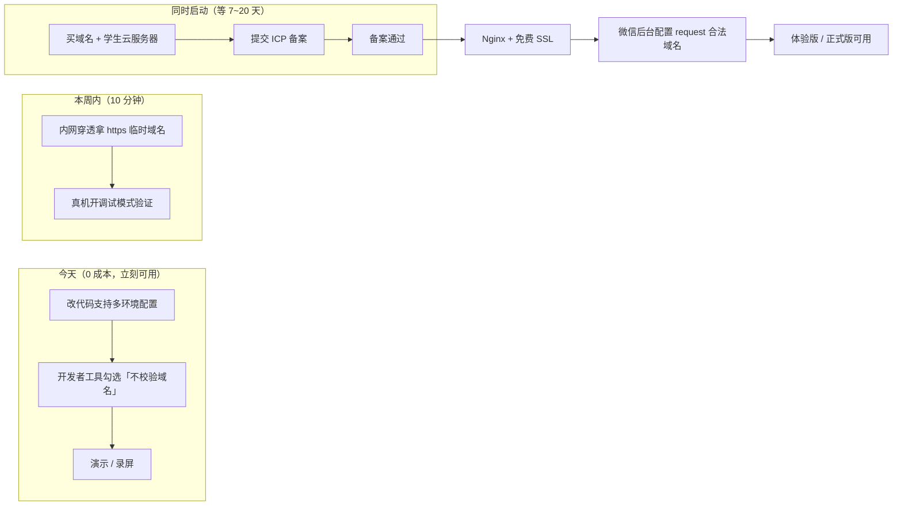

# 前端上线：域名与 HTTPS 落地方案

> **背景**：`miniprogram/services/request.js` 的 `BASE_URL` 硬编码为 `http://127.0.0.1:8000/api/v1`，
> 只能在小程序**开发者工具**里跑（需勾选"不校验合法域名"），**真机与发布均不可用**。
>
> 本文给出从「今天就能演示」到「正式上线」的完整路径。
> ｜ 日期：2026-09-11 ｜ 适用：微信小程序

---

## 一、先看清约束（这决定了方案）

微信小程序对网络请求有**三条硬性要求**，缺一不可：

| # | 要求 | 说明 |
|---|---|---|
| 1 | **必须 `https://`** | `wx.request` 在真机/体验版/正式版**拒绝 http** |
| 2 | **域名必须已完成 ICP 备案** | 在微信公众平台「开发 → 开发设置 → 服务器域名」中添加时，微信会校验备案 |
| 3 | **不支持 IP 地址** | 不能填 `127.0.0.1` 或公网 IP，必须是域名 |

**唯一可以在不合规情况下运行的环境**：

| 环境 | 能否绕过限制 | 怎么绕 |
|---|---|---|
| 开发者工具 | ✅ 可以 | 详情 → 本地设置 → 勾选**「不校验合法域名、web-view（业务域名）、TLS 版本以及 HTTPS 证书」** |
| 真机**开发版** | ✅ 可以 | 手机端打开小程序 → 右上角 `···` → 打开**调试**（会显示 vConsole），此时不校验域名 |
| 真机**体验版 / 正式版** | ❌ **不可以** | 必须合规 |

> **结论**：**演示**可以靠"不校验"绕过；**答辩扫码体验 / 正式发布**必须有合规 https 域名。

---

## 二、四档方案对比（按"从今天到上线"排序）

| 档 | 方案 | 成本 | 上手时间 | 真机可用 | 可发布 | 适合场景 |
|---|---|---|---|---|---|---|
| **A** | 开发者工具本地 `http://127.0.0.1:8000` | ¥0 | **0（现在就行）** | ❌ | ❌ | 内部演示、录屏、答辩用自己电脑 |
| **B** | 内网穿透（cpolar / natapp / frp） | ¥0~10/月 | **10 分钟** | ✅（需开调试） | ❌ | 真机调试、给队友远程试 |
| **C** | 云服务器 + 域名 + **备案** + 免费 SSL | ¥50~200/年 | **备案 7~20 天** | ✅ | ✅ | **正式上线（推荐）** |
| **D** | 微信云托管（CloudBase Run） | 有免费额度 | 1~2 小时 | ✅ | ✅ | 想省去备案与运维 |

### 关键判断

- **备案是唯一的时间瓶颈**（7~20 个工作日），**必须尽早启动**，其余步骤都是小时级
- **A 档和 C 档不冲突**：可以现在用 A 档演示，同时并行启动 C 档备案
- **D 档的取舍**：微信云托管提供的默认域名是腾讯已备案域名，**可省掉备案**，但需要把后端容器化（当前 `deploy/` 还是规划占位）

---

## 三、推荐路径（并行推进，不阻塞演示）



---

## 四、代码改造（今天就能做完，约 10 分钟）

### 4.1 新建 `miniprogram/config.js`

把硬编码的 `BASE_URL` 抽出来，按**小程序运行环境自动切换**：

```js
// 环境配置：按小程序运行环境自动选择后端地址
// envVersion 由微信注入，取值：develop（开发版）/ trial（体验版）/ release（正式版）
const ENV_CONFIG = {
  // 开发版：开发者工具 + 真机开调试模式时使用（需勾选「不校验合法域名」）
  develop: 'http://127.0.0.1:8000/api/v1',

  // 体验版：内网穿透的临时域名，或测试服务器（必须是 https 且已配置到小程序后台）
  trial: 'https://your-test-domain.example.com/api/v1',

  // 正式版：备案域名（必须是 https）
  release: 'https://your-domain.example.com/api/v1',
}

/**
 * 解析当前环境对应的 BASE_URL。
 * 使用官方 API wx.getAccountInfoSync（基础库 2.18.0+），
 * 低版本或调用失败时兜底为 develop，保证开发者工具始终可用。
 */
function resolveBaseUrl() {
  try {
    const info = wx.getAccountInfoSync()
    const envVersion = info && info.miniProgram && info.miniProgram.envVersion
    if (envVersion && ENV_CONFIG[envVersion]) {
      return ENV_CONFIG[envVersion]
    }
  } catch (e) {
    // 静默兜底：不影响开发
  }
  return ENV_CONFIG.develop
}

module.exports = {
  BASE_URL: resolveBaseUrl(),
  ENV_CONFIG,
}
```

> **为什么用 `wx.getAccountInfoSync()` 而不是 `__wxConfig`**：
> `__wxConfig` 是**非官方内部变量**（虽然网上常见），随基础库版本可能失效；
> `wx.getAccountInfoSync()` 是**官方 API**，更稳。

### 4.2 修改 `miniprogram/services/request.js`

```js
// 原：const BASE_URL = 'http://127.0.0.1:8000/api/v1'
// 改为：
const { BASE_URL } = require('../config.js')
```

其余代码**无需改动**（所有请求都通过 `BASE_URL` 拼接）。

### 4.3 顺手修掉「问题 1」（`2003` 未跳登录页）

同一文件里，把 `2003` 一并纳入登录失效处理：

```js
// 原：if (code === 2001 || code === 2002) {
// 改为：
if (code === 2001 || code === 2002 || code === 2003) {
  handleAuthFailure(message)
  reject(err)
  return
}
```

> 后端 `2003` 现表示「无权限 / **账号已禁用**」。不改的话，被禁用用户会停在原页面反复报错。

---

## 五、C 档落地步骤（正式上线）

### 5.1 采购清单（学生优惠）

| 项 | 推荐 | 参考价 |
|---|---|---|
| 域名 | 阿里云/腾讯云，`.top` / `.xyz` 后缀最便宜 | **¥1~30 / 年** |
| 云服务器 | 轻量应用服务器 **2C4G** 起（学生认证更便宜） | **¥9~10 / 月**（学生） |
| SSL 证书 | **免费**：Let's Encrypt，或云厂商免费 DV 证书（1 年） | ¥0 |

> **务必让域名与服务器在同一家云厂商**（备案时"接入商"与"域名注册商"一致，流程最顺）。

### 5.2 ICP 备案（**唯一需要等的一步**）

**准备材料**：身份证、手机号、服务器实例（通常要求购买 3 个月以上）、个人网站需承诺书。

**流程**：
1. 云厂商控制台 → 备案系统 → 填写主体与网站信息
2. 上传身份证、**幕布拍照**或 APP 人脸核验
3. 云厂商初审（1~3 天）
4. **通信管理局审核（7~20 个工作日）** ← 时间瓶颈
5. 通过后获得备案号，需在网站底部展示

**注意**：
- 备案期间**域名不能解析到境外服务器**
- 校园网 IP **无法用于备案**（必须是云服务器实例）
- 若用**微信云托管**（D 档）可完全跳过本节

### 5.3 Nginx 反向代理 + HTTPS

`/etc/nginx/conf.d/xiaojietong.conf`：

```nginx
# HTTP → HTTPS 强制跳转
server {
    listen 80;
    server_name your-domain.com;
    return 301 https://$host$request_uri;
}

server {
    listen 443 ssl;
    http2 on;
    server_name your-domain.com;

    # 免费证书（certbot 自动续期）
    ssl_certificate     /etc/letsencrypt/live/your-domain.com/fullchain.pem;
    ssl_certificate_key /etc/letsencrypt/live/your-domain.com/privkey.pem;

    # 微信要求 TLS 1.2+（禁用更老的协议）
    ssl_protocols       TLSv1.2 TLSv1.3;
    ssl_ciphers         HIGH:!aNULL:!MD5;
    ssl_prefer_server_ciphers on;

    add_header Strict-Transport-Security "max-age=31536000" always;

    # 后端 API
    location /api/v1/ {
        proxy_pass http://127.0.0.1:8000;
        proxy_set_header Host              $host;
        proxy_set_header X-Real-IP         $remote_addr;
        proxy_set_header X-Forwarded-For   $proxy_add_x_forwarded_for;
        proxy_set_header X-Forwarded-Proto $scheme;

        # ⚠️ SSE 流式（POST /chat/send）必须关闭缓冲，否则逐字输出会失效
        proxy_buffering     off;
        proxy_cache         off;
        proxy_read_timeout  300s;
    }

    # 上传的静态资源
    location /static/uploads/ {
        proxy_pass http://127.0.0.1:8000;
    }
}
```

> **两个最容易踩的坑**：
> 1. **`proxy_buffering off`** —— 不关的话 `/chat/send` 的 SSE 会被 Nginx 缓冲，前端逐字渲染变成"一次性吐出"
> 2. **`X-Forwarded-For` 透传** —— 后端的限流（SEC-10）按客户端 IP 计数，不透传会导致所有请求都算到 Nginx 的 IP 上

**签发证书**：
```bash
sudo apt install certbot python3-certbot-nginx
sudo certbot --nginx -d your-domain.com
```

### 5.4 微信公众平台配置

**位置**：微信公众平台 → 开发 → 开发管理 → 开发设置 → **服务器域名**

| 类型 | 填写 |
|---|---|
| **request 合法域名** | `https://your-domain.com` |
| **uploadFile 合法域名** | `https://your-domain.com`（上传图片用，`POST /upload/image`） |
| **downloadFile 合法域名** | `https://your-domain.com` |

**注意事项**：
- 只能填域名，**不能带路径**（填 `https://your-domain.com`，不要填 `.../api/v1`）
- 每月可修改次数有限（有配额），**想清楚再填**
- 修改后需**重新编译并重新提交**小程序才能生效

### 5.5 后端侧需要同步的两件事

| 项 | 说明 |
|---|---|
| **生产环境变量** | `XJT_ENV=prod` + `XJT_JWT_SECRET=<≥32字节随机值>` + `XJT_WX_APPID/SECRET`（否则后端按 SEC-01/02 校验**拒绝启动**） |
| **CORS 白名单** | `XJT_CORS_ORIGINS` 需配置为正式域名（生产环境禁止 `*`，见 SEC-13） |

---

## 六、B 档：内网穿透（真机调试，10 分钟）

若只是想**真机验证**（不发布），用内网穿透最快：

| 工具 | 免费版 | 备注 |
|---|---|---|
| **cpolar** | ✅ 有 | 国内节点，免费版域名随机且会变 |
| **natapp** | ✅ 有 | 国内，需实名 |
| **frp** | 自建 | 需一台有公网 IP 的服务器 |
| **Cloudflare Tunnel** | ✅ 免费 | 域名在 CF 托管时可固定 |

**流程**：
```
内网穿透工具 → 映射本地 8000 端口 → 获得 https 临时域名
              ↓
把该域名临时填入 config.js 的 trial 字段
              ↓
真机打开开发版小程序 + 开启「调试」模式 → 验证
```

> **注意**：免费版临时域名**通常无法配置到微信后台**（未备案），
> 但**真机开发版开调试模式**可以绕过校验，足够联调。

---

## 七、时间规划建议

考虑到备案需要 7~20 天，**建议今天就启动**：

| 时间 | 动作 | 负责人 |
|---|---|---|
| **今天** | 改 `config.js` + `request.js`（§4，10 分钟）；开发者工具勾选"不校验域名"，保证演示不受影响 | 成员1 |
| **今天** | 买域名 + 学生云服务器，**提交备案**（越早越好） | 负责人 |
| **本周** | （可选）内网穿透做真机验证 | 成员1 |
| **备案通过后** | 部署后端 + Nginx + 证书 + 配置小程序后台域名 | 成员3 + 成员2 |
| **之后** | 切 `release` 环境，提交体验版验收 | 成员1 |

---

## 八、常见问题

**Q：能不能用 IP + 端口？**
A：不行。微信明确要求域名，且 `request` 合法域名不支持 IP。

**Q：能不能用非 443 端口？**
A：可以（如 `https://domain.com:8443`），但需在后台按该形式配置，且证书必须匹配。**不建议**，容易被校园网/企业网封。

**Q：备案期间域名完全不能用吗？**
A：国内服务器**未备案不能解析访问**（会被云厂商拦截）。但**开发用的内网穿透/本地不受影响**。

**Q：小程序后台域名配置有配额吗？**
A：有。每个月修改 request/uploadFile/downloadFile 域名的次数有限（通常各 5 次），改之前想清楚。

**Q：必须买服务器吗？**
A：用**微信云托管**（D 档）可以只部署容器，用其默认 https 域名，**省掉备案与服务器采购**。代价是要先把后端容器化（`deploy/docker-compose.yml` 目前还是规划占位）。

---

## 九、与本项目待办清单的关联

本方案落地涉及 `docs/技术方向待处理问题.md` 中的多项：

| 编号 | 关系 |
|---|---|
| `FEAT-06` | 问题②「BASE_URL 硬编码」的**解决方案即本文 §4** |
| `ARCH-03` | 容器化 / Nginx / HTTPS / 域名 —— 本文 §5 是它的**具体执行步骤** |
| `ARCH-02` | 部署时需注入 `XJT_DB_PASSWORD`（口令不得入库） |
| `ARCH-01` | 若上多 worker，限流需接 Redis 才能全局生效 |

---

**相关文档**：
`docs/前端审查报告260911.md`（问题来源）· `deploy/README.md`（容器化规划）·
`docs/architecture.md`（部署架构）· `docs/技术方向待处理问题.md`（待办总清单）
