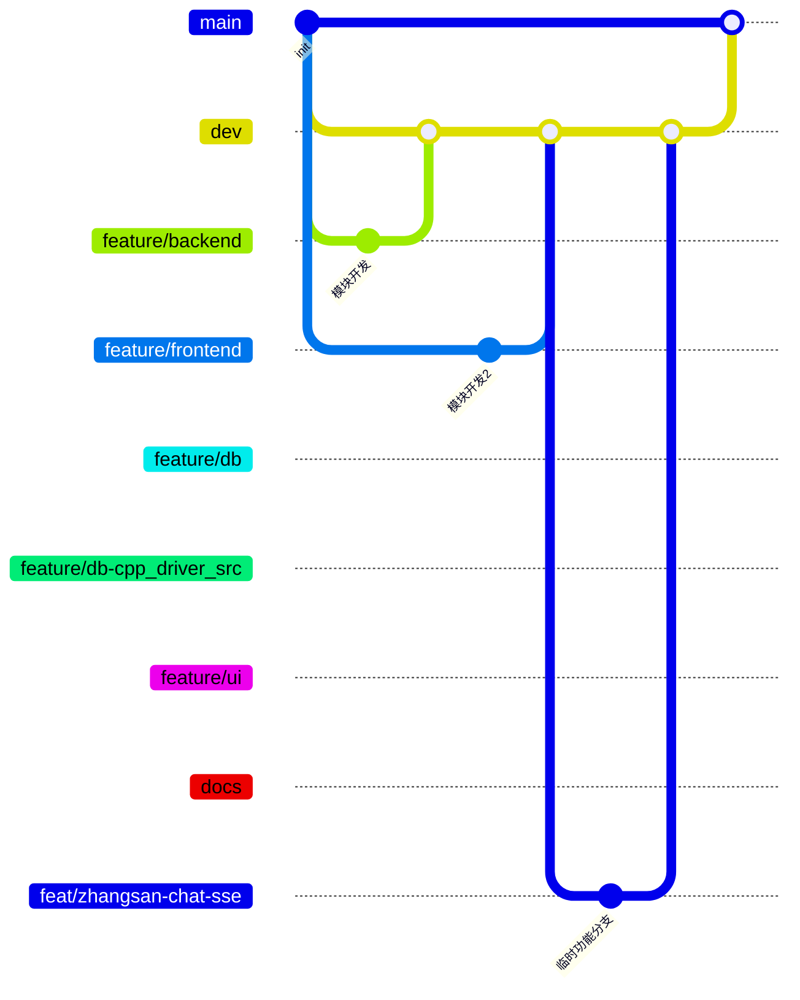

# 校捷通 · Git & GitHub 团队合作协议（自适应版）

> 本项目 Git 协作规范的**权威版本**。由 `docs/校捷通Git合作协议.docx` 整理，并按本项目现有分支结构做**自适应映射**。
> 适用项目：校捷通（XJT Campus）｜4 人团队
> 配套速查：`docs/BRANCH_STRATEGY.md`（分支一览）· `.github/PULL_REQUEST_TEMPLATE.md`（PR 模板，GitHub 自动加载）· `.github/copilot-instructions.md`（Copilot 指令，含本协议提示词）
> 状态：2026-09-08 生效。旧文档凡与本协议冲突处，**以本协议为准**。

---

## 〇、协议如何"自适应"到本项目现有分支

协议草案来自通用 Git 规范，与本项目现状存在两处差异，已做如下映射，**后续所有规则均按映射后的名称执行**：

| 协议原文 | 本项目自适应 | 说明 |
|---|---|---|
| `develop` 开发集成分支 | `dev` | 集成分支，改叫 `dev`（本项目既有命名），职责不变 |
| 仅 main + develop 两个长期分支 | 保留 `feature/*` 模块长驻分支 | 本项目已按 4 人分工建立 5 个模块长驻分支 + `docs`，作为**各模块负责人的长驻工作分支**（见 §1.2），不删除 |
| 功能一律从 develop 拉临时分支 | 两可：模块常规开发走 `feature/*`；新功能/跨模块/需 Review 的任务按协议从 `dev` 拉**临时分支** | 见 §1.3 与 §3 |

---

## 一、仓库分支总定义

### 1.1 长期常驻分支（远程永久存在）

1. **`main`**
   - 生产稳定分支，始终保持可编译、可运行状态。
   - ❌ 禁止任何人直接 push 到 `main`（含仓库 Owner）。
   - 仅允许经过 PR 评审的合并进入 `main`，受 GitHub 分支保护规则强制锁定。
   - `main` 只接收来自 `dev` 的合并。

2. **`dev`（开发集成分支，= 协议中的 develop）**
   - 所有功能开发完成后先经 PR 合并到此分支，做集成测试。
   - 新功能/临时任务基于 `dev` 拉出分支（见 1.3）。
   - 验证通过后，由 `dev` 经 PR 合并至 `main`。
   - `main` 不接收个人分支的直接合并。

### 1.2 模块长驻分支（本项目特有，保留不删）

> 每个模块一位负责人长驻开发，只改自己的模块目录（完整树模式，目录归属见 `docs/分支规划与文件归属.md`）。

| 分支 | 模块 | 负责人 |
|---|---|---|
| `feature/backend` | `backend/`、`ai/`（后端 + AI） | 成员2 |
| `feature/frontend` | `miniprogram/` | 成员1 |
| `feature/db` | `db/sql/` | 成员4 |
| `feature/db-cpp_driver_src` | `db/cpp_driver/` | 成员3 |
| `feature/ui` | `ui/` | 成员4 协助 |
| `docs` | 全部 `*.md` 文档、`.github/` | 成员4 |

**模块长驻分支的使用约束：**
- 模块负责人可**直接**在自己的 `feature/*` 上做常规小粒度开发提交（等同于协议中的"个人工作分支"角色）。
- 阶段性/可演示成果 → 由 `feature/*` 发起 **PR 合并到 `dev`**（遵守 §5 全部 PR 规则），禁止把 `feature/*` 直接合 `main`。
- 各 `feature/*` 每周从 `dev` 同步（`git merge dev`），避免长期分叉。
- 文档改动一律走 `docs`（或随 `main` 的文档合并流程），不混进业务分支。

### 1.3 短期临时分支（开发完成合并后删除，远程 + 本地均清理）

> 一律从 **`dev`** 拉出创建，❌ 禁止从 `main` 创建功能分支。命名中的 `用户名` 用**自己的 GitHub 用户名/拼音**，禁止用 `test`、`mybranch`、`new`、`123` 等无意义命名。

1. `feat/用户名-功能简述` —— 新功能
   例：`feat/zhangsan-chat-sse`、`feat/lisi-seat-reserve`
2. `fix/用户名-bug简述` —— bug 修复
   例：`fix/wangwu-rag-index-crash`
3. `hotfix/简述` —— 线上 `main` 紧急 bug 修复，仅用于 `main` 阻塞性 bug；从 `main` 拉出，修复后双向合并回 `main` + `dev`
4. `docs/用户名-文档内容` —— 仅改文档/readme，不改业务代码
5. `refactor/用户名-模块名` —— 重构，无功能变更
6. `perf/用户名-优化点` —— 性能优化

---

## 二、分支树（全貌）



---

## 三、本地开发完整工作流（每个人严格执行）

```bash
# 0. 每次开始写代码前，同步远程最新代码
git checkout dev
git pull origin dev

# 1. 选分支：模块常规开发 → 切到自己的 feature/* 并同步 dev
git checkout feature/frontend && git merge dev        # 例：成员1
#   或：新功能/临时任务 → 基于最新 dev 创建个人临时分支
git checkout -b feat/zhangsan-chat-sse

# 2. 开发，频繁小粒度提交，不要一次性堆几百行一个大提交
git add miniprogram/ && git commit -m "feat(chat): 新增 SSE 逐字渲染"

# 3. 开发完成，再次同步 dev，在本地解决冲突！禁止留冲突丢给 PR
git checkout dev && git pull origin dev
git checkout feat/zhangsan-chat-sse && git merge dev
#   ✅ 用 VS Code 可视化工具本地解决全部冲突，解决完毕本地编译运行通过，再推送

# 4. 推送自己的分支到远程
git push origin feat/zhangsan-chat-sse

# 5. GitHub 网页发起 Pull Request：目标分支选 dev，不是 main！
#    PR 模板由仓库自动加载，按模板填写；至少 1 人 approve 后 Squash and merge
```

---

## 四、Commit 提交信息强制规范（Conventional Commits 标准）

格式：`类型(作用域): 简短描述`；可选多行详细描述换行后追加。

**允许的类型：**

| 类型 | 含义 |
|---|---|
| `feat` | 新增功能 |
| `fix` | bug 修复 |
| `docs` | 文档修改 |
| `refactor` | 重构，不改变行为 |
| `perf` | 性能优化 |
| `test` | 测试代码 |
| `chore` | 构建脚本、gitignore、配置文件，无业务逻辑改动 |

**示例（校捷通）：**
```
feat(chat): 新增 SSE 对话逐字渲染
fix(agent): 修复座位预约重复冲突未提示
docs: 更新接口契约 api.md 变更记录
refactor(cpp_driver): 重构连接池获取逻辑
```

**规则约束：**
1. 首行标题**不超过 50 字符**；
2. 中英文均可，❌ 禁止 `更新代码`、`修复bug`、`临时提交`、`改东西` 这类模糊描述；
3. 一个 commit 尽量做一件事，不把不相关代码塞进同一 commit；
4. 禁止提交大体积二进制、编译产物、缓存、密钥文件（已被 `.gitignore` 过滤，新增一律补规则）。

---

## 五、Pull Request（PR）完整规则

> 模板文件：`.github/PULL_REQUEST_TEMPLATE.md`（GitHub 新建 PR 自动加载，模板同 §下方）。

### 5.1 PR 基础规则

1. **目标分支一律指向 `dev`**；绝不对 `main` 直接 PR；只有 `dev` 稳定后再 PR `dev → main`。
2. 模块 `feature/*` 或临时分支 → PR 到 `dev`；`dev → main` 的 PR 除外。
3. PR 标题同 commit 格式 `类型(模块): 功能简述`。
4. 必须按模板填写：功能说明、改动内容、自测情况、注意点。
5. **至少 1 名团队成员 Review 并 approve 才允许合并；提交人本人不能给自己 approve**。
6. 合并完成（Squash）后：**删除远程临时分支，本地同步删除**，保持仓库整洁；`feature/*`、`docs` 等长驻分支不删。
7. PR 冲突：**必须开发者本人本地 `merge dev` 解决后重新推送**；❌ 禁止用 GitHub 网页在线解决冲突（易产生代码错乱）。

### 5.2 PR 合并方式规定

- 优先 **Squash and merge**：把该 PR 所有零散 commit 压缩成 1 条干净规范 commit 合入 `dev`，保持历史干净；
- ❌ 禁止 Create a merge commit（产生大量杂乱合并节点）；❌ 禁止直接 Rebase 合并（多人协作易错乱）；
- `hotfix` 紧急修复可用 merge commit。

### 5.3 PR 模板（即 .github/PULL_REQUEST_TEMPLATE.md 内容）

```
## 改动类型
- [ ] feat 新增功能
- [ ] fix 缺陷修复
- [ ] refactor 代码重构
- [ ] docs 文档更新
- [ ] perf 性能优化
- [ ] chore 配置/构建变更

## 实现内容
简要描述本次完成了什么功能、解决什么问题

## 修改模块
列出改动的文件夹/关键文件路径（本仓库请遵守目录归属，勿跨模块）

## 自测情况
- [ ] 本地编译运行正常
- [ ] 无新增报错警告
- [ ] 已同步 dev 分支，本地解决全部代码冲突

## 注意事项
其他组员需要注意的点、依赖、后续任务
```

---

## 六、分支保护配置要求（已按现状配置，2026-09-09 生效）

> GitHub 规则集 `team-branch-protect`（Active）已配置，**目标分支仅 `main`**。

**`main` —— 唯一受保护分支，任何人（含仓库 Owner）一律禁止直接推送**
- ✅ GitHub 已开启 **Require a pull request before merging**（必须 PR 才能合并）；
- ✅ `main` 只接收来自 `dev` 的合并：所有改动经 `feature/* → dev` 集成后，再由 `dev → main` 的 PR 合入；
- ✅ 直接 push 到 `main` 会被 GitHub 服务端强制拒绝（ruleset 已生效，无 bypass）；
- 规则集位置：`Settings → Rulesets → team-branch-protect`（启用：Restrict deletions / Require a pull request before merging / Block force pushes）。

**`dev` —— 不设 GitHub 保护（团队自主放宽，2026-09-09 决定）**
- `dev` 允许直接推送/直接合并，作为集成分支提高迭代效率；
- 仍建议用 PR 合并以便留痕与回溯，但不强制；
- 所有功能最终汇入 `dev`，稳定后再走 `dev → main` PR。

> 若日后使用 gitee 镜像：对应设置位于 仓库 → 管理 → 分支管理 → 保护分支（仅需保护 `main`）。

---

## 七、冲突处理约定

1. 分工尽量隔离文件，多人避免同时改同一文件同一代码段（目录归属见 `docs/分支规划与文件归属.md`）；
2. 冲突**全部在本地 VS Code 可视化工具解决**；
3. 解决后必须本地编译运行确认正常，再推送；
4. 绝不把 `<<<<<<< HEAD` 冲突标记文本提交进仓库。

---

## 八、禁止行为清单

1. ❌ **直接在 `main` 上写代码、直接 push——任何人（含仓库 Owner）一律禁止推送 `main`**；`main` 更新只能经 `dev → main` 的 PR 合并（GitHub 保护已强制）；
2. ❌ 在 `dev` / 各 `feature/*` 上堆一个巨型 commit；
3. ❌ 用 GitHub 网页在线编辑代码提交（文档类经 PR 审批除外）；
4. ❌ PR 遗留冲突不处理直接请求合并；
5. ❌ 提交密钥、API Key、本地 IDE 配置、编译产物（含 `.env`、`*.pem`、`*.pyd`、`build/`）；
6. ❌ 合并完成后不删除废弃临时分支；
7. ❌ 从 `main` 拉个人功能分支、跨模块改动别人目录。

---

## 九、给 Copilot / 开发助手的协作提示词

> 本段已同步写入 `.github/copilot-instructions.md`，Copilot 将自动遵守。

```
你需要严格遵守校捷通项目的 git 协作规范：
项目：校捷通（XJT Campus）
分支体系：main 生产稳定分支，dev 开发集成分支，feature/* 为模块长驻分支（backend/frontend/db/db-cpp_driver_src/ui，各司其职）；功能临时分支从 dev 拉出，命名格式 feat/用户名-功能名、fix/用户名-bug名、docs/用户名-文档名、refactor/用户名-模块名、perf/用户名-优化点、hotfix/简述；禁止直接向 main 提交，所有改动走 PR 合并到 dev，再由 dev 合 main。
commit 消息遵循 Conventional Commits：type(scope): description（type ∈ feat|fix|docs|refactor|perf|test|chore），标题 ≤50 字符，禁止模糊描述。
PR 使用 Squash and merge 挤压合并；PR 必须填 .github/PULL_REQUEST_TEMPLATE.md 模板，至少 1 人 review（本人不可 approve）；冲突必须本地 VS Code 解决，禁止网页处理冲突。
当被要求生成 git commit 信息、分支名称、PR 描述时，严格按上述规范输出。
```

---

## 十、与旧文档的关系与迁移

| 旧物 | 处置 |
|---|---|
| `docs/校捷通Git合作协议.docx` | 保留为草案来源，本 `.md` 为权威执行版 |
| `docs/BRANCH_STRATEGY.md` | 保留为分支速查表，内容与本协议对齐 |
| `docs/分支规划与文件归属.md` | 保留目录归属，增加临时分支说明 |
| gitee 旧分支 `feature/db-cpp_driver`（无 `_src`） | 与现行 `feature/db-cpp_driver_src` 重复，管理员删除 |
| 历史不规范提交（`Initial commit`、`Create sql` 等） | 属远古/网页提交，已推送并被 PR 引用，**不重写历史**；自本协议起全部新提交遵守规范 |

---

## 十一、协作者本地自动同步规范（scripts/auto-sync）

> 多人协作同一 GitHub 主仓库（非 fork），当 PR 合并进主仓库后，协作者本地应自动跟随最新代码。
> 工具：`scripts/auto-sync/`（跨平台，仅依赖 git + 系统自带工具）；详细配置见其 `README.md`。

1. **每个协作者必须配置并启用**：在本地仓库 `scripts/auto-sync/config.sh` 中确认 `REMOTE_NAME`（默认 origin=GitHub 主仓库）与 `TARGET_BRANCH`（本仓库**建议设为 `dev`**，实时跟随队友 PR 成果；`main` 为稳定版）。
2. **每 30 分钟自动运行一次**（Windows 任务计划 / Linux·macOS cron / `--daemon`，见 README §三），当检测到主仓库目标分支有新 commit 时自动 `fetch` + 快进拉取。
3. **同步成功后**：脚本更新本地记录并打印"场景A 代码审查指令"——请把本次 diff 交给 AI 审查（逐条理解、完整编译、边界/空指针/泄漏检查、核对规范、风险评估与测试建议）后再继续开发。
4. **同步冲突时**：脚本**立即中止、不覆盖本地代码、不更新记录**，并打印"场景B 冲突处理指令"；请按 §七 在本地 VS Code 解决冲突（保留双方有效逻辑），解决后提交；禁止把冲突标记提交入库。
5. **边界与责任**：
   - 脚本只在**本地当前分支 == 目标分支**时自动快进，以保护协作者在其它分支的未提交工作；
   - 请勿在 `main` 上保留未推送的领先提交（`main` 更新只能经 `dev→main` PR，见 §一 / §六）；
   - 网络/权限异常时脚本只报错不改动本地代码，可安全重试。
6. 换机器或清除 `.git` 后，重跑一次脚本即可重新初始化记录。
