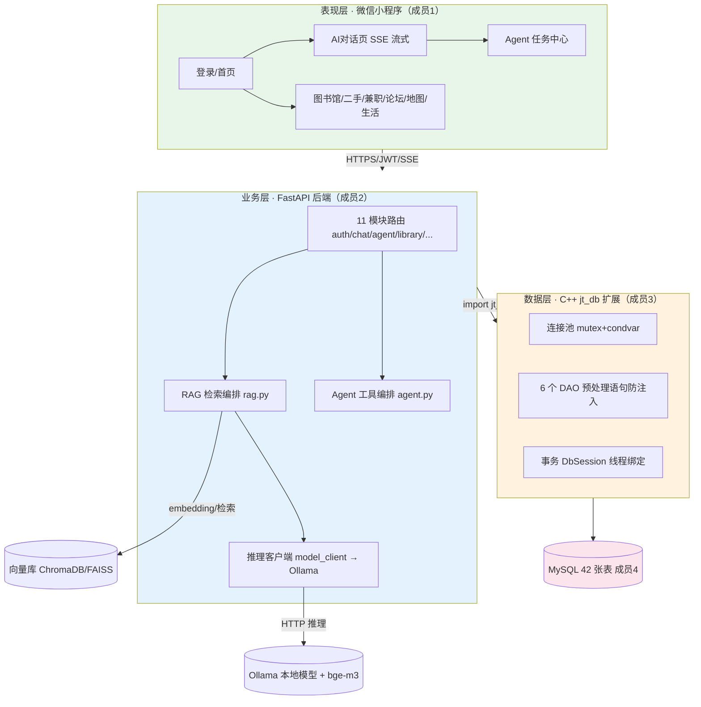
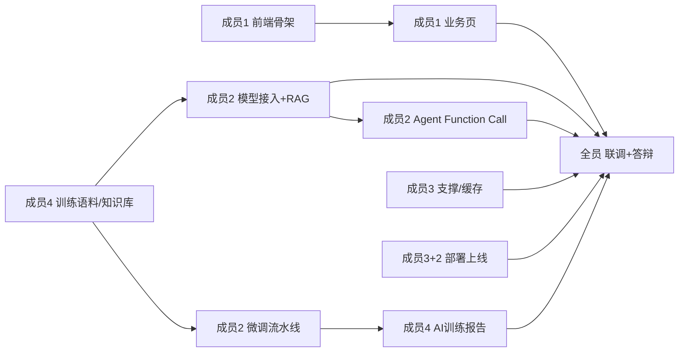

# 校捷通 · 团队讲解手册与任务分工

> 用途：给队友做项目讲解 + 认领任务的一次性手册。
> 建议时长 60~90 分钟：第 1~4 节主讲演示 → 第 5 节分工认领 → 第 6 节排期对齐 → 第 7 节答疑。
> 讲之前务必按「第 3.3 节 现场演示清单」把 demo 跑通。
> 配套文档：`docs/architecture.md`（架构）· `docs/api.md`（接口契约）· `docs/DEVELOPMENT.md`（开发手册）· `docs/BRANCH_STRATEGY.md`（分支规范）

---

## 1. 开场三句话（负责人背下来用）

1. **我们做的是什么**：校捷通 —— 吉林大学一站式校园平台，覆盖「学习·生活·交易·社交·求职」五大场景，AI 深度嵌入（知识库问答 RAG / 任务自动执行 Agent / 校园模型微调）。
2. **我们怎么分工**：前端小程序 + FastAPI 后端 + C++ 高性能数据层 + 数据库/文档，4 人各守一摊，分支隔离、互不阻塞。
3. **我们走到哪了**：**地基全部打完了**（42 张表、C++ 连接池+6 个 DAO、后端 11 模块约 60 个接口都已实测可跑）—— 接下来不是"从零开始"，而是"在地基上盖楼"：**前端页面（成员1）和 AI 深度能力（成员2）是当前两条主线**。

---

## 2. 架构讲解（配合 architecture.md）

> 讲法：白板上只画下面这一张图，讲清 5 条线即可，不要念文档。



**5 条必须讲清的关系：**
1. **数据只有一条通道**：小程序 → FastAPI → C++ `jt_db` 扩展 → MySQL。C++ 层是唯一直接碰数据库的地方（连接池 + 预处理防注入 + 事务）。
2. **后端与 AI 的关系**：对话接口 `chat/send` = RAG 检索 → 拼 Prompt → 调 Ollama 流式 → SSE 逐字回传。Ollama 没就绪时会**优雅降级**，所以前端可以先开发、不阻塞。
3. **接口契约**：`docs/api.md` 是前后端唯一的"合同"，改接口必须在里面登记。前端对着它写请求，后端已全部按它实现并实测。
4. **分支隔离**：每个 feature 分支只改自己目录（见 BRANCH_STRATEGY），最后都并 `dev` 联调、`main` 发版。
5. **AI 三大能力现状**：RAG 检索框架已能跑（差"喂全量知识 + 加载模型"）；Agent 还是关键词规则占位（待升级为 Function Call）；模型微调流水线是空地（待建）。

---

## 3. 现状盘点（让队友 5 分钟内相信"真的能跑"）

### 3.1 已完成（底座，全部实测过）

| 层 | 完成内容 | 证据/验证方式 |
|---|---|---|
| 数据库 | 42 张表分 11 个 SQL 落地，已导入本地 MySQL(3307) | DataGrip / `SHOW TABLES` |
| C++ 数据层 | MySQL C API 封装 + 连接池 + 预处理语句 + 事务 + 6 个 DAO | `test_all_dao.py` 15 组断言全绿（含事务回滚） |
| 后端 | 13 个路由文件，11 模块约 60 接口按 api.md 实现；JWT 登录、统一响应 `{code,message,data}`、SSE 流式、BizError 异常体系 | Swagger `:8000/docs` 实测 |
| RAG 框架 | 分块→embedding→ChromaDB（缺依赖自动降级 numpy + 关键词），入库即自动向量化 | 管理端 `POST /admin/knowledge/ingest` |

### 3.2 空壳与缺口（队友的活在这）

| 模块 | 状态 | 缺口 |
|---|---|---|
| `miniprogram/` | **只有 README 规划，0 个页面** | 前端全量开发 ← 最大缺口 |
| `ai/finetune/` `ai/eval/` `ai/edge/` | 只有 README | 微调流水线 / 评估 / 端侧 demo 全空 |
| Agent | 关键词规则占位 | 升级为 Function Call 工具调用 + Celery 异步 |
| 多模态 | 无 | 语音输入/播报、图像识别、LBS 定位接入 |
| 部署 | 规划 | Docker / Nginx / HTTPS / 域名（小程序强制 https） |
| 文档 | 缺 3 份 | 需求说明书、ER 图、AI 模型训练报告 |

### 3.3 现场演示清单（讲前跑通，按顺序讲）

```bash
# ① 数据库已就绪 —— 42 张表
mysql -u root -P 3307 -p -e "use xiaojietong; show tables;" --default-character-set=utf8mb4

# ② C++ 数据层测试 —— 15 组断言（含事务回滚）
cd db/cpp_driver/test
XJT_DB_PORT=3307 XJT_DB_PASSWORD=*** python test_all_dao.py

# ③ 起后端 —— Swagger 直接给队友看接口
cd backend
XJT_DB_PORT=3307 XJT_DB_PASSWORD=*** python -m uvicorn app.main:app --reload --port 8000
# 浏览器打开 http://127.0.0.1:8000/docs

# ④ 现场点一个接口：登录 → 空教室 → 发帖 → Agent 任务（接口都通了）
#    再演示 SSE：POST /chat/send，Ollama 没起时也能看到"降级应答"链路是通的

# ⑤ RAG 建索引（可选，需 Ollama 已加载 bge-m3）
cd backend && XJT_DB_PORT=3307 XJT_DB_PASSWORD=*** python ../ai/rag/build_index.py --force
```

> 讲完后把 `docs/api.md`、`docs/BRANCH_STRATEGY.md` 发给每个人，并帮每人把本地环境跑通（建库 + 起后端 + 自己模块能验证）。

---

## 4. 逐人讲解口径（告诉每个人"你是谁、下一步干什么"）

### 成员1 · 前端（小程序）→ 当前最忙的人
- **你的好消息**：后端约 60 个接口已全部就绪并实测，`api.md` 就是你的契约，**没有任何等待**；SSE 流式后端已支持，Ollama 没起也有降级兜底。
- **下一步**：按 `miniprogram/README.md` 骨架搭工程，先打通「登录 → TabBar → 首页」，再逐个做业务页。优先级建议：用户/登录 → AI对话页(SSE) → 图书馆 → 论坛 → 二手 → 兼职 → Agent → 地图 → 生活。
- **依赖**：`docs/api.md`（已就绪）；UI 素材找成员4 协助放 `ui/`。

### 成员2 · 后端 + AI → 当前第二条主线
- **你的好消息**：后端接口和 RAG 检索框架已落地，你已不是"从零写接口"，而是往深做 AI。
- **下一步**（按价值排序）：① 加载 Ollama 模型替换降级占位 → ② 建知识库索引让 RAG 真生效 → ③ Agent 从关键词规则升级 Function Call → ④ 搭 `ai/finetune/` 微调流水线（数据找成员4 要）→ ⑤ 多模态接入。
- **依赖**：训练数据/知识库内容找成员4；微调用机器（QLoRA 学生机可训，或租卡/Colab）。

### 成员3 · C++ 数据层（底座已稳）→ 转支撑 + 部署
- **你的好消息**：连接池 / 事务 / 6 DAO / 跨平台构建全部完成且测试全绿，主线活已收尾。
- **下一步**：① 前端联调期按需补 DAO / 性能优化（Redis 缓存热门数据）② 与成员2 一起做 Docker 化 + Nginx + HTTPS（小程序上线强制 https）③ 给后端写性能测试脚本当答辩数据。
- **依赖**：联调问题从 `dev` 分支合流后出现，跟着修。

### 成员4 · 数据库 + 文档 + 数据 → 全场"粮食与记录"
- **你的好消息**：42 张表设计 + 种子数据已完成并入库。
- **下一步**：① 补 ER 图 + 需求说明书（评审/结题刚需）② 扩充种子数据 + 采集 AI 训练语料（对话、知识库、二手文案，供成员2 微调与 RAG）③ 维护 `api.md` 变更登记 ④ 补 `ai/eval` 评估数据与 `AI模型训练报告` ⑤ 协助前端梳理 UI 素材。

---

## 5. 任务分工卡（可直接抄进看板/群公告）

### 5.1 主线任务清单（T 编号，后续用编号沟通）

| 编号 | 任务 | 负责 | 分支 | 产出物 / 验收 | 依赖 |
|---|---|---|---|---|---|
| T1 | 小程序工程骨架 + 登录 + 首页 TabBar | 成员1 | `feature/frontend` | 开发者工具能打开、登录能拿 token | 无（接口已就绪） |
| T2 | 业务页开发（chat/agent/library/secondhand/job/forum/map/life/user） | 成员1 | `feature/frontend` | 页面可调用后端真数据，SSE 流式渲染 | T1 |
| T3 | Ollama 模型接入 + 全量建 RAG 索引 | 成员2 | `feature/backend` | `chat/send` 走真实模型；`retrieve.py` 能查知识库 | Ollama 就绪 |
| T4 | Agent 升级 Function Call 工具调用 | 成员2 | `feature/backend` | 一句话能触发"预约/提醒/发帖"真动作 | T3 |
| T5 | AI 微调流水线（数据→QLoRA→GGUF→评估） | 成员2 | `feature/backend` | `ai/finetune/` 有可复跑脚本 + 训练报告 | T8 数据 |
| T6 | C++/Redis 支撑与联调修复 | 成员3 | `feature/db-cpp_driver_src` | 联调期无阻塞性 BUG；热门接口走缓存 | 合流后 |
| T7 | Docker 化 + Nginx/HTTPS + 部署上云 | 成员3+2 | `feature/backend`/`deploy` | 公网 https 域名可访问小程序 | 功能冻结 |
| T8 | 训练语料采集标注 + 知识库扩充 + 种子数据 | 成员4 | `feature/db` | 交付标注好的数据集 + 知识文档 | 无 |
| T9 | 文档补齐（需求说明书/ER图/AI 训练报告）+ api.md 维护 | 成员4 | `docs` | 3 份文档评审通过 | T5 产出 |
| T10 | 整体联调 + 答辩 demo 准备 | 全员 | `dev` | 一条完整演示链路跑通 | T1~T9 主干 |

### 5.2 优先级与节奏建议（4 人并行、谁都不空转）

- **第一优先（本周就开）**：T1（成员1）、T3（成员2）、T6 预备（成员3）、T8（成员4）。—— 四人四条线互不阻塞。
- **真正的关键路径是 T1→T2（前端）**，因为页面量大且是答辩门面；后端 AI（T3~T5）决定"智能"成色，是评分上限。两条都要保。
- **时间纪律**：每周五合一次 `dev` 联调，功能拆分小步提交，别攒一个月再合。

---

## 6. 任务依赖关系图



---

## 7. 答疑备档（队友大概率会问，提前准备）

| 问题 | 答法 |
|---|---|
| "都 2026 年了，为什么 Python 后端还要用 C++ 碰数据库？" | 这是本项目**核心答辩创新点**：pybind11 把 C++ 连接池+预处理语句编译成 `jt_db` 扩展，Python 直接 import；快、防注入、调用链最短，能体现底层能力。 |
| "前端现在真能开工吗？后端没坑吧？" | 能。11 模块接口已按 `api.md` 全部实现并实测；登录/空教室/发帖/Agent/二手/SSE 都实测通过。开发中遇到问题以 `api.md` 为准登记即可。 |
| "没 GPU 怎么做模型微调？" | 用 QLoRA（4-bit 量化微调），普通笔记本可跑小模型；不行就租卡/Colab；再不行换备选基座 MiniCPM3-4B，或先跑通流水线、用小数据 demo。 |
| "微信小程序要企业主体、要 https，我们没有怎么办？" | 开发期用微信开发者工具 + 测试号即可调通；上线域名/HTTPS 留到部署阶段用学生机解决，答辩以 demo + 架构说明兜底。 |
| "Ollama / 模型没装，接口会不会全挂？" | 不会。chat 走 SSE 且内置优雅降级（模型不可用返回错误事件而非崩溃），RAG embedding 也有 numpy/关键词降级。这是刻意设计，就是为了不阻塞并行开发。 |
| "这么多目录我该动哪个？" | 按分支规范：只动自己模块目录，代码和文档分开，`feature/*` 只改自己的目录，都并到 `dev`。 |

---

## 8. 协作铁律（每次会都强调）

1. **接口以 `api.md` 为准**，任何改动必须先登记再动代码（先文档后代码）。
2. **只改自己模块目录**，代码在 `feature/*`、文档在 `docs` 分支，`main` 受保护禁止直推。
3. **数据库连接串/密钥用环境变量 `XJT_*` 注入**，任何人不得把密码写死在代码里、不得提交 `.env`。
4. **每天有交代、每周有合流**：每天群里报进度/卡点；每周五合 `dev` 联调，README「里程碑」表同步更新。
5. **演示与验收优先**：任何"完成"都必须是"能跑通可演示"，而不是"代码写完了"。
