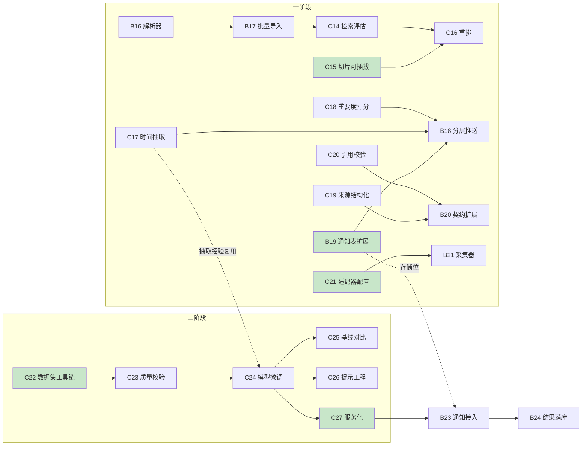

# 校捷通 · 成员2 与成员3 两阶段任务分工

> **依据**：`docs/两阶段科研创新迭代方案.md`（一阶段 4 模块 + 二阶段方向 1）
> **编制**：2026-09-12 ｜ 编制人：成员3
> **编号衔接**：成员2 从 **B16** 起（B1~B8 已用）｜ 成员3 从 **C14** 起（C1~C13 已用）
>
> **本文档的两个目的**：
> 1. **任务落地** —— 把两阶段方案细化到人、到文件、到验收标准；
> 2. **架构预备** —— 明确**现在就要做的结构改造**，使二阶段升级时**不需要推倒重来**（见 §5）。

---

## 一、分工边界（先定规则，避免扯皮）

两阶段涉及大量"模型 ↔ 服务"交界，必须先划清：

| 领域 | 成员3（我） | 成员2 |
|---|---|---|
| **算法与模型** | ✅ 抽取/打分/切片/重排/微调/评测 | ❌ |
| **数据层（C++）** | ✅ DAO / SQL / 索引 / 事务 | ❌（只调 `cpp_bridge`） |
| **服务编排与接口** | ❌ | ✅ 路由 / 契约 / SSE / 异步任务 |
| **知识库运维** | 切片质量、检索指标 | ✅ 采集、解析、入库管道 |
| **前端配合** | 提供数据契约 | 提供接口契约（两人共同与成员1 对接） |

**判据**：**"算法是否可离线跑"** —— 能离线评估的（抽取准确率、检索命中率）归成员3；
必须在线服务的（接口、调度、流式）归成员2。

---

## 二、一阶段任务（工程创新 · 中期 Demo）

### 2.1 模块① 校园领域 RAG

| 编号 | 任务 | 负责 | 产出物 | 验收标准 |
|---|---|---|---|---|
| **C14** | **检索质量评估框架** | 成员3 | `ai/eval/rag_bench.py`<br>20 条标注问答对 | Top-3 命中率 ≥ 80%；可一键出报告 |
| **C15** | **切片策略可插拔化** ⭐ | 成员3 | `services/chunker.py` 抽出 `ChunkStrategy` 接口，实现"固定长度"与"语义边界"两种 | 现有行为不回归；新增策略可注册 |
| **C16** | 检索重排模块 | 成员3 | `services/rerank.py` | 对比无重排，Top-3 命中率提升 ≥ 5 个百分点 |
| **B16** | HTML / PDF 文档解析器 | 成员2 | `services/parser/` 三个解析器 | 三种格式均可 `POST /admin/knowledge/ingest` 入库 |
| **B17** | 知识库批量导入管道 | 成员2 | 命令行脚本 + 进度反馈 | 120 篇可批量入库，失败可续传 |

> **C15 为何标 ⭐**：这是**为二阶段方向 2（动态切片）预留的扩展点**。若现在把切片逻辑写死，
> 二阶段要么改 `rag.py` 核心逻辑，要么复制一份 —— 都违背"升级不推倒重来"的目标。

### 2.2 模块② 通知风险预警

| 编号 | 任务 | 负责 | 产出物 | 验收标准 |
|---|---|---|---|---|
| **C17** | 时间实体抽取（规则+模型混合） | 成员3 | `services/notice_extract.py` | 测试集准确率 ≥ 85%；支持"9月30日前""本周五"等相对/绝对表述 |
| **C18** | 通知重要度打分 | 成员3 | 打分函数 + 依据输出 | 1~5 分；**每条附命中依据**（可解释） |
| **B18** | 分层推送调度（D-7 / D-2） | 成员2 | 定时任务 + 投递记录 | 待办提醒按时触达；`notice_delivery` 有记录 |
| **B19** | **通知表结构扩展** ⭐ | 成员2 | `13_notice_extend.sql` | 新增 `deadline`/`materials`/`target`/`importance` 字段，**可为空**（不破坏现有数据） |

> **B19 为何标 ⭐**：这是**为二阶段方向 1 的抽取结果预留存储位**。
> 若现在不建，二阶段抽出的实体无处可存，又得改表 —— 而**改表要全员同步 + 重编译 C++**（成本高）。
> **一次改到位，两个阶段都受益。**

### 2.3 模块③ 可信信息溯源

| 编号 | 任务 | 负责 | 产出物 | 验收标准 |
|---|---|---|---|---|
| **C19** | 来源结构化返回 | 成员3 | `sources` 含 `snippet`/`chunk_id`/`score` | 前端可直接渲染卡片，无需二次请求 |
| **C20** | **引用反向校验** | 成员3 | `services/citation_check.py` | 模型引用的片段若不在检索结果中 → 标记/剔除（防编造引用） |
| **B20** | `sources` 事件契约扩展 | 成员2 | 更新 SSE 事件 + `docs/api.md` | 契约向后兼容（旧字段保留） |

### 2.4 模块④ 可迁移高校适配引擎

| 编号 | 任务 | 负责 | 产出物 | 验收标准 |
|---|---|---|---|---|
| **C21** | **适配器配置结构设计** ⭐ | 成员3 | `backend/app/adapters/` + 配置 schema + 示例配置 | 可用一份配置描述一所学校（名称/校区/部门/术语映射/采集源） |
| **B21** | 配置驱动的采集器 | 成员2 | 按配置抓取并入库 | 配置新源后**无需改代码**即可入库；遵守 robots.txt + 限速 |

> **C21 为何标 ⭐**：这是**把"吉大专用"变成"全省可推广"的关键一步**，也是省级评审的核心叙事。
> 同时它**顺带解决**了已有的技术债 —— `library/index.js` 借用 `/map/building/1`、
> 二手详情无接口等硬编码问题，都可纳入适配器配置统一管理。

---

## 三、二阶段任务（科研深化 · 方向 1 轻量信息抽取）

### 3.1 数据集构建（核心贡献）

| 编号 | 任务 | 负责 | 产出物 | 验收标准 |
|---|---|---|---|---|
| **C22** | **数据集采集与标注工具链** ⭐ | 成员3 | `ai/dataset/` 采集脚本 + 标注辅助脚本 | 可批量采集、模型预标注、导出标准格式 |
| **C23** | 数据集质量校验 | 成员3 | 双人标注一致性脚本 | Cohen's Kappa ≥ 0.8；产出数据卡（规模/分布/划分） |
| **B22** | 采集合规与限速 | 成员2 | robots.txt 检查 + 限速模块 | 采集过程不违规；有日志可追溯 |

> **C22 为何标 ⭐**：**数据集本身就是科研成果**（可单独发布/申请软著）。
> 工具链若做得好，可复用到其他高校 —— 这又把一阶段的"可迁移"叙事串起来了。

### 3.2 模型与实验

| 编号 | 任务 | 负责 | 产出物 | 验收标准 |
|---|---|---|---|---|
| **C24** | 抽取模型微调 | 成员3 | 复用 `ai/finetune/` 的 QLoRA 流水线 | 微调 Qwen-1.5B / tiny 等轻量模型；产出训练报告 |
| **C25** | **基线对比实验** | 成员3 | `ai/eval/extract_bench.py` | 对比①零样本 ②few-shot ③已微调 `xjt-3b`；**F1 提升 ≥ 15 个百分点** |
| **C26** | 低资源提示工程优化 | 成员3 | prompt 模板对比实验 | 证明"优化 prompt 可减少标注需求"（如 100 条+优化 prompt ≈ 300 条+朴素 prompt） |

### 3.3 工程落地（与一阶段②绑定）

| 编号 | 任务 | 负责 | 产出物 | 验收标准 |
|---|---|---|---|---|
| **C27** | **抽取服务化** ⭐ | 成员3 + 成员2 | 模型封装为 HTTP 服务或注册为 Ollama 模型 | 后端可通过统一接口调用（与对话模型隔离） |
| **B23** | 通知解析接入抽取服务 | 成员2 | `notice` 入库时自动调用抽取 | 入库后 `deadline`/`materials`/`target` 被自动填充 |
| **B24** | 抽取结果落库与回填 | 成员2 | 写入 `notice` 扩展字段 | 抽取失败不阻塞入库（降级为空值） |

> **C27 为何标 ⭐**：这是**论文与产品的接合点**。
> 模型跑在论文里是 F1 指标，跑在系统里才叫落地 —— 服务化做得好，
> 二阶段成果就能**直接驱动一阶段的通知预警**，形成闭环。

---

## 四、任务依赖与关键路径



**关键路径（决定整体进度）**：

1. **B19（通知表扩展）→ B23（抽取接入）** —— 表结构不定，抽取结果无处存
2. **C22（数据集）→ C24（微调）→ C25（论文指标）** —— 论文核心链条，**越早启动越好**
3. **C15（切片可插拔）→ 二阶段方向 2** —— 若选方向 2，这是前置

> **建议**：**C22 立刻启动**（不受其他任务阻塞，且工作量最大）；
> **B19 尽早改表**（一次改表 + 一次 C++ 重编译，避免反复折腾）。

---

## 五、⭐ 为升级预留的架构改造（本文档重点）

> **原则**：**接口先行，实现渐进**。现在只把"扩展点"留出来，不实现全部策略 —— 避免过度设计。

| # | 改造点 | 现状 | 改造成 | 为谁预留 | 何时做 |
|---|---|---|---|---|---|
| 1 | **切片策略** | `chunk_text(content, size, overlap)` 固定长度 | 抽出 `ChunkStrategy` 接口 + 注册表；先实现"固定长度"，保留"语义边界"空实现 | 二阶段方向 2（动态切片） | **C15（本周）** |
| 2 | **检索管道** | `retrieve()` 单段 if-else | 改为管道数组：`[召回] → [重排] → [校验]`，各段可插拔 | 方向 2（可信度打分）+ C20（引用校验） | **C16（本周）** |
| 3 | **通知实体字段** | `notice` 表仅标题/正文/时间 | 加 `deadline`/`materials`/`target`/`importance`，**均允许 NULL** | 二阶段方向 1（抽取结果存储） | **B19（本周）** |
| 4 | **来源契约** | `sources`: `{title, content, source_url, score}` | 增 `snippet`/`chunk_id`/`verified`，**旧字段保留**（向后兼容） | ③溯源 + 方向 2 | **C19/B20（本周）** |
| 5 | **模型注册表** | `model_version` 表（已建） | 增 `task_type` 字段区分 `chat`/`extract`/`embed` | 方向 1（抽取模型登记） | **C24 时** |
| 6 | **适配器目录** | 无（硬编码 `building/1` 等） | 新建 `app/adapters/` + 配置 schema | ④可迁移引擎 | **C21（下周）** |
| 7 | **抽取服务接口** | 无 | 定义统一接口（`POST /extract` 或 Ollama 模型），**先定契约后实现** | C27 服务化 | **C27 前** |

### 5.1 改造 3 的建表语句（示例，供成员2 参考）

```sql
-- 13_notice_extend.sql —— 为二阶段抽取结果预留存储位
-- 设计要点：全部允许 NULL，不影响现有数据与查询
ALTER TABLE notice
    ADD COLUMN deadline    DATETIME     NULL COMMENT '抽取的截止时间（二阶段方向1）',
    ADD COLUMN materials   JSON         NULL COMMENT '材料清单（抽取出，数组）',
    ADD COLUMN target      VARCHAR(255) NULL COMMENT '通知对象（如"大创负责人"）',
    ADD COLUMN importance  TINYINT      NULL COMMENT '重要度 1~5（C18 打分结果）',
    ADD COLUMN extract_ver VARCHAR(32)  NULL COMMENT '抽取模型版本，便于对比实验',
    ADD INDEX idx_deadline (deadline),
    ADD INDEX idx_importance (importance);
```

> **`extract_ver` 字段的用意**：二阶段要做**多模型对比实验**，
> 同一通知可能被不同版本抽取过，保留版本号才能回溯"哪条记录是哪个模型抽的"。

### 5.2 改造 1 的接口草案（供成员3 实现）

```python
# services/chunker.py
from typing import Protocol

class ChunkStrategy(Protocol):
    """切片策略接口 —— 二阶段方向2 的动态切片只需新增一个实现。"""
    name: str
    def split(self, content: str, size: int, overlap: int) -> list[str]: ...

class FixedSizeStrategy:
    """现有行为（保持默认，不回归）。"""
    name = "fixed"
    def split(self, content, size, overlap): ...

class SemanticBoundaryStrategy:
    """二阶段方向2：按通知语义边界切片（当前留空实现）。"""
    name = "semantic"
    def split(self, content, size, overlap): ...
        raise NotImplementedError("二阶段实现")

_STRATEGIES: dict[str, ChunkStrategy] = {"fixed": FixedSizeStrategy()}
def register(strategy: ChunkStrategy) -> None: ...
def get_strategy(name: str = "fixed") -> ChunkStrategy: ...
```

> **成本评估**：抽出接口约 **30 行改动**，但能让二阶段**免于改动 `rag.py` 核心逻辑**。

---

## 六、协作接口约定（成员2 ↔ 成员3 的交接点）

| 交接点 | 成员3 交付 | 成员2 接收 | 契约形式 |
|---|---|---|---|
| 检索结果 | `retrieve()` 返回 `list[dict]` | 拼 prompt / 发 SSE | `{title, category, content, source_url, snippet, score, verified}` |
| 抽取结果 | `extract_notice(text)` 返回实体 dict | 写库 / 触发推送 | `{deadline, materials[], target, importance}` |
| 打分结果 | `score_importance(notice)` → `(score, reasons)` | 排序 / 推送决策 | `(int, list[str])` |
| 模型服务 | 服务地址 + 请求/响应格式 | 调用 | 需在 `docs/api.md` 登记（**改接口先改文档**） |
| 评测报告 | `ai/eval/*.md` 报告 | 引用到文档/答辩 | Markdown |

> **铁律**（团队约定）：**改接口先改 `docs/api.md` 再动代码**。
> 上述契约凡涉及 HTTP 的，必须先落到 `api.md`。

---

## 七、同步到任务清单

本文档的任务已登记为 `docs/技术方向待处理问题.md` 中的：

| 清单编号 | 对应任务 |
|---|---|
| `FEAT-07` | 一阶段 4 模块（C14~C21 / B16~B21） |
| `FEAT-08` | 二阶段方向 1（C22~C27 / B22~B24） |
| `ARCH-04` | B18 依赖的任务队列基础设施 |

> **清单为本、本文档为细**：清单给"为什么"和"验收方式"，本文档给"怎么做、谁做、什么顺序"。

---

## 八、排期建议（与总方案 W1~W16 对齐）

| 周次 | 成员3（我） | 成员2 | 里程碑 |
|---|---|---|---|
| **W1** | C14 检索评估框架<br>**C15 切片可插拔** ⭐ | **B19 通知表扩展** ⭐<br>B16 解析器 | 扩展点就位 |
| **W2** | C16 重排 | B17 批量导入（120 篇） | 检索达标 ≥80% |
| **W3** | C17 时间抽取<br>C18 重要度打分 | B18 分层推送 | 通知预警可演示 |
| **W4** | C19 来源结构化<br>C20 引用校验 | B20 契约扩展 | 溯源可演示 |
| **W5** | **C22 数据集工具链** ⭐ | B21 配置驱动采集器 | 语料与工具就绪 |
| **W6** | C21 适配器配置<br>C23 质量校验 | B22 采集合规 | 可迁移性证据 |
| **W7~W8** | **C24 模型微调** | B23 通知接入抽取 | 中期检查 |
| **W9~W10** | C25 基线对比<br>C26 提示工程 | B24 结果落库 | 论文指标产出 |
| **W11~W12** | C27 服务化 ⭐ | 联调 + 文档 | 工程科研闭环 |
| **W13~W16** | 论文撰写 + 实验补充 | 系统验收 | 论文投稿 |

---

## 附：一页纸任务总表（可打印贴墙）

| 编号 | 任务 | 负责 | 周次 | 状态 |
|---|---|---|---|---|
| C14 | 检索质量评估框架 | 成员3 | W1 | ⬜ |
| C15 | ⭐ 切片策略可插拔化 | 成员3 | W1 | ⬜ |
| C16 | 检索重排模块 | 成员3 | W2 | ⬜ |
| C17 | 时间实体抽取 | 成员3 | W3 | ⬜ |
| C18 | 通知重要度打分 | 成员3 | W3 | ⬜ |
| C19 | 来源结构化返回 | 成员3 | W4 | ⬜ |
| C20 | 引用反向校验 | 成员3 | W4 | ⬜ |
| C21 | ⭐ 适配器配置结构 | 成员3 | W6 | ⬜ |
| C22 | ⭐ 数据集工具链 | 成员3 | W5 | ⬜ |
| C23 | 数据集质量校验 | 成员3 | W6 | ⬜ |
| C24 | 抽取模型微调 | 成员3 | W7~W8 | ⬜ |
| C25 | 基线对比实验 | 成员3 | W9~W10 | ⬜ |
| C26 | 提示工程优化 | 成员3 | W9~W10 | ⬜ |
| C27 | ⭐ 抽取服务化 | 成员3+2 | W11 | ⬜ |
| B16 | HTML/PDF 解析器 | 成员2 | W1 | ⬜ |
| B17 | 知识库批量导入 | 成员2 | W2 | ⬜ |
| B18 | 分层推送调度 | 成员2 | W3 | ⬜ |
| B19 | ⭐ 通知表扩展 | 成员2 | W1 | ⬜ |
| B20 | sources 契约扩展 | 成员2 | W4 | ⬜ |
| B21 | 配置驱动采集器 | 成员2 | W5 | ⬜ |
| B22 | 采集合规与限速 | 成员2 | W6 | ⬜ |
| B23 | 通知接入抽取服务 | 成员2 | W7~W8 | ⬜ |
| B24 | 抽取结果落库 | 成员2 | W9~W10 | ⬜ |

> ⭐ 标记的 5 项为**架构预备任务**：改动小（合计约 100 行），但能让二阶段升级**免于推倒重来**。
