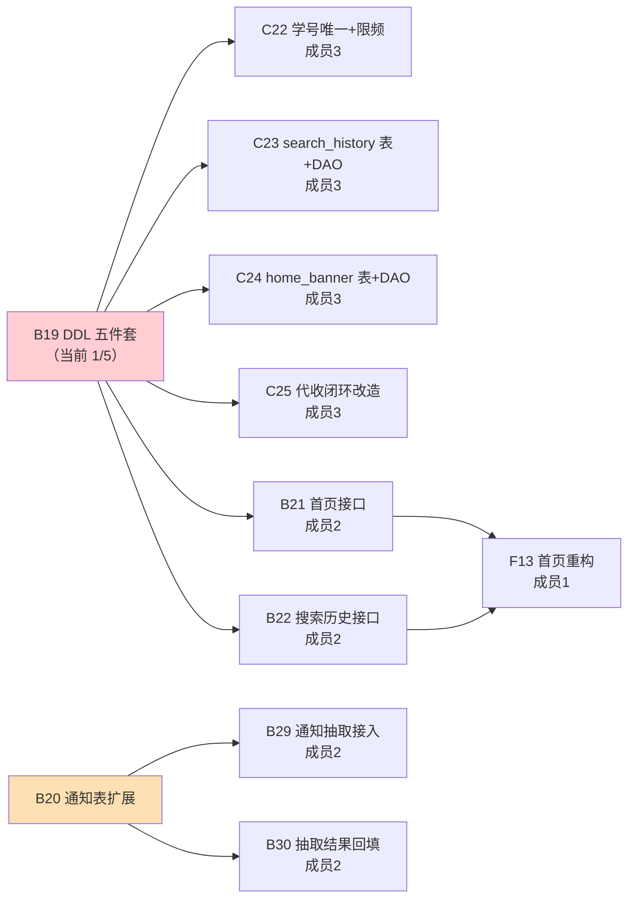

# 给成员4的协作指令 · B19/B20 关键路径解堵（2026-09-14）

> **发起人**：成员3　｜　**协作者**：成员3（C++/DB 层）+ **成员4（本指令的执行人）**
> **目标**：把 `B19`（DDL 打包）+ `B20`（通知表扩展）从"零进展"推到**可合并**，解开卡住 4 个人的阻塞链。
> **本指令所有"现状"数字都是 2026-09-14 实测**，不是抄文档。发现与文档不一致的地方已在 §4 单独标出。

---

## 0. 一句话分工

| 谁 | 拿什么 | 为什么这么分 |
|---|---|---|
| **成员4** | `15_home_banner.sql` · `16_search_history.sql` · **3 个 `.ps1` 补 BOM** | 全是**新建、无历史数据**、**不需要碰 C++ 编译链**；且**原始方案文档里 DDL 脚本本来就是成员4 的活**（见 §3 依据） |
| **成员3** | `17_user_student_no.sql` · `18_takeaway_pickup.sql` · B20 的 **DAO 改造 + 重编译 `jt_db`** | 必须动**历史数据**（64 行空串学号、`takeaway_order` 回填）且必须重编译 C++ |

**两条线互不依赖，可以完全并行、各自独立提 PR。** 谁先做完谁先合，**不用等对方**。

---

## 1. 为什么现在做

`B19` 是二阶段 **W1 的最长阻塞链**，实测**五件套只完成 1/5**：

| 脚本 | dev | PR #60 |
|---|---|---|
| `14_notice_extend.sql`（B20 本体） | ❌ | ✅ 已写好 |
| `15_home_banner.sql` | ❌ | ❌ |
| `16_search_history.sql` | ❌ | ❌ |
| `17_user_student_no.sql` | ❌ | ❌ |
| `18_takeaway_pickup.sql` | ❌ | ❌ |

**它卡着谁**：



---

## 2. 权威字段契约（**照抄，不要自己改名**）

出处：`docs/二阶段整改方案-前端UI重构与后端支撑.md` L323-324（该文档用旧编号 `C29`/`C30`，对应现 `C23`/`C24`）

```
| C29 | 新建 `user_search_history` 表 + DAO | 成员3 | 含 `user_id`/`keyword`/`created_at`，按 `(user_id, created_at)` 索引 |
| C30 | 新建 `home_banner` 表 + DAO | 成员3 | `title`/`image`/`link_type`/`link_target`/`sort`/`start_at`/`end_at`/`enabled` |
| D7  | 上述表 的 DDL 脚本（`14_home_banner.sql` 等） | **成员4** | 统一编号 + 幂等 |
```

> ✅ **这就是让成员4 做这两张表的依据**：DDL 脚本原本的责任人写的就是成员4（`D7`），
> 只是后来任务单 v3 把它改号为 `B19` 并划给了成员2。现在**回归原分工**，不算越权。

---

## 3. 成员4 的 4 项任务

### 任务 ①：`db/sql/15_home_banner.sql`（新建表 + 种子）

- **交付物**：`db/sql/15_home_banner.sql`
- **现状（实测）**：`home_banner` 表**不存在**（`information_schema.tables` 计数 = 0）
- **要做什么**：建 `home_banner` 表（8 个业务字段 + id/时间戳）+ 索引 + **3 条演示种子**（首页轮播没有内容就没法演示）

**字段规格**（类型供参考，可按下面直接写）：

| 列 | 类型 | 说明 |
|---|---|---|
| `id` | `BIGINT UNSIGNED NOT NULL AUTO_INCREMENT` | 主键 |
| `title` | `VARCHAR(128) NOT NULL DEFAULT ''` | 轮播标题 |
| `image` | `VARCHAR(255) NOT NULL DEFAULT ''` | 图片 URL |
| `link_type` | `VARCHAR(32) NOT NULL DEFAULT ''` | 跳转类型（如 `notice`/`page`/`url`/`none`） |
| `link_target` | `VARCHAR(255) NOT NULL DEFAULT ''` | 跳转目标（页面路径 / 公告 id / URL） |
| `sort` | `INT NOT NULL DEFAULT 0` | 排序，**越大越前**（⚠️ 排序方向未经验证，**请与成员2 的 B21 对齐**；本指令按"越大越前"假定） |
| `start_at` | `DATETIME NULL DEFAULT NULL` | 生效开始，NULL = 立即生效 |
| `end_at` | `DATETIME NULL DEFAULT NULL` | 生效结束，NULL = 永不过期 |
| `enabled` | `TINYINT NOT NULL DEFAULT 1` | 1 启用 / 0 停用 |
| `created_at` | `DATETIME NOT NULL DEFAULT CURRENT_TIMESTAMP` | |
| `updated_at` | `DATETIME NOT NULL DEFAULT CURRENT_TIMESTAMP ON UPDATE CURRENT_TIMESTAMP` | |

**索引**：`KEY idx_enabled_sort (enabled, sort)`

**验收**：`SELECT * FROM home_banner` 能出 3 条；`enabled=1` 且时间窗内的按 `sort DESC` 排在最前。

---

### 任务 ②：`db/sql/16_search_history.sql`（新建表）

- **交付物**：`db/sql/16_search_history.sql`
- **现状（实测）**：`user_search_history` 表**不存在**
- **要做什么**：建表，满足任务单验收「**写入自动去重**」「**按 `(user_id, created_at)` 查询高效**」

| 列 | 类型 | 说明 |
|---|---|---|
| `id` | `BIGINT UNSIGNED NOT NULL AUTO_INCREMENT` | 主键 |
| `user_id` | `BIGINT UNSIGNED NOT NULL` | 逻辑外键 → `user.id` |
| `keyword` | `VARCHAR(128) NOT NULL` | 搜索词 |
| `created_at` | `DATETIME NOT NULL DEFAULT CURRENT_TIMESTAMP` | 最后一次搜索时间 |

**索引**：
- `UNIQUE KEY uk_user_keyword (user_id, keyword)` ← **去重靠它**（同人同词只留一行）
- `KEY idx_user_created (user_id, created_at)` ← 任务单明确要求的查询路径

> ⚠️ **契约提示**（写给成员2 的 B22 DAO）：有了唯一键，「重复搜索」必须写成
> `INSERT ... ON DUPLICATE KEY UPDATE created_at = CURRENT_TIMESTAMP`（把旧记录"顶"到最前），
> 而不是裸 `INSERT`（会 `ERROR 1062`）。请在本脚本注释里写明这一点。

---

### 任务 ③：~~B20 的 Pydantic 契约~~ —— ✅ **已取消，已由成员3 完成**

> ⚠️ **本指令初版在这里给错了任务，特此更正。**
>
> 初版让你建 `backend/app/schemas/notice_extend.py`。实测发现**这个目录根本不存在**：
> 本仓 30 个 `BaseModel` **全部内联在 `routers/*.py`**，而且**只有请求模型 `*In`**，
> 响应统一走 `ok(dict)`（`attach_extended_fields()` 直接给 dict 打补丁）。
> ⇒ 照初版做会造出一个**没有任何调用方的死模块**。**不要做这件事。**

**正确的做法（已由成员3 在 PR #73 落地，你无需重复）**：把契约落成**可执行断言** ——
新增 `backend/tests/test_notice_extend_contract.py`，核心是**把 DDL 与 Python 常量绑死**：

- `db/sql/14_notice_extend.sql` 新增的列 == `notice._EXTENDED_NAMES` == `notice_scheduler.EXTENDED_COLUMN_NAMES`
- 未导入 DDL ⇒ 不 SELECT 这 3 列、**一条补查 SQL 都不发**、接口不出现这 3 个字段（旧字段一个不少）
- 导入后 ⇒ 能 SELECT 到、按 id 合并、缺行补 `None`

**参考**：https://github.com/asuperj1/xiaojietong-project/pull/73

> 📌 **对你的影响**：任务 ③ **不用做了**。你只剩 ①②④ 三项。
> 注意 PR #73 的目标分支是 `feature/backend`（PR #60 的 head）；它合入后再同步 `dev` 即可。

---

### 任务 ④：给 3 个 `.ps1` 补 UTF-8 BOM（**PR #60 的阻断项**）

- **交付物**：`backend/tests/` 下 3 个文件的**编码修正**
  - `gen_kb_bench.ps1`
  - `make_kb_pdf_samples.ps1`
  - `verify_b16_b18.ps1`
- **现状（实测）**：这 3 个文件**都缺 UTF-8 BOM**，在团队默认的 **Windows PowerShell 5.1** 下
  语法错误数分别为 **17 / 2 / 13**，**完全无法解析执行**。而仓库既有 4 个 `.ps1` **全部有 BOM、错误数 0**。

**为什么必须修**：PowerShell 5.1 对**无 BOM** 的 `.ps1` 按系统 ANSI（GBK/936）读；
UTF-8 中文占 3 字节，被当 GBK 解析时会把后面的 ASCII 字节当"尾字节"吞掉 ——
**`{`=0x7B、`}`=0x7D 正好落在 GBK 尾字节区间 `0x40–0x7E`**，于是报「缺少右 `}`」。
（归因已用反向对照坐实：**只补 BOM、内容一字不改 → 错误数 13 → 0**。）

**修法（任选，推荐第 1 个）**：
1. 编辑器里"另存为 → 编码选 **UTF-8 with BOM**"；
2. 或跑 §附 B 的一行 PowerShell 命令。

**验收**：3 个文件语法错误数 = **0**，且 `verify_b16_b18.ps1` **实跑 EXIT=0** 并贴输出。

---

## 4. ⚠️ 与文档不一致的两处（**请以此处实测为准**）

| 项 | 文档写的 | 实测 | 影响 |
|---|---|---|---|
| `user` 表空串学号行数 | **63 行** | **64 行** | 成员3 的 `17_` 脚本会按**动态清洗**写（`WHERE student_no=''`），不写死 63，所以**对成员4 无影响** |
| `C25` 的代收表名 | 曾写 `life_order` | 真实表是 **`takeaway_order`（存在）**，`life_order` 不存在 | 同上，归成员3 |

`pickup_point` 表**不存在**（实测计数 = 0）—— 归成员3 的 `18_`。

---

## 5. 🚫 铁律（请不要做的事）

1. **不要动 `db/sql/14_notice_extend.sql`** —— 它是 B20 本体，已由成员2 在 PR #60 里写好并通过幂等实测。你只做 `15_`/`16_`。
2. **建表不要用 `DROP TABLE IF EXISTS`！**
   本仓既有 `09_life.sql` 是 `DROP + CREATE` 的写法，但那是**首次建库脚本**。
   `B19` 的硬要求是「**幂等可重跑**」—— 用 `DROP` 会导致**重跑即清空线上数据**。
   ⇒ 请用 **`CREATE TABLE IF NOT EXISTS`**（模板见 §附 A）。
3. **不要推 `dev` / `main`**（分支保护，禁直推）。走 PR。
4. **PR 的 base 必须是 `dev`** —— 建 PR 时 GitHub 会**默认重置成 `main`**，必须手动改；
   直接开链接最稳：`https://github.com/asuperj1/xiaojietong-project/compare/dev...<你的分支>?expand=1&base=dev`
   （这个错误本组已犯过 4 次：`#52` `#64` `#69` `#70`）
5. **不要改成员3 的文件**（`17_`/`18_`/`life_dao.cpp`/`services/knowledge.py` 等），避免冲突。
6. **不要改 `db/sql/README.md` 之外的既有 SQL 文件**。若需要登记，只加一行。

---

## 6. 提交与 PR 流程

```powershell
# 1) 从 dev 拉分支（分支名按协议 feat/<用户名>-<功能>）
git fetch github
git switch -c feat/<你的用户名>-b19-ddl-banner-search github/dev

# 2) 写文件：db/sql/15_home_banner.sql、db/sql/16_search_history.sql
#            （Pydantic 契约已取消 —— 契约测试由成员3 在 PR #73 完成，不要重复做）
#            3 个 .ps1 的编码修正（BOM）

# 3) 自测（见 §7），全绿再提交
# 4) commit（Conventional Commits，中文描述，一事一 commit）
git add db/sql/15_home_banner.sql db/sql/16_search_history.sql
git commit -m "feat(db): B19 新增 home_banner / user_search_history 幂等建表脚本"
git add backend/tests/*.ps1
git commit -m "fix(backend): 3 个 ps1 补回 UTF-8 BOM（PowerShell 5.1 下无法解析）"

# 5) 推送 + 建 PR（base 手动确认 = dev）
git push github HEAD
```

> 💡 **建议拆 2 个 PR**：`15_/16_`（DDL）一个、3 个 `ps1` 的 BOM（后端小修）一个。
> ⚠️ 3 个 `ps1` 的 BOM 修复**成员3 已在 PR #73 做掉了** —— 先确认 #73 是否已合，
> 若已合就**不要再动这 3 个文件**（否则会冲突）；若未合，你也不必重复修。

---

## 7. 验收清单（成员4 自检，逐条打勾再交）

- [ ] `db/sql/15_home_banner.sql` 在 **`dev`** 上存在
- [ ] 连跑两遍 `mysql < 15_home_banner.sql`（第二遍**不报错**、数据**不丢**）→ 贴输出
- [ ] `SELECT * FROM home_banner` 出 3 条种子
- [ ] `db/sql/16_search_history.sql` 在 **`dev`** 上存在
- [ ] 连跑两遍 16 号脚本（同样不报错、不丢数据）→ 贴输出
- [ ] `SHOW INDEX FROM user_search_history` 含 `uk_user_keyword` + `idx_user_created`
- [ ] ~~`backend/app/schemas/notice_extend.py` 能 import~~ → **已取消**（契约测试由成员3 在 PR #73 完成）
- [ ] `pytest tests -q` 全绿（PR #73 合入后应为 **83 passed**；不足 83 说明缺了契约测试那 11 条）
- [ ] ~~3 个 `.ps1` 语法错误数 = 0~~ → **成员3 已在 PR #73 修掉**；你若基于陈旧代码工作，请先 rebase
- [ ] `verify_b16_b18.ps1` 实跑 **EXIT=0** → 贴输出（修复 BOM 后已可执行）
- [ ] PR **base = `dev`**（截图确认）

---

## 8. 合并顺序（两条线互不阻塞）

```
成员4: 15_home_banner.sql  ┐
       16_search_history.sql┘─→ PR-A ─→ 合入 dev        （不依赖任何人）
成员3: 3 个 ps1 补 BOM + B20 契约测试 ─→ **PR #73** ─→ 合入 feature/backend ─→ 同步 dev
                                                              ↓ 立刻解掉 PR #60 的 BOM 阻断项
成员3: 17_user_student_no.sql ┐
       18_takeaway_pickup.sql ┘─→ PR-C ─→ 合入 dev
成员3: LifeDAO 改造 + 重编译 jt_db ─→ PR-D ─→ 合入 dev
                                                              ↓
                                        DDL 执行（14~18 一起跑）+ 重编译一次 → C22~C25 / B21~B22 全部解锁
```

---

## 附 A · 幂等建表模板（**可直接复制改写**）

```sql
-- ============================================================
-- B19 · 首页轮播表 home_banner（成员4）
--
-- 幂等性：用 CREATE TABLE IF NOT EXISTS —— 重复执行不报错、**不清空数据**。
--         ⚠️ 不要照抄 09_life.sql 的 DROP TABLE IF EXISTS，那是首次建库脚本；
--         本脚本线上会被重跑，DROP 等于丢数据。
-- 字段契约：docs/二阶段整改方案-前端UI重构与后端支撑.md L324
-- ============================================================
USE xiaojietong;

CREATE TABLE IF NOT EXISTS `home_banner` (
    `id`          BIGINT UNSIGNED NOT NULL AUTO_INCREMENT COMMENT '主键',
    `title`       VARCHAR(128)    NOT NULL DEFAULT ''        COMMENT '轮播标题',
    `image`       VARCHAR(255)    NOT NULL DEFAULT ''        COMMENT '图片 URL',
    `link_type`   VARCHAR(32)     NOT NULL DEFAULT ''        COMMENT '跳转类型 notice/page/url/none',
    `link_target` VARCHAR(255)    NOT NULL DEFAULT ''        COMMENT '跳转目标',
    `sort`        INT             NOT NULL DEFAULT 0         COMMENT '排序，越大越靠前',
    `start_at`    DATETIME        NULL     DEFAULT NULL      COMMENT '生效开始，NULL=立即',
    `end_at`      DATETIME        NULL     DEFAULT NULL      COMMENT '生效结束，NULL=永不过期',
    `enabled`     TINYINT         NOT NULL DEFAULT 1         COMMENT '1启用 0停用',
    `created_at`  DATETIME        NOT NULL DEFAULT CURRENT_TIMESTAMP,
    `updated_at`  DATETIME        NOT NULL DEFAULT CURRENT_TIMESTAMP ON UPDATE CURRENT_TIMESTAMP,
    PRIMARY KEY (`id`),
    KEY `idx_enabled_sort` (`enabled`, `sort`)
) ENGINE=InnoDB DEFAULT CHARSET=utf8mb4 COLLATE=utf8mb4_unicode_ci COMMENT='首页轮播';

-- 自检：应看到 11 个列 + idx_enabled_sort
SELECT column_name AS `列`, column_type AS `类型`, is_nullable AS `可空`
FROM information_schema.columns
WHERE table_schema = DATABASE() AND table_name = 'home_banner'
ORDER BY ordinal_position;

-- 种子：固定主键 + ON DUPLICATE KEY UPDATE ⇒ 重跑不产生重复行
INSERT INTO `home_banner` (`id`, `title`, `image`, `link_type`, `link_target`, `sort`, `enabled`)
VALUES
    (1, '校园通知新版上线', '/static/images/banner-notice.png', 'page', '/pages/notice/index', 30, 1),
    (2, 'AI 助手帮你答疑',  '/static/images/banner-ai.png',     'page', '/pages/ai/index',     20, 1),
    (3, '二手交易更放心',   '/static/images/banner-second.png', 'page', '/pages/second/index', 10, 1)
ON DUPLICATE KEY UPDATE
    `title` = VALUES(`title`), `image` = VALUES(`image`),
    `link_type` = VALUES(`link_type`), `link_target` = VALUES(`link_target`),
    `sort` = VALUES(`sort`), `enabled` = VALUES(`enabled`);
```

**16 号脚本同法**，只换表名与列：

```sql
USE xiaojietong;

CREATE TABLE IF NOT EXISTS `user_search_history` (
    `id`         BIGINT UNSIGNED NOT NULL AUTO_INCREMENT COMMENT '主键',
    `user_id`    BIGINT UNSIGNED NOT NULL                COMMENT '逻辑外键 -> user.id',
    `keyword`    VARCHAR(128)    NOT NULL                COMMENT '搜索词',
    `created_at` DATETIME        NOT NULL DEFAULT CURRENT_TIMESTAMP COMMENT '最后一次搜索时间',
    PRIMARY KEY (`id`),
    UNIQUE KEY `uk_user_keyword` (`user_id`, `keyword`),   -- 去重：同人同词只留一行
    KEY `idx_user_created` (`user_id`, `created_at`)       -- 倒序拉取用
) ENGINE=InnoDB DEFAULT CHARSET=utf8mb4 COLLATE=utf8mb4_unicode_ci COMMENT='用户搜索历史';
```

> ⚠️ **sql_mode 提示**：`ON DUPLICATE KEY UPDATE` 里用了 `VALUES(col)`，该语法在 **MySQL 8.0.20+ 已标记废弃**
> （仍可用，会告警）。本机是 8.0.46，**能跑**；若想彻底消警，可改成
> `INSERT ... AS new ON DUPLICATE KEY UPDATE title = new.title`。二选一即可，别混用。

---

## 附 B · BOM 修复与自检（**一行命令**）

**先查**（无需运行脚本，只做语法解析）：

```powershell
# 期望输出 0；当前分别是 17 / 2 / 13
foreach($f in 'gen_kb_bench.ps1','make_kb_pdf_samples.ps1','verify_b16_b18.ps1'){
  $p = "backend/tests/$f"
  $e = $null
  [void][System.Management.Automation.Language.Parser]::ParseFile((Resolve-Path $p), [ref]$null, [ref]$e)
  Write-Host ("  {0,-28} 错误数 = {1}" -f $f, $e.Count)
}
```

**再修**（补 BOM，**内容一字不改**；用 .NET 写不会动换行）：

```powershell
$utf8Bom = New-Object System.Text.UTF8Encoding $true
foreach($f in 'gen_kb_bench.ps1','make_kb_pdf_samples.ps1','verify_b16_b18.ps1'){
  $p = (Resolve-Path "backend/tests/$f").Path
  $txt = [System.IO.File]::ReadAllText($p, [System.Text.UTF8Encoding]::new($false))
  [System.IO.File]::WriteAllText($p, $txt, $utf8Bom)      # $true = 带 BOM
  Write-Host "  已补 BOM: $f"
}
```

**复验 + 实跑**：

```powershell
cd backend
$env:XJT_DB_PASSWORD='<密码>'; $env:XJT_DB_PORT='3307'
powershell -NoProfile -ExecutionPolicy Bypass -File tests\verify_b16_b18.ps1   # 期望 EXIT=0
```

> 💡 提交时注意：**只改编码、不改内容**，所以 `git diff` 可能显示"整个文件重写"。
> 建议 `git diff --stat` 确认只是这一个文件，并在 commit message 里写明「仅补 BOM，内容未改」。

---

## 附 C · 参考文件（照抄风格与幂等守卫写法）

| 文件 | 看什么 |
|---|---|
| `db/sql/14_notice_extend.sql` | **幂等 DDL 的守卫写法**（`information_schema` 判定 + `PREPARE` 动态执行 + 自检 + 回滚注释）。注：那是 `ALTER TABLE` 的场景，**建表用 `CREATE TABLE IF NOT EXISTS` 更简单** |
| `db/sql/09_life.sql` | 建表风格：类型宽度、`ENGINE=InnoDB DEFAULT CHARSET=utf8mb4 COLLATE=utf8mb4_unicode_ci COMMENT=...`、索引命名 `idx_*` |
| `db/sql/19_topic_fulltext.sql` | 另一份幂等 DDL 范例（含 PREPARE 分支） |
| `db/sql/README.md` | 新增脚本要在这里登记一行 |

---

## 附 D · 有疑问找谁

| 问题 | 找谁 |
|---|---|
| `home_banner` 字段够不够 B21 用 | 成员2（B21 作者） |
| `user_search_history` 去重语义 | 成员2（B22 作者）+ 成员3 |
| B20 契约测试与 DAO/接口层如何衔接 | 成员3（见 `tests/test_notice_extend_contract.py`）|
| PowerShell 编码 / `.ps1` 语法 | 成员3（本项已实测过归因） |
| 分支/PR/保护规则 | 见 `docs/团队Git合作协议.md` |
