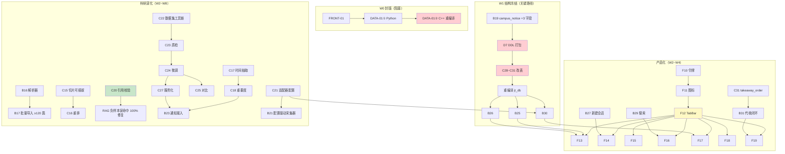

# 校捷通 · 二阶段任务总表（v2 全量重排 · 2026-09-12）

> **本版核心变更（v1 → v2）**：按**编号分界**重新定义阶段 —— **`B16+` / `C14+` / `F10+` / `D7+` 一律归二阶段**。
> 因此 v1 中被拆到「三阶段」的 `C22~C27` **回归二阶段**；三阶段改为**部署上线与推广（非编号工作）**。
> **配套**：`docs/二阶段整改方案-前端UI重构与后端支撑.md`（技术方案）· `docs/成员2与3两阶段任务分工.md`（C/B 明细）· **跟踪议题**：[#43](https://github.com/asuperj1/xiaojietong-project/issues/43)
> **规则**：Git 协作以 `docs/团队Git合作协议.md` 为准（`main` 禁推、PR 一律 → `dev`）；「完成」= **真机/真数据可演示**；每个页面/接口**独立分支 + PR**
> **权威性**：本文负责**顺序 / 归属 / 波次**；单项任务的**详细产出与验收标准**以 `docs/成员2与3两阶段任务分工.md` 与 `docs/二阶段整改方案…md` 为准。

---

## 第 0 部分 · 阶段与编号分界（**本版核心**）

| 阶段 | 定位 | 编号区间 | 现状 |
|---|---|---|---|
| **① 一阶段（已完成）** | 工程底座（中期 Demo） | 后端 `B1~B15` · 前端 `F1~F9` · 数据/AI `C1~C13` · DB/文档 `D0~D6` | ✅ 已合 `dev@bbb2ca9` |
| **② 二阶段（本表主战场）** | **产品化整改 + 科研深化**（**双线并行**） | 后端 **`B16` 起** · 前端 **`F10` 起** · 数据/AI **`C14` 起** · DB/文档 **`D7` 起** | 🔵 待开工（`C14` 已交付、**待合入 `dev`**） |
| **③ 三阶段** | **部署上线与省级推广**（**非编号工作**） | — | ⚪ 二阶段后 |
| **贯穿** | 一阶段需整改（审计编号） | `SEC-` / `DATA-` / `FRONT-` / `CAC-` / `CON-` / `ENG-` | 🔧 **并入二阶段波次**，不单列章节 |

### 二阶段两条主线（**同一阶段内并行，不是前后关系**）

| 主线 | 内容 | 编号 | 目标 |
|---|---|---|---|
| **A. 产品化整改** | 液态玻璃 UI 重构 + 5 页重构 + 后端支撑 + 外卖改代收 | `F10~F19` · `B25~B31` · `C28~C33` · `D7~D11` | 省级评审**可演示、可体验** |
| **B. 科研深化** | 一阶段 4 模块收尾（RAG/通知预警/溯源/适配）+ 轻量信息抽取主线 | `C14~C27` · `B16~B24` · `D12~D13` | **论文 / 软著 / 答辩**产出 |

> ⚠️ **为什么两条线都在二阶段**：`B16~B24` / `C14~C27` 是**一阶段规划的 4 个科研创新模块**与**轻量信息抽取主线**
> （数据集→微调→对比→服务化）的落地任务，按产品方口径**统归二阶段**。
> 二者与 UI 重构**无代码冲突**（前者在 `services/` + `ai/`，后者在 `miniprogram/`），可安全并行。

### 0.1 v1 → v2 修正记录（含 **9 项事实纠错**）

| # | v1 说法 | **实测核查结果** | v2 处理 |
|---|---|---|---|
| 1 | `C15~C27` / `B16~B24` 归"三阶段"或"遗留" | 按新口径**全部属二阶段** | 并入 §3.1 / §3.2 |
| 2 | 三阶段新编号 `C34~C39` | 与既有 `C22~C27` **同名同义** → **重复立项** | **作废**，统一用 `C22~C27` |
| 3 | `B19` 扩展 **`notice` 表** | ❌ **`notice` 表不存在**！真实表 = **`campus_notice`**；且 `target` 已以 **`target_grade`** 存在 | 改为 `campus_notice`，**只需加 3 字段**（`deadline`/`materials`/`importance`） |
| 4 | `B19` 产出 `13_notice_extend.sql` | ❌ **编号冲突**：`13_index_optimize.sql` 已占用 | 改为 **`14_notice_extend.sql`**（`D7` 全域重编号） |
| 5 | `C28` 需给 `user` **加** `student_no` | ❌ **`student_no` 已存在** | 改为：加**唯一索引** + `student_no_updated_at` + `token_version` |
| 6 | `B18` 分层推送需从 0 建 | ✅ **`notice_delivery` 表已完整**（`channel`/`score`/`reason`/`is_exposed`/`is_read`） | `B18` 只差**定时触发**，不是从 0 |
| 7 | `C31` 改 `life_order` | ❌ 真实表 = **`takeaway_order`** | 改为 `takeaway_order` + 新建 `pickup_point` |
| 8 | `C14` 列在一阶段已完成 | 按新口径属二阶段；且**未合入 `dev`**（当前在 `test/beta-assets`） | 移入 §3.1，标注「已交付 · 待合入」 |
| 9 | "知识库 120 篇"为附属项 | ❌ 实测 **27 篇**（`knowledge_doc status=1`）= **硬指标缺口** | 提升为 `B17` 的**验收门槛**，W2 内必须达标 |

---

## 第 1 部分 · 一阶段已完成（基线盘点 · **只读**）

> 用途：新成员快速了解"已经有什么"，**不要重复开发**。以下均为**已实测**能力。

### 1.1 后端 `B1 ~ B15` ✅（已合 `dev@bbb2ca9`）

| 编号 | 内容 | 状态 |
|---|---|---|
| B1~B5 | 底座：13 表设计 + 统一响应/错误码 + JWT 登录 + 上传 + 分页 | ✅ |
| B6 | 内容审核闭环（词库规则 + 模型二次判定 + `audit_log` 留痕 + 轮询/批量审核） | ✅ |
| B7 | Agent 三级链路（Function Call → 规则兜底**真写库** → `status=3` 明确失败） | ✅ |
| B8 | 可观测性（`/health/detail`、`/health/selfcheck`） | ✅ |
| B9 | 二手 AI（三级定价回退 + 价格护栏 + `GET /items/{id}` + `POST /items/ai-price`） | ✅ |
| B10 | 通知精准推荐（标签+行为+年级+时效打分 + 投递懒生成 + 未读三接口） | ✅ |
| B11 | 帖子个性推荐（混合打分 + 逐条 score/reason + 冷启动回落热度榜） | ✅ |
| B12 | 工程化基线（`.env.example` 32 项 + pytest 骨架） | ✅ |
| B13 | 路网导航（网格 A\* + 绕行折线 + `straight_distance` + 8 个 POI 种子） | ✅ |
| B14 | 上传加固（HMAC 签名 URL + 存储抽象 + 篡改/过期 403 + `storage.resign()` 闭环） | ✅ |
| B15 | Celery + Redis 异步化（**默认 eager 降级**，无 Redis 亦可运行） | ✅ |

### 1.2 前端 `F1 ~ F9` ✅（29 页已合 `dev`）

`F1` 工程三件套 · `F2` 登录页 · `F3` 首页 · `F4` AI 对话（SSE） · `F5` 空教室 · `F6` 座位预约 · `F7` 论坛 · `F8` 我的 · `F9` 业务页（二手/兼职/地图/生活）

### 1.3 数据层 / AI `C1 ~ C13` ✅

`C1` 微调流水线骨架 · `C2` 训练数据 · `C3` 知识库 **27 篇** · `C4/C5` QLoRA 试跑 + GGUF（产出 **`xjt-3b`**） · `C6` 性能压测素材 · `C7~C13` 数据/评测基础

> ⚠️ **`C14`（RAG 检索评估框架）不在本表** —— 按新口径属二阶段，见 §3.1（**已交付**，hit@3 = 100%）。

### 1.4 DB / 文档 `D0 ~ D6` ✅

`D0` 明文密码清理 · `D1` 训练语料 · `D3` 需求说明书 · `D4` ER 图 · `D5` api.md 维护 · `D6` auto-sync 推广

---

## 第 2 部分 · 🔴 二阶段前置：**封测必修**（阻塞，先于一切）

> 封测（238 例）是**一阶段的关门动作**，但代码仍在 `dev` 上 —— 因此这 6 项必须在 **W0/W1** 完成。
> 依据：`docs/项目审计报告20260912序1.md` + `docs/项目审计报告260910序2-技术专项.md` §0.5（含逐行改法）。

| 编号 | 问题 | 级别 | 负责 | 修法（已实测定位） | 波次 |
|---|---|---|---|---|---|
| **`DATA-01`** ① | 二手**详情**接口无 `audit_status` 过滤（Python 层，**无需重编译**） | **P0** | 成员2 | `secondhand.py` `item_detail` 加过滤 | **W0** |
| **`DATA-01`** ② | 二手**列表** DAO 无 `audit_status` 过滤（C++ 层，**需重编译**） | **P0** | 成员3 | `secondhand_dao.cpp` `page_items` 加 `AND t.audit_status = 1`（论坛已有现成写法）。**必须改两层，只改一层无效** | **W0** |
| **`DATA-02`** | Agent 工具链发布二手**不过审** | **P0** | 成员2 | Agent 发布路径接入 `audit_content` | W1 |
| **`FRONT-01`** | 前端 `BASE_URL` 写死 `http://127.0.0.1:8000` | **P0** | 成员1 | 改配置化（dev/prod 切换）→ **否则真机无法验收任何页面**，**W0 第一件事** | **W0** |
| **`PR42-N01`** | `auth.py:43` 头像**未重签名**（`_user_view` 重复实现导致漏改） | **P1** | 成员2 | 补 `resign(...)`，或**删掉 `auth.py:_user_view` 复用 `user.py:_view`**（推荐） | **W0** |
| **`SEC-17`** | 限流可被伪造 `X-Forwarded-For` 绕过（实测 15/15 全 200） | **P0** | 成员2 | 仅信任可信代理 / 改读 `request.client.host`；登录加**按账号维度**第二把锁 | W1 |
| **`SEC-18`** | dev 默认 JWT 密钥在仓库 + `env` 默认 `dev` | **P0** | 成员2 + 成员4 | 启动时若 `env != prod` 且用默认密钥 → **告警横幅**；文档标注上线必换 | W1 |
| `ERR_SERVER` | `secondhand.py` 用未导入的 `err_server` → 创建订单失败路径 `NameError` | P1 | 成员2 | **一行 import**，顺手修 | **W0** |

### 2.1 封测编排（非编码，成员3 主责）

1. **合并顺序**：`#48`（SEC-23）→ `#49`（封测资产）→ `#46`（二阶段文档）；**关闭 `#44`**（误指 `main`）、**`#47`**（基线过期）
2. **冻结基线**：正式开测当日执行 `git rev-parse --short dev` → 写入 `docs/验收测试/C-测试记录表模板.md` 首行；冻结后 `dev` **只收非破坏性修复**
3. **自检归零**：`python tools/preflight_check.py` → **阻塞项 = 0**（当前仅剩 Ollama 代理项，`#48` 合入后自动消除）
4. **正式封测**：按 `docs/验收测试/A-使用向测试用例.md`（117 例）+ `B-技术性测试用例.md`（121 例）逐条记录

---

## 第 3 部分 · 二阶段全量任务

### 3.0 波次总览（**执行顺序** —— 取代 v1 的三周排期）

| 波次 | 时长 | 成员1 前端 | 成员2 后端 | 成员3 数据/AI | 成员4 DB/文档/运维 | 里程碑 |
|---|---|---|---|---|---|---|
| **W0 封版** | 1 天 | `FRONT-01` | `DATA-01①` `PR42-N01` `ERR_SERVER` | `DATA-01②`（重编译） | 冻结 `dev` SHA · `preflight` 归零 | **封测可启动** |
| **W1 结构** | 2 天 | `F10` 令牌 · `F11` 图标 | `B16` 解析器 · `B19` 通知表扩展 | **`C28~C31` 表变更 + 重编译**（并 `SEC-07/08`） | **`D7` DDL 打包** · `D8` ER 图 | **结构冻结** |
| **W2 基建** | 3 天 | **`F12` TabBar POC** | `B17` 批量导入（**≥120 篇**） | `C15` 切片可插拔 · `C16` 重排 · **`C20` 引用校验** · `C33`+`CAC-25` | `D9` 需求说明书 · `D11` UI 规范 | **检索质量达标** |
| **W3 主页面** | 3 天 | `F13` 首页 · `F14` AI 侧栏 · `F15` 服务页 | `B25` `B26` `B27` `B29` `B30` | `C17`/`C18` 通知抽取与打分 | `D10` 外卖迁移 | **5 页重构过半** |
| **W4 收尾** | 3 天 | `F16` `F17` `F18` `F19` | `B18` `B20` `B21` `B28` | `C19` 来源结构化 · `C32` 语音服务 | 验收材料归档 | **UI 重构完成** |
| **W5 科研** | 1 周 | *（`F20` 可选）* | `B22` `B23` `B24` | **`C22` 数据集工具链** · `C21` 适配器 | `D12` 标注协作 | 数据集就绪 |
| **W6 科研** | 1 周 | — | 回归 | `C23` 质检（**Kappa ≥ 0.8**）· **`C24` 微调** | `D13` 数据卡 | 模型产出 |
| **W7 科研** | 1 周 | — | — | **`C25` 基线对比（F1 +≥15pt）** · `C26` 提示工程 | 论文素材 | 实验完成 |
| **W8 收口** | 1 周 | 真机兼容抽测 | 全链路回归 | `C27` 抽取服务化 · RAG 指标复核 | 答辩材料 | **二阶段准出** |

> **并行度说明**：W1~W4 是**双线并行** —— 成员1/成员4 走**产品化**，成员2/成员3 走**产品化 + 科研**混合
> （成员2：`B16~B21` 科研 + `B25~B31` 产品化；成员3：`C15~C21` 科研 + `C28~C33` 产品化）。
> W5~W8 收敛为**科研单线**（产品化已完成，前端空闲 → `F20` 或真机兼容加固）。

### 3.1 数据 / AI · 成员3（`C14 ~ C33`，20 项）

| 编号 | 任务 | 产出 | 验收标准 | 波次 | 核查状态 |
|---|---|---|---|---|---|
| **C14** | RAG 检索质量评估框架 | `ai/eval/rag_bench.py` + 27 题 | hit@3 ≥ 80%（**实测 100%**）；⚠️ 负样本误命中 100% 待 `C20` 修 | W1 | ✅ **已交付 · 待合入 `dev`**（在 `test/beta-assets`） |
| **C15** | **切片策略可插拔** ⭐ | `chunker.py` 抽出 `ChunkStrategy` 接口（固定长度 / 语义边界） | 现有行为不回归；新策略可注册 | W2 | ❌ 实测 `chunker.py` 63 行、**无接口** |
| **C16** | 检索重排模块 | `services/rerank.py` | 对比无重排，Top-3 **+ ≥ 5 个百分点** | W2 | ❌ 文件不存在 |
| **C17** | 时间实体抽取（规则+模型） | `services/notice_extract.py` | 准确率 ≥ 85%；支持"9月30日前""本周五" | W3 | ❌ 文件不存在 |
| **C18** | 通知重要度打分 | 打分函数 + 依据输出 | 1~5 分；**每条附命中依据**（可解释） | W3 | ❌ 未做 |
| **C19** | 来源结构化返回 | `sources` 含 `snippet`/`chunk_id`/`score` | 前端可直接渲染卡片 | W4 | ❌ 未做 |
| **C20** | **引用反向校验** | `services/citation_check.py` | 引用的片段不在检索结果中 → 标记/剔除 | **W2** | ❌ 未做 · ⭐ **正是 RAG「负样本误命中 100%」的正解** |
| **C21** | **适配器配置结构** ⭐ | `backend/app/adapters/` + schema + 示例配置 | 一份配置描述一所学校（名称/校区/部门/术语映射/采集源） | W5 | ❌ 目录不存在 · **`B30` 学号格式校验与之同体系** |
| **C22** | **数据集采集与标注工具链** ⭐ | `ai/dataset/`：采集 + 模型预标注 + 标准格式导出 | 可批量采集/预标注/导出；**数据集本身即成果**（可申软著） | W5 | ❌ 目录不存在 |
| **C23** | 数据集质量校验 | 双人标注一致性脚本 + 数据卡 | **Cohen's Kappa ≥ 0.8**；数据卡含规模/分布/划分 | W6 | ❌ 未做 |
| **C24** | 抽取模型微调 | 复用 `ai/finetune/` QLoRA 流水线 | 微调 Qwen-1.5B/3B；产出训练报告 | W6 | ❌ 未做（流水线已有） |
| **C25** | **基线对比实验** ⭐ | `ai/eval/extract_bench.py` | 对比①零样本 ②few-shot ③微调；**F1 提升 ≥ 15 个百分点** | W7 | ❌ 文件不存在 |
| **C26** | 低资源提示工程优化 | prompt 模板对比实验 | 证明"优化 prompt 可减少标注需求"（100 条+优 prompt ≈ 300 条+朴素） | W7 | ❌ 未做 |
| **C27** | **抽取服务化** ⭐ | 模型封装为 HTTP 服务或 Ollama 模型 | 后端可统一调用（与对话模型隔离） | W8 | ❌ 未做 |
| **C28** | **学号唯一 + 限频 + `token_version`** | DAO 改造 + 重编译 `jt_db` | 重复学号被拒；**1 次 / 7 天**限频；`PUT /user/me` 可改并回读；登出使 token 失效 | **W1** | ⚠️ **`student_no` 已存在** → 只需加**唯一索引** + `student_no_updated_at` + `token_version` |
| **C29** | `user_search_history` 表 + DAO | 建表 + DAO（增/查/单删/清空） | 写入自动去重；按 `(user_id, created_at)` 查询高效 | W1 | ❌ 表不存在 |
| **C30** | `home_banner` 表 + DAO | 建表 + DAO（有效期/排序/启用筛选） | 支持 `enabled` + `start_at`/`end_at` 过滤 | W1 | ❌ 表不存在 |
| **C31** | **代收闭环数据改造** ⭐ | **`takeaway_order`**（**非 `life_order`**）加 `biz_type`/`pickup_code`/`pickup_point_id`/`arrived_at`/`notified_at`；**新建 `pickup_point` 表**；历史回填 | 历史订单不丢；新订单默认**代收**；取件码可生成与回查 | **W1** | ❌ 表名须更正；`pickup_point` 不存在 |
| **C32** | 语音转文字服务化（备选路线） | 本地 `faster-whisper` 封装为 HTTP 服务 | 后端可调用；**离线环境可用**（网络受限时兜底） | W4 | ❌ 未做 |
| **C33** | 帖子搜索索引优化 | FULLTEXT 或 2-gram 方案 + 压测数据 | 1 万条帖子下关键词查询 **p95 < 200ms** | W2 | ❌ 未做（`13_index_optimize.sql` 现有分类索引因 `(? = '' OR col = ?)` **全部失效**） |

> ⚠️ **`C28 ~ C31` 必须打包成一批**：改表需**全员 SQL 同步 + 重编译 C++**（成本高），**一次做完**；
> 与成员4 的 **`D7`**（DDL 脚本）**同批复审、同批提交**。**`SEC-07/08` 的 `token_version` 也并入本批**。

### 3.2 后端 · 成员2（`B16 ~ B31`，16 项）

| 编号 | 任务 | 产出 | 验收标准 | 波次 | 核查状态 |
|---|---|---|---|---|---|
| **B16** | HTML / PDF / Markdown 文档解析器 | `services/parser/` 三个解析器 | 三种格式均可 `POST /admin/knowledge/ingest` 入库 | W1 | ❌ 目录不存在 |
| **B17** | 知识库批量导入管道 | 命令行脚本 + 进度反馈 | **≥120 篇**可批量入库，失败可续传 | W2 | ❌ 未做 · **当前仅 27 篇** |
| **B18** | 分层推送调度（D-7 / D-2） | 定时任务 + 投递记录 | 待办提醒按时触达；`notice_delivery` 有记录 | W4 | ⚠️ **`notice_delivery` 表已完整**，只差**定时触发** |
| **B19** | **通知表结构扩展** ⭐ | **`14_notice_extend.sql`**（原 `13_` **编号冲突**） | **`campus_notice`**（**非 `notice`**）新增 **`deadline`/`materials`/`importance`**，**可为空**（不破坏现有数据）。⚠️ `target` 已以 **`target_grade`** 存在 | **W1** | ❌ 未做 · 编号与表名均须更正 |
| **B20** | `sources` 事件契约扩展 | 更新 SSE 事件 + `docs/api.md` | 契约**向后兼容**（旧字段保留） | W4 | ❌ 未做 |
| **B21** | 配置驱动的采集器 | 按 `C21` 配置抓取并入库 | 配置新源后**无需改代码**即可入库；遵守 robots.txt + 限速 | W4 | ❌ 未做 |
| **B22** | 采集合规与限速 | robots.txt 检查 + 限速模块 | 采集不违规；有日志可追溯 | W5 | ❌ 未做 |
| **B23** | 通知解析接入抽取服务 | **`campus_notice`** 入库时自动调用抽取 | 入库后 `deadline`/`materials`/`target` 被自动填充 | W5 | ❌ 未做 |
| **B24** | 抽取结果落库与回填 | 写入 `campus_notice` 扩展字段 | **抽取失败不阻塞入库**（降级为空值） | W5 | ❌ 未做 |
| **B25** | 首页数据接口 | `GET /home/banners` + `GET /home/feed`（分页/排序） | 两接口 `code=0`；feed 支持排序 + 分页；有鉴权 | W3 | ❌ `routers/home.py` 不存在 |
| **B26** | 搜索历史接口 | `GET`/`POST`/`DELETE /search/history` | 写入去重；倒序拉取；清空生效 | W3 | ❌ `routers/search.py` 不存在 |
| **B27** | 显式新建会话 | `POST /chat/conversations`（+ 可选 `PATCH` 重命名/置顶） | 点新建即返回 `conversation_id`；空会话可正常对话 | W3 | ❌ 未做 |
| **B28** | 语音转文字接口 | `POST /voice/transcribe` | 3~10 秒中文语音转写可用；**失败给明确错误码**（不静默） | W4 | ❌ `routers/voice.py` 不存在 |
| **B29** | 论坛关键词搜索 | `GET /topics?keyword=`（标题+正文，分页） | 关键词命中正确；空结果不报错 | W3 | ❌ 未做 |
| **B30** | 用户资料增强 | `PUT /user/me` 支持 `student_no`（唯一 + **限频** + **格式按学校配置校验**） | 重复学号被拒；**超频返回 `3001` + 剩余天数**；格式规则**由适配器配置提供** | W3 | ❌ 未做 · 依赖 `C28`/`C21` |
| **B31** | **代收业务闭环** ⭐ | 下线代买接口；下单 → **生成 6 位取件码** → 到件 → **站内通知** | 无代买入口；取件码可查；到件触发 `notice_delivery` 一条消息 | W4 | ❌ 未做 · 依赖 `C31` |

### 3.3 前端 · 成员1（`F10 ~ F20`，11 项）

| 编号 | 任务 | 产出 | 验收标准 | 波次 | 依赖 |
|---|---|---|---|---|---|
| **F10** | **设计令牌 + 玻璃样式库** | `styles/tokens.wxss` + `styles/glass.wxss`（**三层降级**） | 套用后视觉一致；Android 低版本不糊 | W1 | — |
| **F11** | **苹果线性图标集** | `static/icons/*.svg`（本地导出，`stroke-width:1.5`），**补齐缺失的 `user-solid.svg`** | 全站无彩色 / 粗重图标 | W1 | — |
| **F12** | **自定义 TabBar** ⭐ | `custom-tab-bar/`：5 项 + **AI 居中凸起圆形** + **长按唤起语音** | 真机凸起位置正确；长按有震动并弹窗；全屏页正确隐藏 | **W2**（**先做 POC**） | — |
| **F13** | 首页重构（需求 1~4） | Logo 唯一置顶 · 轮播 · 搜索上拉+历史 · 精简入口 · 热点信息流 | 轮播可滑可点；搜索上拉置顶且主体清空；历史可增删；信息流上拉加载 | W3 | `B25`/`B26` |
| **F14** | AI 助手侧边栏（需求 6） | 左滑出侧边栏（历史 + 新建会话）· 长按语音 · 保留原 tab | 侧滑流畅；新建会话可对话；会话可删；语音可用 | W3 | `B27`/`B28` |
| **F15** | 服务页重构（需求 7） | 置顶**路线维保中心**吸顶卡 + 8 功能 **2×4** 玻璃宫格 | 吸顶生效；8 卡跳转正确 | W3 | `F10`/`F11` |
| **F16** | 论坛搜索 + 标签（需求 8） | 搜索框 + 7 标签栏（全部/学习/生活/闲置/活动/热点/我的帖子） | 搜索有结果；7 标签均生效（复用 `?category=`） | W4 | `B29` |
| **F17** | 我的 + 资料设置页（需求 9） | 头像/昵称/**学号**展示 + 设置页（上传头像、改昵称、绑学号） | 学号可绑定；**两类错误提示**（已被占用 / 修改过于频繁） | W4 | `B30` |
| **F18** | 校园地图容器（需求 10） | 大尺寸地图容器（≥ 60% 屏）+ 顶部导航 | POI 可显示；点击可导航 | W4 | — |
| **F19** | 外卖改革（需求 11） | 移除代买入口；**代收订单详情（取件码大字 + 驿站信息）** | 全站无"代买"字样；代收流程可用 | W4 | `B31` |
| **F20** | 抽取结果展示（**可选**） | 通知卡片展示 `deadline`/`materials` | 抽取结果可视；空值有兜底 | W5 | `C24` |

> **优先级**：`F10`/`F11`/`F12`（基建）> `F13`/`F14`（主页面）> `F15`/`F16`/`F17` > `F18`/`F19` > `F20`
> ⚠️ **`FRONT-01`（`BASE_URL` 配置化）必须最先完成**（已列 W0），否则真机无法验收任何页面。

### 3.4 DB / 文档 / 运维 · 成员4（`D7 ~ D13`，7 项）

| 编号 | 任务 | 产出（**编号已重排，避免与 `13_index_optimize.sql` 冲突**） | 验收标准 | 波次 |
|---|---|---|---|---|
| **D7** | **DDL 打包脚本** | **`14_notice_extend.sql`**（`campus_notice` +3 字段）· `15_home_banner.sql` · `16_search_history.sql` · `17_user_student_no.sql`（唯一索引 + 限频 + `token_version`）· `18_takeaway_pickup.sql`（+ `pickup_point` 建表 + 种子） | **幂等可重跑**；与 `C28~C31` / `B19` DAO 字段**严格一致** | **W1** |
| **D8** | ER 图更新 | DataGrip 反向导出 → `docs/db/ER图.md` | 含新增表/字段，关系正确 | W1 |
| **D9** | 需求说明书补 UI 规范 | `docs/需求说明书.md`：新增「UI 设计规范」+「需求 1~11 对照表」 | 11 条需求**逐条可追溯到任务编号** | W2 |
| **D10** | 外卖数据迁移脚本 | 代买订单归档 + `biz_type` 回填 | **可回滚**；迁移前后行数一致 | W3 |
| **D11** | UI 设计规范落地文档 | `docs/UI设计规范.md`：色板/字号/圆角/阴影/玻璃参数/图标规范 | 前端可直接照做；含**降级策略** | W2 |
| **D12** | 标注协作与质检 | 组织双人标注 + 一致性复核 | **Kappa ≥ 0.8**；标注进度可追溯 | W5 |
| **D13** | 数据卡与论文素材 | 数据卡 + 实验记录归档 | 满足论文/答辩引用要求 | W6 |

> **成员4 额外职责（贯穿）**：站点稳定性 · 驿站种子（**模仿拼多多样式**，真实驿站/快递柜 5~8 个）· 二阶段验收材料归档。

### 3.5 一阶段需整改（**审计编号 · 并入波次，不单列章节**）

| 编号 | 问题 | 级别 | 负责 | 波次 |
|---|---|---|---|---|
| **`SEC-17`** | 限流可被伪造 `X-Forwarded-For` 绕过 | P0 | 成员2 | W1 |
| **`SEC-18`** | dev 默认 JWT 密钥入库 + `env` 默认 `dev` | P0 | 成员2 + 成员4 | W1 |
| **`SEC-07`** / **`SEC-08`** | 登出为空操作、refresh 不轮换 | P1 | 成员3 | **W1**（并入 `C28` 的 `token_version` 同批） |
| **`CAC-25`** | 中文关键词兜底**恒为空**（`[\s,，、;；/]+` 切词把整句当一个词） | P1 | 成员3 | W2（与 `C33` 同批） |
| **`DATA-02`** | Agent 工具链发布二手不过审 | P0 | 成员2 | W1 |
| **`DATA-06`** | 分页 `total` 填的是**本页条数**（9 处） | P2 | 成员2 | W3 |
| `DATA-03/04/11/16` · `CON-09` | 审核过滤、座位时间比较、`from` 契约、并发项 | P1/P2 | 成员2/3 | W3~W4 |
| 空 body → **422 `{"detail"}`** 非契约 | 缺 `RequestValidationError` handler | P2 | 成员2 | W3 |
| **`FRONT` 系列** | **12 个列表页缺 `onReachBottom`**（长列表只能看第一页） | P1 | 成员1 | W3~W4（随分页加载一起覆盖） |
| `library/seat.js:5` | `new Date()` 解析字符串（**iOS Invalid Date 风险**） | P2 | 成员1 | W4 |
| **`ENG-01`** | **无 CI**（`.github/workflows/` 为空） | P1 | 成员4 | W2 |

> **说明**：`FRONT-02`（5 页分类 tab）已在 `dev` 上**修复** ✅，无需整改。

### 3.6 测试资产与工具整改（来源：**PR #49 Code Review**）

> 队友对 PR #49 提出 13 条意见（5 阻断 / 3 高 / 4 中 / 1 低）。**11 条已在 PR #49 内当场修复**
> （凭据脱敏 / `SEC-23` 归属 / PR #42 状态 / 便携性 / RAG 结论措辞 / 冻结基线定义 / 历史快照横幅 /
> `99f` 安全闸门 / `audit_probe` 副作用披露 / `baseline.json` 相对路径 / `ui/README` 说明）。以下 2 项排入本阶段：

| 编号 | 问题 | 级别 | 负责 | 验收标准 | 波次 |
|---|---|---|---|---|---|
| **`T-01`** | 探针工具**缺收尾能力**：仅"披露"会创建 `oXJT_DEV_*` 用户，**无自动清理**；且**始终 `return 0`**，CI 无法据退出码判定 | P2 | 成员3 | 新增 `--cleanup` 与 `--strict`；**同问题适用于 `pr39_*.py` / `ux_probe.py`** | W4 |
| **`T-02`** | 测试资产**未入流水线**：RAG 基线只是**人工跑一次的快照**，无回归守卫 | P1 | 成员4 | 随 `ENG-01` 一起入：`pytest` + `preflight_check.py` + `rag_bench.py --strict`；**hit@3 < 80% 即 CI 红** | W2 |

### 3.7 依赖与关键路径



**关键路径**（决定二阶段最短工期）：

```
W0: FRONT-01 + DATA-01(两层) + PR42-N01
      ↓
W1: D7(DDL) → C28~C31(改表) → 重编译 jt_db   ← 🔴 全队卡点，必须 2 天内打完
      ↓
W2~W4: B25/B26/B27/B29/B30/B31 → F13~F19（前端 7 页）→ 真机验收
      ↓
W5~W8: C22→C23→C24→C25→C27 → 论文/软著/答辩材料
```

---

## 第 4 部分 · 三阶段：部署上线与省级推广（**非编号工作**）

> **定位说明（v2 变更）**：按新编号分界（`B16+`/`C14+`/`F10+` = 二阶段），**所有编号任务已在二阶段完成**，
> 因此三阶段**不再有 `C/B/F/D` 编号任务**，改为**上线、推广与答辩**的**非编码工作**。

| # | 事项 | 负责 | 完成标志 |
|---|---|---|---|
| 1 | **生产环境部署** | 成员4 + 成员2 | 见 `docs/部署/` + `docs/前端上线-域名与HTTPS方案.md`；Docker/服务器就绪 |
| 2 | **域名 + HTTPS + 小程序审核发布** | 成员4 | 备案通过、`request` 合法域名已配、**正式版提审通过** |
| 3 | **`SEC-18` 上线必换密钥** | 成员2 | 生产 `JWT_SECRET` 已换，`XJT_ENV=prod` |
| 4 | **多校适配推广**（`C21` 成果落地） | 成员3 + 成员4 | 用**第二所学校**的适配器配置跑通全流程（证明"全省可推广"） |
| 5 | **省级评审答辩材料** | 全员（成员4 统筹） | 演示脚本 + PPT + **数据集/模型/实验数据卡** + 软著申请材料 |
| 6 | **论文投稿** | 成员3 主笔 | 轻量信息抽取方向，含 `C22~C27` 全部实验 |
| 7 | **运维与监控** | 成员4 | 日志/备份/告警；`/health/detail` 常态化监控 |

---

## 第 5 部分 · 验收与准出

| 阶段 | 准出条件 |
|---|---|
| **一阶段（封测）** | 见 `docs/验收测试/00-第一阶段验收测试方案.md` §5：P0 = 0、A 分册通过率 ≥ 95%、B-1/B-2/B-4 = 100%、RAG hit@3 ≥ 80%（当前 **100%**） |
| **二阶段** | ① **UI 一致性 + iOS/Android 真机兼容通过** ② TabBar 长按语音可用 ③ **5 页重构达标记** ④ **全站无"代买"字样**、代收含取件码 ⑤ **一阶段功能无退化**（RAG hit@3 不下降、pytest 全绿、preflight 阻塞 = 0）⑥ 科研线：**数据集 Kappa ≥ 0.8** + **F1 提升 ≥ 15 个百分点** + 抽取服务可用 |
| **三阶段** | 正式版上线 + 第二所学校适配跑通 + 答辩材料齐备 |

---

## 第 6 部分 · 风险与卡点

| # | 风险 | 影响 | 对策 |
|---|---|---|---|
| 1 | **改表 + 重编译 C++ 是单点瓶颈** | 全队卡在成员3 | **W1 首两日集中打完**；DDL 与 DAO 同批评审；`SEC-07/08` 一并并入 |
| 2 | **`backdrop-filter` 低端机不兼容** | 视觉崩坏 | 三层降级 + 「减弱透明」开关 + W1 就抽真机验证 |
| 3 | **自定义 TabBar 改造面大** | 可能拖垮前端进度 | **先 POC（1 小时）**；不可行则退化为「普通 5 tab + 独立语音按钮」 |
| 4 | **语音转文字依赖微信配额** | 演示时可能不可用 | 双路：微信原生（主）+ 本地 Whisper（`C32` 备） |
| 5 | **外卖裁剪涉及历史数据** | 数据丢失 | 只归档不删（`biz_type`）+ **可回滚**迁移（`D10`） |
| 6 | **成员2/成员3 双线并行（产品化 + 科研）争工时** | 科研线被无限延后 | **波次硬切**：W1~W4 产品化优先，W5~W8 科研独占 |
| 7 | **`B17` 知识库 120 篇是硬缺口**（当前 27 篇） | 影响 RAG 与溯源叙事 | W1 起就并行采集解析；`B16`→`B17` 优先于其他后端任务 |
| 8 | **一阶段 P0 未修污染 UI 验收** | 结论不可信 | `DATA-01`/`FRONT-01` 列为 **W0 必做**（§2） |
| 9 | **`C21` 适配器是"全省推广"叙事核心** | 影响省级评审 | W5 必须产出**第二所学校**的可跑配置 |

---

## 第 7 部分 · 附：产品方决策（2026-09-12 确认）

### 7.1 外卖「代收」需要 取件码 / 驿站 / 到件通知（本期最小可用 + 字段预留）

| 要素 | 本期最小可用 | 预留（下期） |
|---|---|---|
| 取件码 | 下单生成 **6 位取件码**，详情页大字展示 | 二维码/条形码核销 |
| 驿站 | **固定取件点单选**（`pickup_point` 表，**模仿拼多多样式**） | 多驿站、按距离推荐 |
| 到件通知 | **复用站内通知**（`notice_delivery`） | 微信订阅消息 / 短信 |
| 费用 | **不计费**（字段预留） | — |

> ⚠️ **本期边界**：取件码 + 驿站单选 + 站内到件通知 + **不计费**；**核销（扫码/输码）列入下期**。

### 7.2 学号允许学生自改，但**限频**

| 项 | 方案（产品方已确认） |
|---|---|
| 频率 | **1 次 / 7 天**（一周一次） |
| 唯一性 | `UNIQUE KEY uk_student_no`（**字段已存在，只需加索引**） |
| **格式** | **不写死正则** —— **按学校配置**（不同学校学号规则不同）：新增 `student_no_pattern` 配置项，**与 `C21`（适配器配置结构）同体系**；默认放宽为 `^\S{4,20}$`（仅非空 + 长度） |
| 审计 | 写 `audit_log` |
| 超频 | `BizError(3001, "学号修改过于频繁，请 X 天后重试")` |
