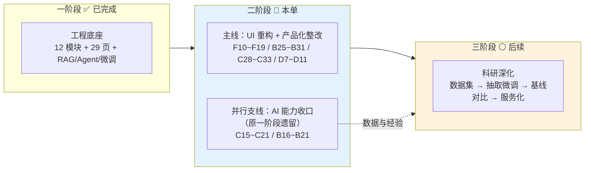
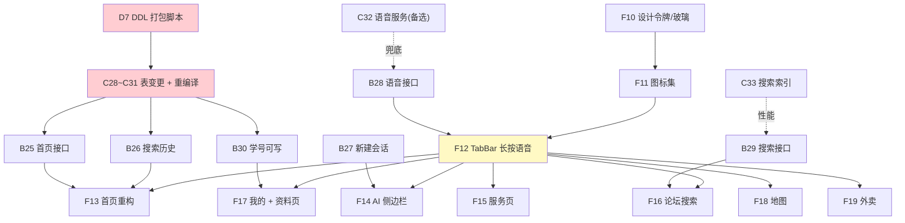

# 校捷通 · 二阶段 & 三阶段 成员任务单（2026-09-12 版）

> **适用阶段**：二阶段（产品化整改）+ 三阶段（科研深化）
> **配套**：`docs/二阶段整改方案-前端UI重构与后端支撑.md`（技术方案）
> **上游**：`docs/两阶段科研创新迭代方案.md`、`docs/成员2与3两阶段任务分工.md`
> **规则**：Git 协作以 `docs/团队Git合作协议.md` 为准（`main` 禁推、PR 一律 → `dev`）；
> 「完成」= **真机/真数据可演示**，不是代码写完；每个页面/接口**独立分支 + PR**
> **编号**：前端 **F10** 起 ｜ 后端 **B25** 起 ｜ 数据层/AI **C28** 起 ｜ DB/文档 **D7** 起

---

## 0. 阶段结构（先看清全局）



| 阶段 | 定位 | 关键交付 |
|---|---|---|
| 一阶段 | 工程底座 | ✅ `dev@bbb2ca9`（PR #39/#42 已合） |
| **二阶段** | **产品化整改** | UI 液态玻璃重构 + 5 页重构 + 后端支撑 + 外卖裁剪 |
| 三阶段 | 科研深化 | 抽取数据集 → 微调 → 对比实验 → 服务化 |

> **并行支线说明**：原一阶段未完成的 AI 能力（通知时间抽取、可信溯源、可迁移适配）**不取消**，
> 归入二阶段**并行支线**，由成员3 主责、成员2 配合；不与主线抢前端工时。

---

## 👤 成员1 · 前端小程序（分支 `feature/frontend`，只改 `miniprogram/`）

> **本阶段总目标**：完成全局 UI 重构（液态玻璃 + 苹果线性图标 + 自定义 TabBar），并重构 5 大页面。

### W1 · 全局基建（不依赖后端，可立即开工）

| 编号 | 任务 | 产出 | 验收标准 |
|---|---|---|---|
| **F10** | **设计令牌 + 玻璃样式库** | `styles/tokens.wxss`（颜色/圆角/阴影/间距）、`styles/glass.wxss`（玻璃组件类 + **三层降级**） | 抽 3 个页面套用后视觉一致；Android 低版本不糊 |
| **F11** | **苹果线性图标集落地** | `static/icons/*.svg`（本地导出，统一 `stroke-width:1.5`），含**补齐 `user-solid.svg`** | 全站无彩色/粗重图标；图标可换色 |
| **F12** | **自定义 TabBar 改造** ⭐ | `custom-tab-bar/`：5 项 + **AI 居中凸起圆形按钮** + **长按唤起语音弹窗** | 真机上凸起按钮位置正确；长按有震动反馈并弹窗；聊天全屏页正确隐藏 |

> ⚠️ **F12 先做 POC**（1 小时验证凸起按钮可行）再铺开 —— 原生 `tabBar` 不支持凸起，必须自定义。

### W2 · 页面重构（上半）

| 编号 | 任务 | 产出 | 验收标准 |
|---|---|---|---|
| **F13** | **首页重构**（需求 1~4） | Logo 唯一置顶 · 3~5 张轮播 Banner · 搜索上拉+历史 · 精简入口 · 热点信息流 | 轮播可滑可点；搜索点开后上拉置顶且主体清空；历史可增删；信息流上拉加载 |
| **F14** | **AI 助手侧边栏**（需求 6） | 左滑出侧边栏（历史列表 + 新建会话）· 长按语音 · 保留原 tab | 侧滑动画流畅；新建会话可对话；会话可删除；语音转文字可用 |
| **F15** | **服务页重构**（需求 7） | 顶部**路线维保中心**通栏吸顶卡 · 8 功能 2×4 玻璃宫格 | 吸顶生效；8 卡跳转正确；地图卡进地图页 |

### W3 · 页面重构（下半）+ 收尾

| 编号 | 任务 | 产出 | 验收标准 |
|---|---|---|---|
| **F16** | **论坛搜索 + 标签筛选**（需求 8） | 顶部搜索框 · 7 个标签栏（全部/学习/生活/闲置/活动/热点/我的帖子） | 搜索有结果；7 个标签均生效（复用 `?category=`） |
| **F17** | **我的 + 资料设置页**（需求 9） | 头像/昵称/**学号**展示 · 个人资料设置页（头像上传、昵称、学号） | 学号可绑定成功且唯一校验提示友好；头像上传后正确回显 |
| **F18** | **校园地图容器**（需求 10） | 大尺寸地图容器（≥60% 屏）+ 顶部导航栏 | POI 可显示；点击可导航 |
| **F19** | **外卖裁剪**（需求 11） | 移除代买入口/页面；保留**代收**流程 | 全站搜索无"代买"字样；代收流程可用 |

> **F-优先级**：F10/F11/F12（基建）> F13/F14（主页面）> F15/F16/F17 > F18/F19
> **⚠️ 必做**：顺手修 `FRONT-01`（`BASE_URL` 配置化）—— 否则真机无法验收任何页面。

---

## 👤 成员2 · Python 后端 + AI 工程（分支 `feature/backend`）

> **本阶段总目标**：为 UI 重构提供后端支撑（6 组新接口）+ 外卖业务裁剪 + 语音转文字。

### W1

| 编号 | 任务 | 产出 | 验收标准 |
|---|---|---|---|
| **B25** | **首页数据接口** | `GET /home/banners`（轮播）、`GET /home/feed`（热点信息流，分页） | 两接口 `code=0`；feed 支持排序 + 分页参数；有鉴权 |
| **B26** | **搜索历史接口** | `GET / POST / DELETE /search/history` | 写入自动去重；拉取按时间倒序；清空生效 |
| **B27** | **显式新建会话** | `POST /chat/conversations`（可选 `PATCH` 重命名/置顶） | 点新建即返回 `conversation_id`；空会话可正常进入对话 |

### W2

| 编号 | 任务 | 产出 | 验收标准 |
|---|---|---|---|
| **B28** | **语音转文字接口** | `POST /voice/transcribe`（接收录音 → 文本） | 3~10 秒中文语音转写可用；**失败有明确错误码**（不静默） |
| **B29** | **论坛关键词搜索** | `GET /topics?keyword=`（标题+正文模糊，分页） | 关键词命中正确；**空结果不报错** |
| **B30** | **用户资料增强** | `PUT /user/me` 支持 `student_no`（唯一 + 格式校验） | 重复学号被拒且提示明确；修改后可回读 |

### W3

| 编号 | 任务 | 产出 | 验收标准 |
|---|---|---|---|
| **B31** | **外卖业务裁剪** | 下线代买接口；`POST /life/orders` 语义改为**代收**；`docs/api.md` 标注废弃 | 无代买入口可调；代收下单/查询可用；文档同步 |
| **B-回归** | 一阶段接口回归 | 跑 `tools/e2e_connectivity.py` + `pytest tests -q` | 全通；无退化 |

> **并行支线（时间富余时推进）**：`B16~B21`（HTML/PDF 解析器、批量导入、分层推送、通知表扩展、sources 契约、配置驱动采集）
> —— 详见 `docs/成员2与3两阶段任务分工.md` §2。**优先级低于主线**。

---

## 👤 成员3 · C++ 数据层 + 模型微调 + 数据（分支 `feature/db-cpp_driver_src`）

> **本阶段总目标**：① **表结构打包变更**（阻塞项，最先做）② 搜索/索引优化 ③ 并行支线的 AI 能力

### W1 · ⚠️ 表结构打包变更（**最高优先级，全队依赖**）

| 编号 | 任务 | 产出 | 验收标准 |
|---|---|---|---|
| **C28** | `user.student_no` **可写** + 唯一索引 + 格式校验 | DAO 改造 + 重编译 `jt_db` | 重复学号写入被拒；`PUT /user/me` 可改并回读 |
| **C29** | **`user_search_history` 表 + DAO** | 建表 SQL + DAO（增/查/删/清空） | 写入去重；按 `(user_id, created_at)` 查询高效 |
| **C30** | **`home_banner` 表 + DAO** | 建表 SQL + DAO（按有效期/排序筛选） | 支持 `enabled` + `start_at/end_at` 过滤 |
| **C31** | 生活订单加 `biz_type`（代买/代收）+ 历史回填 | 改表 + DAO + 回填脚本 | 历史订单不丢；新订单默认代收 |

> ⚠️ **这 4 项必须打包成一批**：改表要**全员同步 + 重编译 C++**（成本高），一次做完。
> 与成员4 的 **D7**（DDL 脚本）**同一批提交**，脚本与 DAO 严格对应。

### W2 · 优化与并行支线

| 编号 | 任务 | 产出 | 验收标准 |
|---|---|---|---|
| **C32** | **语音转文字服务化（备选路线 B）** | 本地 `faster-whisper` 封装为 HTTP 服务或 Ollama 模型 | 后端可调用；离线环境可用（网络受限时的兜底） |
| **C33** | **帖子搜索索引优化** | FULLTEXT 或 2-gram 方案 + 压测数据 | 1 万条帖子下关键词查询 p95 < 200ms；**与 `CAC-25` 同批** |
| **C15**（支线） | 切片策略可插拔化 ⭐ | `services/chunker.py`：`ChunkStrategy` 接口 + 固定长度/语义边界两种实现 | 现有行为不回归；新策略可注册 |
| **C16**（支线） | 检索重排模块 | `services/rerank.py` | 对比无重排，**Top-3 命中率提升 ≥ 5 个百分点** |

### W3 · 支线收口 + 回归

| 编号 | 任务 | 产出 | 验收标准 |
|---|---|---|---|
| **C17/C18**（支线） | 通知时间实体抽取 + 重要度打分 | `services/notice_extract.py` + 打分函数 | 测试集**准确率 ≥ 85%**；每条附**命中依据**（可解释） |
| **C19/C20**（支线） | 来源结构化 + 引用反向校验 | `sources` 含 `snippet/chunk_id/score`；`services/citation_check.py` | 模型引用不在检索结果中 → **标记/剔除**（防编造） |
| **C21**（支线） | 适配器配置结构设计 ⭐ | `backend/app/adapters/` + schema + 示例配置 | 一份配置可描述一所学校（名称/校区/部门/术语/采集源） |
| **C-回归** | 数据层全量回归 | `test_all_dao.py` + `ai/eval/rag_bench.py` | DAO 全绿；RAG hit@3 不下降（当前 **100%**） |

> **支线优先级**：C15/C16 > C17/C18 > C19/C20 > C21。若主线受阻（改表/重编译），支线**可随时插空推进**。

---

## 👤 成员4 · 数据库 + 文档 + 数据（分支 `docs` / `feature/db`）

> **本阶段总目标**：DDL 与迁移脚本先行、文档同步、训练语料储备（为三阶段准备）

### W1

| 编号 | 任务 | 产出 | 验收标准 |
|---|---|---|---|
| **D7** | **二阶段 DDL 打包脚本** | `db/sql/14_home_banner.sql`、`15_search_history.sql`、`16_user_student_no.sql`、`17_life_biz_type.sql` | **幂等可重跑**；与成员3 DAO 字段严格一致；按序可执行 |
| **D10** | **外卖数据迁移脚本** | 代买订单归档 + `biz_type` 回填 | **可回滚**（附回滚脚本）；迁移前后行数一致 |
| **D12'** | `docs/api.md` 维护 | 新增 8 个接口全部登记 | 与实现一致（`D5` 规则延续） |

### W2

| 编号 | 任务 | 产出 | 验收标准 |
|---|---|---|---|
| **D8** | **ER 图更新** | DataGrip 反向导出 → `docs/db/ER图.md` | 含 4 张新表/新字段；关系正确 |
| **D9** | **需求说明书补 UI 规范章节** | `docs/需求说明书.md`：新增「UI 设计规范」+「需求 1~11 对照表」 | 11 条需求逐条可追溯到任务编号 |
| **D11** | **UI 设计规范落地文档** | `docs/UI设计规范.md`：色板/字号/圆角/阴影/玻璃参数/图标规范 | 前端可直接照做；含降级策略 |

### W3 · 三阶段准备（提前启动，避免三阶段卡数据）

| 编号 | 任务 | 产出 | 验收标准 |
|---|---|---|---|
| **D13** | **训练语料储备** | 论坛/通知/公告文本**脱敏**后入 `train_corpus`，**≥ 2000 条** | 去学号/手机号/姓名；去重；来源可追溯 |
| **D14** | 三阶段标注规范草案 | `docs/数据标注规范.md`（实体类型/标注边界/示例） | 与成员3 对齐后可开工 |

---

## 三、三阶段任务（科研深化 · 二阶段完成后启动）

> 定位：把二阶段的"工程能力"做成**可发表的科研贡献**。主线选**方向 1 轻量信息抽取**（已有 60% 基础）。
> 周期建议 **4 周**。

### 成员3 · 主线（科研核心）

| 编号 | 任务 | 产出 | 验收标准 |
|---|---|---|---|
| **C34** | **数据集采集与标注工具链** ⭐ | `ai/dataset/`：采集脚本 + 模型预标注 + 标准格式导出 | 可批量采集、预标注、导出；**数据集本身即成果**（可申请软著） |
| **C35** | **数据集质量校验** | 双人标注一致性脚本 + 数据卡 | **Cohen's Kappa ≥ 0.8**；数据卡含规模/分布/划分 |
| **C36** | **抽取模型微调** | 复用 `ai/finetune/` QLoRA 流水线 | 微调 Qwen-1.5B/3B；产出训练报告 |
| **C37** | **基线对比实验** ⭐ | `ai/eval/extract_bench.py` | 对比①零样本 ②few-shot ③微调 `xjt-3b`；**F1 提升 ≥ 15 个百分点** |
| **C38** | **提示工程优化实验** | prompt 模板对比实验 | 证明"优化 prompt 可减少标注需求"（100 条+优 prompt ≈ 300 条+朴素 prompt） |
| **C39** | **抽取服务化** ⭐ | 模型封装为 HTTP 服务或 Ollama 模型 | 后端可统一调用（与对话模型隔离） |

### 成员2 · 工程落地

| 编号 | 任务 | 产出 | 验收标准 |
|---|---|---|---|
| **B32** | 采集合规与限速 | robots.txt 检查 + 限速模块 | 采集不违规；日志可追溯 |
| **B33** | 通知解析接入抽取服务 | `notice` 入库时自动调用抽取 | 入库后 `deadline`/`materials`/`target` **自动填充** |
| **B34** | 抽取结果落库与回填 | 写入 `notice` 扩展字段（`B19` 预留） | **抽取失败不阻塞入库**（降级为空值） |

### 成员4 · 数据与文档

| 编号 | 任务 | 产出 | 验收标准 |
|---|---|---|---|
| **D15** | 标注协作与质检 | 组织双人标注 + 一致性复核 | Kappa ≥ 0.8；标注进度可追溯 |
| **D16** | 数据卡与论文素材 | 数据卡 + 实验记录归档 | 满足论文/答辩引用要求 |

### 成员1 · 前端配合（轻量）

| 编号 | 任务 | 产出 | 验收标准 |
|---|---|---|---|
| **F20** | 抽取结果展示（可选） | 通知卡片展示 `deadline`/`materials` | 抽取结果可视；空值有兜底 |

---

## 四、依赖与关键路径



**关键路径（决定二阶段最短工期）**：

```
D7(DDL) → C28~C31(改表+重编译) → B25/B26/B30 → F13/F16/F17 → 真机验收
        ↑ 红色 = 阻塞项，必须第一天启动
```

> **瓶颈在成员3 的"改表 + 重编译 C++"** —— 建议 **W1 第 1~2 天集中完成**，其余任务全部等它。

---

## 五、排期建议（3 周）

| 周 | 成员1（前端） | 成员2（后端） | 成员3（数据/AI） | 成员4（DB/文档） |
|---|---|---|---|---|
| **W1** | F10 设计令牌 · F11 图标 · **F12 TabBar POC** | B25 · B26 · B27 | **C28~C31 表变更（阻塞项）** | **D7 DDL** · D10 迁移 · api.md |
| **W2** | F13 首页 · F14 AI 侧边栏 · F15 服务页 | B28 语音 · B29 搜索 · B30 资料 | C32 语音服务 · **C15/C16 支线** | D8 ER 图 · D9 需求说明书 · D11 UI 规范 |
| **W3** | F16 论坛 · F17 我的 · F18 地图 · F19 外卖 | B31 裁剪 · B-回归 | C33 索引 · C17~C21 支线 | D13 语料 · D14 标注规范 |
| **W4** | 真机兼容性抽测 + 回归 | 联调 + 文档 | 数据层回归 + RAG 指标 | 二阶段验收材料归档 |
| **W5~W8** | （三阶段）F20 可选 | B32~B34 | **C34~C39 科研主线** | D15~D16 |

**每日节奏**（延续既有约定）：
1. 群里一句话进度/卡点
2. 每个任务**独立分支 + PR → `dev`**，改接口**先改 `docs/api.md`**
3. 每天 `bash scripts/auto-sync/sync.sh dev` 同步
4. **验收 = 能演示真数据**，不是代码写完

---

## 六、验收与准出

| 阶段 | 准出条件 |
|---|---|
| **二阶段** | 见 `二阶段整改方案` §7（12 项标准）；其中 **P0 缺陷 = 0**、**UI 一致性 + 兼容性真机通过**、**一阶段功能无退化** |
| **三阶段** | 数据集（Kappa ≥ 0.8）+ 微调模型 + **F1 提升 ≥ 15 个百分点**的对比报告 + 服务化可用 |

---

## 七、风险与卡点（提前暴露）

| # | 风险 | 影响 | 对策 |
|---|---|---|---|
| 1 | **改表 + 重编译 C++ 是单点瓶颈** | 全队卡在成员3 | W1 首两日集中打完；DDL 与 DAO **同一批**评审 |
| 2 | **`backdrop-filter` 低端机不兼容** | 视觉崩坏 | 三层降级 + 「减弱透明」开关 + W1 就抽真机验证 |
| 3 | **自定义 TabBar 改造面大** | 可能拖垮前端进度 | **先 POC**（1 小时），不可行则退化为「普通 5 tab + 单独语音按钮」 |
| 4 | **语音转文字依赖微信配额** | 演示时可能不可用 | 双路：微信原生（主）+ 本地 Whisper（备） |
| 5 | **外卖裁剪涉及历史数据** | 数据丢失风险 | 只归档不删（`biz_type`）+ 可回滚迁移 |
| 6 | **成员2 主线 + 支线争工时** | 支线长期不推进 | 支线**明确低优先级**，仅在主线受阻时插空 |
| 7 | **既有 P0（`DATA-01` 二手待审泄漏）未修** | 污染 UI 验收 | 建议二阶段 W1 顺带修（1 处 DAO 条件） |
