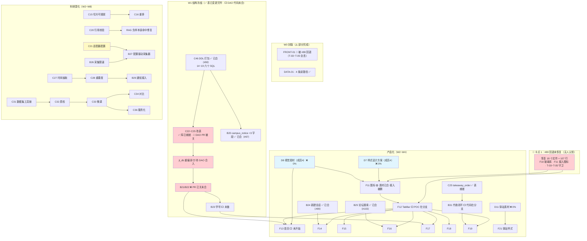

# 校捷通 · 二阶段任务总表（**v5 · 2026-09-16 实测刷新**）

> 🔄 **v5 变更（2026-09-16 17:20，全部实测）—— 本版三件事**：
> ① **§0·2 进度快照整节重写**：每个数字都由命令实测（`git ls-tree` / `rev-list --left-right` / 真实 MySQL），不引用任何人的自述；
> ② 🔴 **新增 §0·2.2「`#89` 整体回退的未恢复清单」**—— 本版**最需要全队知道**的事实：
>    前端 `F10` 玻璃基建与 `FRONT-01` 的 `T-03~T-05` 守卫**已不在 `dev` 上**，且**当时没有任何 PR 在恢复它们**；
> ③ **逐行刷新任务状态**：`C15`/`C16`/`C21`/`C26`/`C31`/`C46` 等已完成；
>    `C20`/`C22`/`C23~C25`/`C28`/`C29` 与 `B21`/`B22` 的 PR **被关闭未合并**，代码仍在分支上，**重开 PR 即可**。
>
> 🔄 **v3 变更（2026-09-14）—— 本版四件事**（保留）：
> ① **全员任务编号按优先级重排**：排序原则 = **阻塞他人 > W1 结构 > 波次先后**（同成员内）；
>    **已交付且已被 PR / 审查报告引用的任务保留原号**（`F10` `B16` `B17` `B18` `C14` `C15` `C16` `C20`）。
> ② **成员4 职责收缩**为两个方向：**文档方向 + 图片素材方向**；其**全部脚本/工程化任务划给成员2**
>    （`D7` DDL → **`C46`**（原 `B19`） · `D10` 迁移 → **`B33`** · `ENG-01`/`T-02` CI → **`B34`**）。
> ③ **素材分工**：`F11`/`F12`/`F13`/`F21` 的**图像绘制与查找**全部由成员4（`D8`）交付；成员1 只出**素材清单** + 做接入。
> ④ **具体前端样式设计方案**由成员4 出具（**`D7`**）。
>
> 🔍 **完整新老序号对照见文末「附录 A」**；今日执行单见 `docs/成员任务单260914序1.md`。
>
> **v2 原有核心（保留）**：按**编号分界**定义阶段 —— **`B16+` / `C14+` / `F10+` / `D7+` 一律归二阶段**；
> 三阶段改为「**进一步科研产出**」（方向 2 + 方向 3 + 论文/软著）。
> **配套**：`docs/二阶段整改方案-前端UI重构与后端支撑.md`（技术方案）· `docs/成员2与3两阶段任务分工.md`（C/B 明细）· **跟踪议题**：[#43](https://github.com/asuperj1/xiaojietong-project/issues/43)
> **规则**：Git 协作以 `docs/团队Git合作协议.md` 为准（`main` 禁推、PR 一律 → `dev`）；「完成」= **真机/真数据可演示**；每个页面/接口**独立分支 + PR**
> **权威性**：本文负责**顺序 / 归属 / 波次**；单项任务的**详细产出与验收标准**以 `docs/成员2与3两阶段任务分工.md` 与 `docs/二阶段整改方案…md` 为准。

---

## 第 0 部分 · 阶段与编号分界（**本版核心**）

| 阶段 | 定位 | 编号区间 | 现状 |
|---|---|---|---|
| **① 一阶段（已完成）** | 工程底座（中期 Demo） | 后端 `B1~B15` · 前端 `F1~F9` · 数据/AI `C1~C13` · DB/文档 `D0~D6` | ✅ 已合 `dev@bbb2ca9` |
| **② 二阶段（本表主战场）** | **产品化整改 + 科研深化**（**双线并行**） | 后端 **`B16~B34`** · 前端 **`F10~F22`** · 数据/AI **`C14~C36`** · **文档/素材 `D7~D13`** | 🔵 进行中（**后端 7 项 · 数据/AI 7 项已进 `dev`**；前端因 `#89` 回退**净倒退**；`D 系列 0%`）· 详见 **§0·2** |
| **③ 三阶段** | **进一步科研产出**（方向 2 RAG 幻觉抑制 + 方向 3 画像个性化推送 + 论文/软著） | **`C40+` / `B40+` / `F40+` / `D40+`**（起始号已上调，避开二阶段新号段） | ⚪ 二阶段后 |
| **贯穿** | 一阶段需整改（审计编号） | `SEC-` / `DATA-` / `FRONT-` / `CAC-` / `CON-` / `ENG-` | 🔧 **并入二阶段波次**，不单列章节 |

### 二阶段两条主线（**同一阶段内并行，不是前后关系**）

| 主线 | 内容 | 编号 | 目标 |
|---|---|---|---|
| **A. 产品化整改** | 液态玻璃 UI 重构 + 5 页重构 + 后端支撑 + 外卖改代收 | `F10~F22` · `B20~B34` · `C21~C26` · **`C46`** · `D7~D13` | 省级评审**可演示、可体验** |
| **B. 科研深化** | 一阶段 4 模块收尾（RAG/通知预警/溯源/适配）+ 轻量信息抽取主线 | `C14~C20` · `C27~C36` · `B16~B18` · `B26~B30` | **论文 / 软著 / 答辩**产出 |

> ⚠️ **为什么两条线都在二阶段**：`B16~B24` / `C14~C27` 是**一阶段规划的 4 个科研创新模块**与**轻量信息抽取主线**
> （数据集→微调→对比→服务化）的落地任务，按产品方口径**统归二阶段**。
> 二者与 UI 重构**无代码冲突**（前者在 `services/` + `ai/`，后者在 `miniprogram/`），可安全并行。

### 0.1 v1 → v2 修正记录（含 **9 项事实纠错**）

> ⚠️ **本节是 v1→v2 的**历史记录**，里面的编号是**当时的 v2 编号**，
> **与 2026-09-14 重排后的 v3 编号不同** —— 请对照 **附录 A** 换算（例：本节 `C28` 现为 `C22`、`D7` 现为 `B19`、`B19` 现为 `B20`）。
> 本节按团队约定**不改内容**（保留当时的决策痕迹）。

| # | v1 说法 | **实测核查结果** | v2 处理 |
|---|---|---|---|
| 1 | `C15~C27` / `B16~B24` 归"三阶段"或"遗留" | 按新口径**全部属二阶段** | 并入 §3.1 / §3.2 |
| 2 | 三阶段新编号 `C34~C39` | 与既有 `C22~C27` **同名同义** → **重复立项** | 原内容**作废**（统一用 `C22~C27`）；**但 `C34~C39` 号段保留，改作三阶段「进一步科研产出」的**新任务**（见 §4） |
| 3 | `B19` 扩展 **`notice` 表** | ❌ **`notice` 表不存在**！真实表 = **`campus_notice`**；且 `target` 已以 **`target_grade`** 存在 | 改为 `campus_notice`，**只需加 3 字段**（`deadline`/`materials`/`importance`） |
| 4 | `B19` 产出 `13_notice_extend.sql` | ❌ **编号冲突**：`13_index_optimize.sql` 已占用 | 改为 **`14_notice_extend.sql`**（`D7` 全域重编号） |
| 5 | `C28` 需给 `user` **加** `student_no` | ❌ **`student_no` 已存在** | 改为：加**唯一索引** + `student_no_updated_at` + `token_version` |
| 6 | `B18` 分层推送需从 0 建 | ✅ **`notice_delivery` 表已完整**（`channel`/`score`/`reason`/`is_exposed`/`is_read`） | `B18` 只差**定时触发**，不是从 0 |
| 7 | `C31` 改 `life_order` | ❌ 真实表 = **`takeaway_order`** | 改为 `takeaway_order` + 新建 `pickup_point` |
| 8 | `C14` 列在一阶段已完成 | 按新口径属二阶段；且**未合入 `dev`**（当前在 `test/beta-assets`） | 移入 §3.1，标注「已交付 · 待合入」 |
| 9 | "知识库 120 篇"为附属项 | ❌ 实测 **27 篇**（`knowledge_doc status=1`）= **硬指标缺口** | 提升为 `B17` 的**验收门槛**，W2 内必须达标 |

---

## 第 0·2 部分 · 实测进度快照（**v5 · 2026-09-16 17:20**）

> **本节每一个数字都用命令实测得到，不引用任何人的自述。** 复跑方法见各节末。
> ⚠️ **本节取代 v4 快照**（v4 已过期：它写的 `dev = a0fd208`、`C31` 目录不存在、`C46` 待开 PR —— 三条**均已不成立**）。

### 基线

| 项 | 实测值 |
|---|---|
| `github/dev` | **`ade1459`**（2026-09-16 17:03；含 #99 `B24`） |
| `github/main` | `ef57504`（2026-09-13 21:12，**落后 `dev` 111 个提交**；按协议只接收来自 `dev` 的合并） |
| 本分支 | `fix/task-sheet-v5` ← `github/dev@ade1459` |
| **开放 PR** | **8 个**：`#94` `#98` `#100` `#101` `#104` `#105` `#106` `#107` |

### 四人进度（实测）

| 成员 | 已交付·**已进 `dev`** | 已开发·**待合入** | 未开始 | 一句话 |
|---|---|---|---|---|
| **成员1**（前端） | **1**：`F11` 素材 `ui/icons/` 43 svg（#77） | 0 | `F10`~`F22` 其余 | 🔴 **净倒退**：`F10` 玻璃基建 + `FRONT-01` 守卫被 #89 回退，**至今无人恢复**（见 §0·2.2） |
| **成员2**（后端/工程化） | **7**：`B16` `B17`（管线）`B18` `B20` `B24` `B25` `B26` | 2：`B32`(#105) · `B34`(#104) | `B21` `B22` `B23` `B27` `B28` `B29` `B30` `B31` `B33` | 主干终于有后端了；但 `B21`/`B22` 的 PR **已关未合** |
| **成员3**（数据/AI，本表核定人） | **7**：`C14` `C15` `C16` `C21` `C26` `C31` **`C46`** ＋ `DATA-01` 回补 ＋ `CAC-25` | 3：`C27`(#100) `C32`(#98) `C34`(#94)（＋ `#101`/`#106` 登记类） | 4：`C30` `C33` `C35` `C36` | C 系列 **6/20 已进 `dev`（另 +`C46`）**；另 **7 项 PR 被关需重开** |
| **成员4**（文档+图片素材） | **0** | 0 | `D7`~`D13` | **仍 0%**：ER 图 / UI 规范 / 需求说明书 / 素材目录**全部不存在** |

### 0·2.1 逐项证据

**成员3 · C 系列**（`git ls-tree -r --name-only github/dev -- <路径>`）：

| 产出 | 在 `dev`? |
|---|---|
| `ai/eval/rag_bench.py` · `rag_questions.json`（`C14`） | ✅ |
| `backend/app/services/chunker.py` 含 `ChunkStrategy`（`C15`，PR **#63**） | ✅ |
| `backend/app/services/rerank.py`（`C16`，PR **#64**） | ✅ |
| `backend/app/services/zh_tokenizer.py`（`CAC-25`） | ✅ |
| `backend/app/adapters/`（`C21`，PR **#66**） | ✅ |
| `db/sql/19_topic_fulltext.sql` · `services/topic_search.py`（`C26`，PR **#67**） | ✅ |
| `db/sql/14_~19_` 六个 SQL ＋ `tools/verify_ddl_convergence.py` / `verify_ddl_dao_contract.py`（`C46`，PR **#90**） | ✅ |
| `ai/dataset/`（8 文件，`C31`，PR **#92**） | ✅ |
| `tools/verify_data01_audit_filter.py` ＋ `secondhand_dao.cpp` 含 `audited_only`（`DATA-01` 回补，PR #68） | ✅ |
| `backend/app/services/citation_check.py`（`C20`） | ❌ → PR **#65 已关未合** |
| `backend/app/services/notice_extract.py`（`C27`） | ❌ → PR **#100** 开着 |
| `ai/dataset/quality.py`（`C32`）· `ai/eval/extract_bench.py`（`C34`） | ❌ → PR **#98** / **#94** 开着 |
| `C22` 的 `update_student_no` / `bump_token_version`（`user_dao.cpp`） | ❌ → PR **#75 已关未合** |
| `C23~C25` DAO · `C28` 打分 · `C29` 的 `snippet`/`chunk_id` | ❌ → PR **#78 / #80 / #84 均已关未合** |

**成员2 · B 系列**：

| 产出 | 在 `dev`? |
|---|---|
| `backend/app/services/parser/`（`B16`，PR #60） | ✅ |
| `services/notice_scheduler.py` ＋ `notice.py` 私密行过滤（`B18`，PR #60 ＋ **#95 修 P0 泄漏**） | ✅ |
| `notice_extended_columns()` ＋ C++ DAO `include_extended`（`B20`，PR #97） | ✅ |
| `routers/chat.py` 的 `POST /conversations`（`B24`，PR #99） | ✅ |
| `routers/forum.py` 的 `GET /topics?keyword=`（`B25`，PR #103） | ✅ |
| `backend/app/collector/`（`B26`，PR #96） | ✅ |
| `routers/home.py`（`B21`）· `routers/search.py`（`B22`） | ❌ → PR **#82 / #83 已关未合**；代码在 `feat/b21-b22-home-search`（领先 3） |
| `routers/voice.py`（`B32`） | ❌ → PR **#105** 开着 |
| `.github/workflows/`（`B34`） | ❌ → PR **#104** 开着 |
| `B23` / `B27` / `B28` / `B29` / `B30` / `B31` / `B33` | ❌ 全缺（`sources` 事件无 `snippet`/`chunk_id`；`B31` 代码在 `feat/b31-takeaway` 领先 3） |

**成员1 · F 系列**：`ui/icons/` **43 个 svg 已在 `dev`**（PR #77；`user-solid.svg` 仍缺）；
`miniprogram/styles/` 目录**整个不存在**、`miniprogram/utils/` 只剩 `format.js` → **见 §0·2.2**。

**成员4 · D 系列**：`docs/db/ER图.md` · `docs/UI设计规范.md` · `docs/需求说明书.md` · `ui/assets/` —— **全部缺**。

**数据库实测**（真实库 `127.0.0.1:3307 / xiaojietong`）：

| 项 | 实测 | 影响 |
|---|---|---|
| `knowledge_doc` = **27** · `knowledge_chunk` = 27 | **未变** | `B17` 验收「≥120 篇」**硬缺口未动** |
| `campus_notice`（10 行）含 `deadline`/`materials`/`importance` | ✅ **已有** | `B20` / `B29` 的**表结构不再阻塞** |
| `user`（66 行）含 `student_no_updated_at`/`token_version` ＋ `uk_student_no` | ✅ **已有** | `C22` 只差 **DAO 代码** |
| `takeaway_order`（3 行）含 `biz_type`/`pickup_code`/`pickup_point_id`/`arrived_at`/`notified_at` | ✅ **已有** | `C25` / `B31` 只差 **DAO/业务代码** |
| `home_banner` 3 行 · `pickup_point` 3 行 · `user_search_history` 1 行 | ✅ **三表均在** | `C23` / `C24` 只差 **DAO 代码** |
| `topic`（81 行）含 `ft_topic_search` FULLTEXT | ✅ **已有** | `C26` 已闭环 |

> ⚠️ **`DDL-01`**：`dev` 的 `15_/18_*.sql` 列名与**真实库 / DAO / 文档**三处不一致
> （SQL 写 `image_url`/`link_url`/`open_time`，库里是 `image`/`link_type`/`link_target`/`business_hours`）
> → 已由 **PR #101** 登记，**尚未修**。

### 0·2.2 🔴 全体必读：`#89` 整体回退的**未恢复清单**

`#89`（`revert/to-pre-b19-20260916` @ `1acbf38`，2026-09-16 已合入 `dev`）以「回退到 PR #73 之前」为名，
**删除了 42 个文件、修改了 29 个文件**。此后 `#90`（`C46` DDL）与 `#91`（C 系列 29 文件）只补回了**后端 / 数据侧**，
**前端侧至今未恢复**。实测方法：`git diff --name-status 1acbf38^ 1acbf38` × `git ls-tree -r --name-only github/dev`。

**① 仍未恢复的「被删文件」：18 / 42**

| 类别 | 文件 | 归属 |
|---|---|---|
| 玻璃样式库（3） | `miniprogram/utils/glass.js` · `miniprogram/styles/tokens.wxss` · `miniprogram/styles/glass.wxss` | **`F10`**（PR #59 已经两轮审查 Approve，却被整体删除） |
| 接入后图标（13） | `miniprogram/static/icons/*.svg`（`user.svg` / `user-solid.svg` / `bell.svg` / `map.svg` / `briefcase.svg` …） | **`F11`** 的**接入产物** |
| 验证工具（2） | `tools/verify_frontend_base_url_guard.js` · `tools/verify_f11_icon_set.js` | `T-03` / `F11` 的**回归守卫** |

**② 被回退掉内容、仍未补回的「已改文件」**（`git diff --numstat 1acbf38^ github/dev -- <file>`）

| 文件 | 仍缺行数 | 丢的是什么 |
|---|---|---|
| `miniprogram/services/request.js` | **−44** | `T-03`：入口 `try/catch` ＋ `makeEnvError()`（修「同步 throw 绕过 `.catch` / `onError`」） |
| `miniprogram/app.js` | **−26** | `T-04`：`checkApiEnv()` 启动自检 ＋ `require('./config/env')` ＋ `require('./utils/glass')` |
| `miniprogram/config/env.js` | **−12** | `T-05`：release 环境 **https 断言** |
| `miniprogram/pages/index/index.js` · `pages/service/service.js` | −10 / −8 | `F10` / `F11` 的样式接入 |
| `miniprogram/app.wxss` | −7 | `@import 'styles/tokens.wxss'` ＋ `glass.wxss` |

> 🔴 **后果**：§3.3 把 `F10` 标为「已完成」、§2 把 `FRONT-01` 标为「W0 已完成」，
> 但 **`dev` 上这两样的前端产物一行都不在**。
> **恢复是「复制 18 个文件 ＋ 补回 107 行」级别的机械动作**，难点只在**先定由谁认领** ——
> 否则 `F13`~`F19` 五页会全部铺在缺失的地基上。

### 0·2.3 开放 PR 与门禁（**8 个**）

| PR | 内容 | 分支 → base | 备注 |
|---|---|---|---|
| **#94** | `C34` 基线对比框架 | `feat/c34-extract-bench` → `dev` | 已对齐 `dev`（落后 0）· 40 passed |
| **#98** | `C32` 数据集质量校验 | `feat/c32-dataset-quality` → `dev` | 已对齐 · 55 passed |
| **#100** | `C27` 通知时间抽取 | `feat/c27-notice-time-extract` → `dev` | 已对齐 · 54 passed |
| **#101** | 登记 `DDL-01`（SQL 与真实库/DAO 不一致） | `fix/docs-ddl-consistency-registry` → `dev` | 纯文档 |
| **#106** | 登记 `CAC-30`（`normalize_deadline` 口径漂移） | `fix/deadline-normalize-contract` → `dev` | 纯文档 |
| **#104** | `B34` CI 流水线 | `feat/b34-ci-pipeline` → `dev` | 队友 `yl-love` |
| **#105** | `B32` 语音转写接口 | `feat/b32-voice-transcribe` → `dev` | 队友 `yl-love`（5 条评论） |
| **#107** | 封测 / 审查资产 | `test/beta-assets` → `dev` | 我方 |

> ⚠️ **建 PR 必须核对 base**：GitHub **每次**都把新 PR 的 base 重置为默认分支 `main`
> （已连犯 **#52 / #64 / #69 / #70**）。
> ⚠️ **`.../pull/new/<分支>?expand=1&base=dev` 这个防呆链接实测已失效** —— 它会被忽略并重定向到
> `.../compare/<分支>?expand=1`（base 又回到 `main`）。**正确姿势是三段式**：
> `https://github.com/<owner>/<repo>/compare/dev...<分支>?expand=1`。

### 0·2.4 卡点排序（本轮结论）

1. 🔴 **`#89` 回退未恢复（前端 18 文件 / 107 行）** —— 卡住 `F10`→`F11`→`F12`→`F13` 整条前端链，**当前无人认领**；
2. 🔴 **`B21`/`B22` 的 PR 已关未合**（`routers/home.py` / `routers/search.py` 在 `dev` 上不存在）→ 卡住 `F13` 首页与 `F16` 论坛；
3. 🟡 **`C20` `C22` `C23~C25` `C28` `C29` 五个 PR 被关** —— 代码都在分支上（分别领先 `7 / 1 / 7 / 1 / 1` 个提交），**重开 PR 即可**（成本最低、收益最高）；
4. 🟡 **`D 系列 = 0%`** —— 卡住 `F11`/`F12`/`F13`/`F21` 的素材与样式依据；
5. 🟡 **`B17` 知识库 27 / 120 篇** —— 「可演示」叙事的硬缺口；
6. ⚪ **`DDL-01`** —— 会让新人「照 SQL 建库」后与真实库不一致（`#101` 登记中）。

### 0·2.5 🔴 被关闭但**从未合并**的 PR（代码都还在分支上）

> 2026-09-16 实测：`is:pr is:closed` 中 `merged=false` 且有价值的条目。
> **这是本轮最大的“隐形损失”** —— 作者以外的人都以为它们合了。

| PR | 内容 | 分支 | 领先 `dev` | 重开即可恢复？ |
|---|---|---|---|---|
| **#65** | `C20` 引用反向校验 | `feat/c20-citation-check` | 7 | ✅ |
| **#72** | 任务总表 v4（已由 #102 + 本版覆盖） | `fix/task-sheet-v4` | 12 | ❌ **不需重开** |
| **#75** | `C22` 学号唯一 + `token_version` | `feat/c22-student-no-token-version` | 1 | ✅ |
| **#78** | `C23~C25` 三个 DAO | `feat/c23-c25-dao` | 7 | ✅ |
| **#80** | `C28` 通知重要度打分 | `feat/c28-notice-importance` | 1 | ✅ |
| **#81** | `C27` 通知时间抽取（旧号） | `feat/c27-notice-time-extract` | 0（已被 **#100** 取代） | ✅ **#100 已开着** |
| **#82** | `B21`/`B22`（标题误写 B19） | `feat/b19-ddl-pack` | 1 | ✅ 建议改用 `feat/b21-b22-home-search`（领先 3） |
| **#83** | `B22` 搜索历史 | `feat/b21-b22-home-search` | 3 | ✅ |
| **#84** | `C29` sources 结构化 | `feat/c29-sources-structured` | 1 | ✅ |
| **#85** | `C31` 数据集工具链（旧提交） | — | 0 | ✅ **#92 已合入** |

> 🛠️ **自查命令**（不需要 `gh`，不需要 token）：网页搜 `is:pr is:open author:@me` ——
> **只看 open 列表不够**，还要看 closed 里 `merged=false` 的；本项目已发生 **10 次**。
> 📌 **根因推测**：`#89` 整体回退时，一批 PR 被批量关闭（时间戳集中在 2026-09-16 07:07~07:10），
> 而**重交付只覆盖了其中一部分**（`C27`→#100、`C31`→#92）→ **剩下的就静默丢了**。

---

## 第 1 部分 · 一阶段已完成（基线盘点 · **只读**）

> 用途：新成员快速了解"已经有什么"，**不要重复开发**。以下均为**已实测**能力。

### 1.1 后端 `B1 ~ B15` ✅（已合 `dev@bbb2ca9`）

| 编号 | 内容 | 状态 |
|---|---|---|
| B1~B5 | 底座：13 表设计 + 统一响应/错误码 + JWT 登录 + 上传 + 分页 | ✅ |
| B6 | 内容审核闭环（词库规则 + 模型二次判定 + `audit_log` 留痕 + 轮询/批量审核） | ✅ |
| B7 | Agent 三级链路（Function Call → 规则兜底**真写库** → `status=3` 明确失败） | ✅ |
| B8 | 可观测性（`/health/detail`、`/health/selfcheck`） | ✅ |
| B9 | 二手 AI（三级定价回退 + 价格护栏 + `GET /items/{id}` + `POST /items/ai-price`） | ✅ |
| B10 | 通知精准推荐（标签+行为+年级+时效打分 + 投递懒生成 + 未读三接口） | ✅ |
| B11 | 帖子个性推荐（混合打分 + 逐条 score/reason + 冷启动回落热度榜） | ✅ |
| B12 | 工程化基线（`.env.example` 32 项 + pytest 骨架） | ✅ |
| B13 | 路网导航（网格 A\* + 绕行折线 + `straight_distance` + 8 个 POI 种子） | ✅ |
| B14 | 上传加固（HMAC 签名 URL + 存储抽象 + 篡改/过期 403 + `storage.resign()` 闭环） | ✅ |
| B15 | Celery + Redis 异步化（**默认 eager 降级**，无 Redis 亦可运行） | ✅ |

### 1.2 前端 `F1 ~ F9` ✅（29 页已合 `dev`）

`F1` 工程三件套 · `F2` 登录页 · `F3` 首页 · `F4` AI 对话（SSE） · `F5` 空教室 · `F6` 座位预约 · `F7` 论坛 · `F8` 我的 · `F9` 业务页（二手/兼职/地图/生活）

### 1.3 数据层 / AI `C1 ~ C13` ✅

`C1` 微调流水线骨架 · `C2` 训练数据 · `C3` 知识库 **27 篇** · `C4/C5` QLoRA 试跑 + GGUF（产出 **`xjt-3b`**） · `C6` 性能压测素材 · `C7~C13` 数据/评测基础

> ⚠️ **`C14`（RAG 检索评估框架）不在本表** —— 按新口径属二阶段，见 §3.1（**已交付**，hit@3 = 100%）。

### 1.4 DB / 文档 `D0 ~ D6` ✅

`D0` 明文密码清理 · `D1` 训练语料 · `D3` 需求说明书 · `D4` ER 图 · `D5` api.md 维护 · `D6` auto-sync 推广

---

## 第 2 部分 · 🔴 二阶段前置：**封测必修**（阻塞，先于一切）

> 封测（238 例）是**一阶段的关门动作**，但代码仍在 `dev` 上 —— 因此这 6 项必须在 **W0/W1** 完成。
> 依据：`docs/项目审计报告20260912序1.md` + `docs/项目审计报告260910序2-技术专项.md` §0.5（含逐行改法）。
> **2026-09-16 实测复核**：`DATA-01` ✅ 已完 · `ERR_SERVER` ✅ 已修 · **`FRONT-01` 🔴 部分被回退（见下）** · `SEC-17`/`SEC-18`/`DATA-02`/`PR42-N01` ❌ **仍未修**。

| 编号 | 问题 | 级别 | 负责 | 修法（已实测定位） | 波次 / **2026-09-16 状态** |
|---|---|---|---|---|---|
| **`DATA-01`** ① | 二手**列表** `page_items` 无 `audit_status` 过滤（C++，**需重编译**） | **P0** | 成员3 | ✅ **已修**：加 `bool audited_only = true` + `AND i.audit_status = 1`（与 `forum_dao.cpp:23` 同范式） | **W0 · 已完** |
| **`DATA-01`** ② | 二手**AI 供需匹配** `match_items_for_wish` 无过滤（C++） | **P0** | 成员3 | ✅ **已修**：硬过滤 `AND i.audit_status = 1`（**原审计漏报，本轮实测发现**） | **W0 · 已完** |
| **`DATA-01`** ③ | 二手**详情** `item_detail` 无过滤（Python） | **P0** | 成员2 | ✅ **已修**：`(audit_status = 1 OR user_id = ?)` —— 本人可见、他人 `1001` | **W0 · 已完** |
| **`DATA-01`** ④ | **论坛详情** `topic_detail` 无过滤（Python） | **P0** | 成员2 | ✅ **已修**：`(audit_status = 1 OR author_id = ?)`（**原审计漏报**：论坛列表已过滤、详情漏了） | **W0 · 已完** |

| **`DATA-02`** | Agent 工具链发布二手**不过审** | **P0** | 成员2 | Agent 发布路径接入 `audit_content` | ❌ **仍未修**（2026-09-16 实测：`services/agent_executor.py:291` `_exec_post_secondhand` 直连 `SecondhandDAO.publish`，**全仓 `audit_content` 只出现在 `forum.py`/`secondhand.py` 路由层**） |
| **`FRONT-01`** | 前端 `BASE_URL` 写死 `http://127.0.0.1:8000` | **P0** | 成员1 | 改配置化（dev/prod 切换）→ **否则真机无法验收任何页面**，**W0 第一件事** | 🔴 **部分被回退**：#58 曾合入 `dev`，但 **#89 把 `T-03`/`T-04`/`T-05` 三处守卫全部抹掉**（`request.js` −44 · `app.js` −26 · `env.js` −12）→ 需恢复，见 **§0·2.2** |
| **`PR42-N01`** | `auth.py` 头像**未重签名**（`_user_view` 重复实现导致漏改） | **P1** | 成员2 | 补 `resign(...)`，或**删掉 `auth.py:_user_view` 复用 `user.py:_view`**（推荐） | ❌ **仍未修**（2026-09-16 实测：`user.py:27` 已 `resign(...)`，但 `auth.py:_user_view` 仍直接返回 `u.get("avatar")` 裸路径） |
| **`SEC-17`** | 限流可被伪造 `X-Forwarded-For` 绕过（实测 15/15 全 200） | **P0** | 成员2 | 仅信任可信代理 / 改读 `request.client.host`；登录加**按账号维度**第二把锁 | ❌ **仍未修**（实测 `core/ratelimit.py:81` 仍**优先取 `x-forwarded-for` 首段**） |
| **`SEC-18`** | dev 默认 JWT 密钥在仓库 + `env` 默认 `dev` | **P0** | 成员2 + 成员4 | 启动时若 `env != prod` 且用默认密钥 → **告警横幅**；文档标注上线必换 | ❌ **仍未修**（`config.py:15` 默认密钥仍在仓库；`jwt_secret_is_default` **只在 prod 校验里被调用**，无非 prod 告警横幅） |
| `ERR_SERVER` | `secondhand.py` 用未导入的 `err_server` → 创建订单失败路径 `NameError` | P1 | 成员2 | **一行 import**，顺手修 | ✅ **已修**（实测 `secondhand.py:21` 已 import `err_server`，`:278` 正常 `raise`） |

> ✅ **`DATA-01` 实现完毕**：分支 `fix/data01-audit-read-paths`（`f7c7855`）· 验证工具 `tools/verify_data01_audit_filter.py`
> （三段式：DAO 运行时 / 源码断言 / HTTP 端到端）· **实测 18/18 通过**（含「过审后仍可见」回归对照，防过度拦截）。
>
> ⚠️ **方法论教训**：「列表过滤了」≠「模块安全了」—— 只要有**第二个读入口**，同样的过滤必须再来一遍。
> 原审计只验了列表，**漏掉 AI 供需匹配与两处详情**，共少算 2 条读路径。今后审同类问题需**枚举全部读入口**。
>
> ⚠️ **陷阱（已验证）**：`jt_db` C++ 层把所有值转成**字符串**（`id` 回 `"40"`）→ 断言写 `x["id"] == iid` 恒为 False，会造成**假通过**。必须 `int()` 转换。

### 2.1 封测编排（非编码，成员3 主责）

> ⚠️ **2026-09-16 状态：本节 1/2 两步已完成，3/4 步未执行。**

1. **合并顺序**：✅ **已完成** —— `#48`（SEC-23）· `#49`（封测资产）· `#46`（二阶段文档）均已合入 `dev`；`#44`（误指 `main`）· `#47`（基线过期）已关闭
2. **冻结基线**：✅ **已冻结**，但 **`dev` 随后被 `#89` 整体回退重置**（见 §0·2.2）→ **需在恢复完成后重新冻结一次 SHA**
3. **自检归零**：⬜ **未执行** —— 现应跑 `python tools/preflight_check.py`，并额外核对 §0·2.2 的 18 个缺失文件（`tools/verify_frontend_base_url_guard.js` 本身就在缺失清单里）
4. **正式封测**：⬜ **未执行** —— 按 `docs/验收测试/A-使用向测试用例.md`（117 例）+ `B-技术性测试用例.md`（121 例）逐条记录；
   ⚠️ **前置条件**：`SEC-17`/`SEC-18`/`DATA-02` 三个 P0 仍未修（§2），**安全类用例现在跑会得到不可信的结论**

---

## 第 3 部分 · 二阶段全量任务

### 3.0 波次总览（**执行顺序** —— 取代 v1 的三周排期）

| 波次 | 时长 | 成员1 前端 | 成员2 后端 | 成员3 数据/AI | 成员4 文档/素材 | 里程碑 |
|---|---|---|---|---|---|---|
| **W0 封版** | 1 天 | ⚠️ `FRONT-01` **被 #89 回退** | ❌ `PR42-N01` 未修 · ✅ `ERR_SERVER` 已修 | ✅ `DATA-01`（**4 条读路径**） | 冻结 `dev` SHA · `preflight` 归零 | ⚠️ **封测未启动**（3 个 P0 未修） |
| **W1 结构** | 2 天 | ⚠️ `F10` **已交付但被 #89 删除待恢复** · 🟡 `F11` 素材已进 `dev`（接入产物待恢复） | ✅ `C46` DDL 已合（#90）· ✅ `B20` 表结构已合（#97） | ✅ `C22~C25` **表已变更完毕**（实测库已就绪）· ⬜ DAO 未做 · ❌ `SEC-07/08` 未做 | ❌ `D7` / `D8` / `D9` **全未开始** | 🟡 **结构已冻结，但前端地基缺失** |
| **W2 基建** | 3 天 | ⬜ `F12` POC 在分支（领先 2）· ⬜ `F13` · ⬜ `F22` 小程序静态检查 | ❌ `B21`/`B22` **PR 已关未合** · ⬜ `B23` · ✅ `B26` 采集限速已合（#96）· ⬜ `B28` sources 契约 | ✅ `C21` 适配器已合（#66）· ✅ `C26` 搜索索引已合（#67）· ✅ `C15`/`C16` 已合 · 🔴 `C20` **PR 被关** | ❌ `D10` 未开始 | ✅ **检索质量达标**（hit@3 100%） |
| **W3 主页面** | 3 天 | `F14` AI 侧栏 · `F15` 服务页 · `F16` 论坛搜索 | `B24` 新建会话 · `B25` 论坛搜索 · `B27` 采集器 · `B31` 代收闭环 | `C27`/`C28` 通知抽取与打分 | `D11` 驿站视觉素材 | **5 页重构过半** |
| **W4 收尾** | 3 天 | `F17` 我的页 · `F18` 地图 · `F19` 外卖改革 · `F21` 驿站样式 | `B29`/`B30` 通知接入与回填 · `B32` 语音 · `B33` 迁移脚本 · `B34` CI | `C29` 来源结构化 · `C30` 语音服务 | 验收材料归档 | **UI 重构完成** |
| **W5 科研** | 1 周 | *（`F20` 可选）* | 回归 | **`C31` 数据集工具链** | `D12` 标注协作 | 数据集就绪 |
| **W6 科研** | 1 周 | — | 回归 | `C32` 质检（**Kappa ≥ 0.8**）· **`C33` 微调** | `D13` 数据卡 | 模型产出 |
| **W7 科研** | 1 周 | — | — | **`C34` 基线对比（F1 +≥15pt）** · `C35` 提示工程 | 论文素材 | 实验完成 |
| **W8 收口** | 1 周 | 真机兼容抽测 | 全链路回归 | `C36` 抽取服务化 · RAG 指标复核 | 答辩材料 | **二阶段准出** |

> 📌 **编号规则（2026-09-14 重排）**：**编号 = 优先级顺序**（阻塞他人 > W1 结构 > 波次先后）。
> 一阶段已占 `F1~F9`/`B1~B15`/`C1~C13`/`D0~D6`，故二阶段起点为 `F10`/`B16`/`C14`/`D7`；
> **已交付且已被 PR/审查报告引用的任务保留原号**（`F10` `B16` `B17` `B18` `C14` `C15` `C16` `C20`）。
> 完整新老对照见 **附录 A**。
>
> **并行度说明**：W1~W4 是**双线并行** —— 成员1 走产品化（+ 静态检查），
> 成员2 走产品化 + **全部脚本/工程化**（原成员4 的 DDL/迁移/CI 已并入），
> 成员3 走产品化 + 科研混合，**成员4 只走文档 + 图片素材两个方向**。
> W5~W8 收敛为**科研单线**。

### 3.1 数据 / AI · 成员3（`C14 ~ C36` 20 项 + **`C46`**：**已进 `dev` 7**（含 `C46`）· **PR 已开待合 3** · **PR 被关待重开 7** · **未开始 4**）

> 📌 **本表已按优先级重新编号**（2026-09-14）—— 新老对照见 **附录 A**。
> 🔁 **2026-09-16 变更**：原 `B19`（DDL 打包 · 原属成员2）**转出 B 系列、并入本表**，
>    新编号 **`C46`**，责任人改为**成员3**。`B20 ~ B34` 号段**保持不变**（不做全员重排，
>    避免再次打乱已被 PR / 审查报告引用的编号）。
> **已交付且已被 PR / 审查报告引用的 4 项保留原号**：`C14` `C15` `C16` `C20`。

| 编号 | 任务 | 产出 | 验收标准 | 波次 | 核查状态 |
|---|---|---|---|---|---|
| **C14** | RAG 检索质量评估框架 | `ai/eval/rag_bench.py` + 27 题 | hit@3 ≥ 80%（**实测 100%**）；⚠️ 负样本误命中 100% 待 `C20` 修 | W1 | ✅ **已合入 `dev`**：`rag_bench.py` + `rag_questions.json` 实测均在 `dev` |
| **C15** | **切片策略可插拔** ⭐ | `chunker.py` 抽出 `ChunkStrategy` 接口（固定长度 / 语义边界） | 现有行为不回归；新策略可注册 | W2 | ✅ **已合入 `dev`**（PR **#63** 已合并）：2026-09-15 实测 `dev` 上 `backend/app/services/chunker.py` 含 `ChunkStrategy`（出现 16 处）与策略注册表；40 组 golden 逐字节一致 + 159 单测 |
| **C16** | 检索重排模块 | `services/rerank.py` | ⚠️ 原验收「Top-3 +≥5pt」**已饱和**（基线 hit@3=100%）→ 改判 `hit@1`/`MRR` | W2 | ✅ **已合入 `dev`**（PR **#64**）：`rerank.py` 实测在 `dev`；机制交付 · **实测为负收益 → 默认 `none`**（零行为变化，24 单测） |
| **C20** | **引用反向校验** | `services/citation_check.py` | 引用的片段不在检索结果中 → 标记/剔除 | **W2** | 🔴 **PR #65 已关闭未合并** → `dev` 上**无此文件**。代码仍在 `feat/c20-citation-check`（领先 7 提交，含 P2 整改 `889c45a`，58 单测）→ **重开 PR 即可**；拒答阈值待 `CAC-27` |
| **C21** | **适配器配置结构** ⭐（**W5 → 提前**） | `backend/app/adapters/` + schema + 示例配置 | 一份配置描述一所学校（名称/校区/部门/术语映射/采集源） | **W2** | ✅ **已合入 `dev`**（PR **#66**）：`adapters/schema.py` + `configs/example_university_b.yml` 实测均在 `dev`；**`B27` 采集器已解卡** |
| **C22** | **学号唯一 + 限频 + `token_version`** | DAO 改造 + 重编译 `jt_db` | 重复学号被拒；**1 次 / 7 天**限频；`PUT /user/me` 可改并回读；登出使 token 失效 | **W1** | 🔴 **PR #75 已关闭未合并** → 实测 `dev` 的 `user_dao.cpp` **无** `update_student_no`/`bump_token_version`。代码在 `feat/c22-student-no-token-version`（领先 1；11 单测 + 311 回归通过）；**表结构已就绪**（实测 `user` 含 `student_no_updated_at`/`token_version` + `uk_student_no`）→ **重开 PR 即可** |
| **C23** | `user_search_history` 表 + DAO | 建表 + DAO（增/查/单删/清空） | 写入自动去重；按 `(user_id, created_at)` 查询高效 | W1 | ✅ **表已就绪**（`16_search_history.sql` 随 `C46` 合入 `dev`；2026-09-16 实测表存在，1 行测试数据）；🔴 **DAO 代码在 PR #78（已关未合）**，分支 `feat/c23-c25-dao` 领先 7 |
| **C24** | `home_banner` 表 + DAO | 建表 + DAO（有效期/排序/启用筛选） | 支持 `enabled` + `start_at`/`end_at` 过滤 | W1 | ✅ **表已就绪**（`15_home_banner.sql` 随 `C46` 合入 `dev`；实测表存在且有 3 行种子）；🔴 **DAO 代码在 PR #78（已关未合）**；⚠️ 列名与真实库不一致 → `DDL-01` |
| **C25** | **代收闭环数据改造** ⭐ | **`takeaway_order`**（**非 `life_order`**）加 `biz_type`/`pickup_code`/`pickup_point_id`/`arrived_at`/`notified_at`；**新建 `pickup_point` 表**；历史回填 | 历史订单不丢；新订单默认**代收**；取件码可生成与回查 | **W1** | ✅ **表已就绪**（`18_takeaway_pickup.sql` 随 `C46` 合入 `dev`）：实测 `pickup_point` 已建且有 3 行种子、`takeaway_order` 五列齐全；🔴 **DAO 代码在 PR #78（已关未合）**；⚠️ 列名与真实库不一致 → `DDL-01` |
| **C26** | 帖子搜索索引优化 | FULLTEXT 或 2-gram 方案 + 压测数据 | 1 万条帖子下关键词查询 **p95 < 200ms** | W2 | ✅ **已合入 `dev`**（PR **#67**）：`19_topic_fulltext.sql` + `bench_c26_topic_search.py` 实测在 `dev`；**1 万条下冷词 p95 1.42ms**（原 `LIKE` 9.53ms）；`ForumDAO::search_topics` 已随 `jt_db` 重编译 |
| **C27** | 时间实体抽取（规则+模型） | `services/notice_extract.py` | 准确率 ≥ 85%；支持“9月30日前”“本周五” | W3 | 🟡 **PR #100 开着**（`feat/c27-notice-time-extract`，已对齐 `dev`，54 passed，规则 baseline + 42 条评测集）；⚠️ `dev` 上仍无 `notice_extract.py`；⚠️ 与 `C32`/`C34` 存在 `normalize_deadline` **口径漂移**（`CAC-30`，实测 10 组输入有 5 组不同） |
| **C28** | 通知重要度打分 | 打分函数 + 依据输出 | 1~5 分；**每条附命中依据**（可解释） | W3 | 🔴 **PR #80 已关闭未合并**；代码在 `feat/c28-notice-importance`（领先 1）→ **重开 PR 即可** |
| **C29** | 来源结构化返回 | `sources` 含 `snippet`/`chunk_id`/`score` | 前端可直接渲染卡片 | W4 | 🔴 **PR #84 已关闭未合并**；代码在 `feat/c29-sources-structured`（领先 1）；⚠️ 与 `B28` 同源 → **需与成员2 商定由谁交付，避免重复实现** |
| **C30** | 语音转文字服务化（备选路线） | 本地 `faster-whisper` 封装为 HTTP 服务 | 后端可调用；**离线环境可用**（网络受限时兜底） | W4 | ❌ 未做 |
| **C31** | **数据集采集与标注工具链** ⭐ | `ai/dataset/`：采集 + 模型预标注 + 标准格式导出 | 可批量采集/预标注/导出；**数据集本身即成果**（可申软著） | W5 | ✅ **已合入 `dev`**（PR **#92**）：`ai/dataset/`（8 文件：`schema`/`collect`/`prelabel`/`export`/`cli` + `tests/test_toolchain.py`，30 单测）实测均在 `dev`；含**读取边界 `str(None)`** 修复与**导出前校验前移**
| **C32** | 数据集质量校验 | 双人标注一致性脚本 + 数据卡 | **Cohen's Kappa ≥ 0.8**；数据卡含规模/分布/划分 | W6 | 🟡 **PR #98 开着**（`feat/c32-dataset-quality`，已对齐 `dev`，55 passed）；⚠️ 其 `normalize_deadline` 与 `C34` **口径不同**（`CAC-30`）→ **会影响 `Kappa ≥ 0.8` 验收结论，建议先定口径再合** |
| **C33** | 抽取模型微调 | 复用 `ai/finetune/` QLoRA 流水线 | 微调 Qwen-1.5B/3B；产出训练报告 | W6 | ❌ 未做（流水线已有） |
| **C34** | **基线对比实验** ⭐ | `ai/eval/extract_bench.py` | 对比①零样本 ②few-shot ③微调；**F1 提升 ≥ 15 个百分点** | W7 | 🟡 **PR #94 开着**（`feat/c34-extract-bench`，已对齐 `dev`，40 passed）；**已有真实基线**：zero-shot micro-F1 **0.3043** · few-shot **0.4693** · finetuned `xjt-3b` **0.2418** → **ΔF1(few-shot − zero-shot) = +16.5pt ✅ 达标**；⚠️ 微调侧 **−6.25pt**（失败原因已定位：prompt 未给当前日期/评分细则）→ 交给 `C35` |
| **C35** | 低资源提示工程优化 | prompt 模板对比实验 | 证明“优化 prompt 可减少标注需求”（100 条+优 prompt ≈ 300 条+朴素） | W7 | ❌ 未做 |
| **C36** | **抽取服务化** ⭐ | 模型封装为 HTTP 服务或 Ollama 模型 | 后端可统一调用（与对话模型隔离） | W8 | ❌ 未做 |
| **C46** | **DDL 打包脚本**（🔴 **全队关键路径** · **由原 `B19` 转入成员3**） | `db/sql/14_notice_extend.sql` · `15_home_banner.sql` · `16_search_history.sql` · `17_user_student_no.sql` · `18_takeaway_pickup.sql`（`pickup_point` 建表 + 种子）· `19_topic_fulltext.sql` | **幂等可重跑**；与 `C22~C25` / `B20` / `B22` 的 DAO 字段**严格一致** | **W1** | ✅ **已合入 `dev`**（PR **#90**）：6 个 SQL + `db/sql/README.md` + `tools/verify_ddl_convergence.py`（34/34）· `tools/verify_ddl_dao_contract.py`（12/12，含反向对照）实测均在 `dev`；**表结构已实测落地**（见 §0·2.1 数据库实测）；⚠️ 遗留 **`DDL-01`**（SQL 列名与真实库/DAO 不一致，`#101` 登记中） |

> ⚠️ **`C22 ~ C25` 必须打包成一批**：改表需**全员 SQL 同步 + 重编译 C++**（成本高），**一次做完**；
> DDL 由 **`C46`（成员3）** 交付（编号沿革：`D7` → `B19` → 现 **`C46`**），**同批复审、同批提交**。
> ✅ **2026-09-16 实测：本批已打完** —— `C46` 已合入 `dev`（#90），**6 个 SQL 全部在库上生效**（`campus_notice` 3 列、`user` 的 `token_version`/`uk_student_no`、`takeaway_order` 5 列、`home_banner`/`pickup_point`/`user_search_history` 三表、`topic` FULLTEXT）。
> ⬜ **但仍欠 DAO 代码**：`C22`(#75) / `C23~C25`(#78) 的 PR **已关未合** → **表已就绪、代码未进主干**。
> **`SEC-07/08` 的 `token_version`** 表结构已在，代码同样未合。
> ⚠️ **`C21` 为什么从 W5 提到 W2**：它解锁成员2 的 `B27`（配置驱动采集器），属“阻塞他人”→ 优先。

### 3.2 后端 + 工程化 · 成员2（`B16 ~ B34`；**`B19` 已转出 → `C46`（成员3）**；**已进 `dev` 7** · PR 已开待合 2 · 未开始 9）

> 📌 **本表已按优先级重新编号**（2026-09-14）—— 新老对照见 **附录 A**。
> **已交付且已被 PR #60 / 审查报告引用的 3 项保留原号**：`B16` `B17` `B18`。
> 🆕 **原成员4 的脚本/工程化任务已全部并入本表**：`C46`（原 `D7` → 原 `B19` DDL 打包，**2026-09-16 已再转入 §3.1**）· `B33`（原 `D10` 迁移脚本）· `B34`（原 `ENG-01` + `T-02` CI）。

| 编号 | 任务 | 产出 | 验收标准 | 波次 | 核查状态 |
|---|---|---|---|---|---|
| **B16** | HTML / PDF / Markdown 文档解析器 | `services/parser/` 三个解析器 | 三种格式均可 `POST /admin/knowledge/ingest` 入库 | W1 | ✅ **已合入 `dev`**（PR **#60**）：实测 `backend/app/services/parser/`（6 文件）在 `dev` |
| **B17** | 知识库批量导入管道 | 命令行脚本 + 进度反馈 | **≥120 篇**可批量入库，失败可续传 | W2 | ✅ **管线已合入 `dev`**（PR #60）；❌ **验收未达成**（2026-09-16 实测 `knowledge_doc` = **27 篇**，未动）→ **仍是全队硬缺口** |
| **B18** | 分层推送调度（D-7 / D-2） | 定时任务 + 投递记录 | 待办提醒按时触达；`notice_delivery` 有记录 | W4 | ✅ **已合入 `dev`**（PR #60）· ✅ **P0 私密行泄漏已修**（PR **#95**）：实测 `life.py` 已改走 `notice_service.public_notice_page(private_ids, …)`，`life_dao.cpp` 已带 `target_grade` 过滤 |
| ~~**B19**~~ | ~~DDL 打包脚本~~ | ➡️ **已转出**：并入 §3.1，新编号 **`C46`**（成员3，2026-09-16） | — | — | 🔁 编号沿革：`D7` → `B19` → **`C46`**；`B20~B34` 号段不再重排 |
| **B20** | **通知表结构扩展** ⭐ | `campus_notice`（**非 `notice`**）新增 `deadline`/`materials`/`importance`（**可空**） | 不破坏现有数据；⚠️ `target` 已以 `target_grade` 存在 | **W1** | ✅ **已合入 `dev`**（PR **#97**）：`14_notice_extend.sql`（#90）＋ C++ DAO `include_extended` ＋ `notice.py::notice_extended_columns()` 三路兼容回退，实测均在 `dev`；实测库中 3 列已存在 |
| **B21** | 首页数据接口 | `GET /home/banners` + `GET /home/feed` | 两接口 `code=0`；feed 支持排序 + 分页；有鉴权 | W3→**W2** | 🔴 **PR #82 已关闭未合并**（且当时标题写的是 B19，与内容不符）→ `dev` 上 `routers/home.py` **不存在**。代码在 `feat/b21-b22-home-search`（领先 3）→ **重开 PR（base=dev、标题改对）即可** |
| **B22** | 搜索历史接口 | `GET`/`POST`/`DELETE /search/history` | 写入去重；倒序拉取；清空生效 | W3→**W2** | 🔴 **PR #83 已关闭未合并** → `dev` 上 `routers/search.py` **不存在**；代码在 `feat/b21-b22-home-search`（领先 3）；`user_search_history` 表已就绪；⬜ 重开时顺手改 `keyword` 校验 64 → **128**（实测列宽 `VARCHAR(128)`） |
| **B23** | 用户资料增强 | `PUT /user/me` 支持 `student_no`（唯一 + **限频** + **格式按学校配置校验**） | 重复学号被拒；**超频返回 `3001` + 剩余天数**；格式规则**由适配器配置提供** | W3→**W2** | ❌ 未做；依赖 `C22`（`token_version`，**代码未合**）/ `C21`（格式规则，✅ 已合） |
| **B24** | 显式新建会话 | `POST /chat/conversations` | 点新建即返回 `conversation_id`；空会话可正常对话 | W3 | ✅ **已合入 `dev`**（PR **#99**）：实测 `chat.py` 已有 `POST/PATCH/GET/DELETE /conversations` 全线 |
| **B25** | 论坛关键词搜索 | `GET /topics?keyword=`（标题+正文，分页） | 关键词命中正确；空结果不报错 | W3 | ✅ **已合入 `dev`**（PR **#103**）：实测 `forum.py` 走 `topic_search.search(...)`（复用 `C26` 的 FULLTEXT + ngram），按相关度倒序 |
| **B26** | 采集合规与限速 | `robots.txt` 检查 + 限速模块 | 采集不违规；有日志可追溯 | W5→**W2** | ✅ **已合入 `dev`**（PR **#96**）：实测 `backend/app/collector/`（6 文件：`robots`/`limiter`/`journal`/`__main__`）在 `dev`，`python -m app.collector check <配置>` 可用 |
| **B27** | 配置驱动的采集器 | 按 `C21` 配置抓取并入库 | 配置新源后**无需改代码**即可入库；遵守 robots.txt + 限速 | W4→**W3** | ⬜ **部分**：`collector` 已能**读 `C21` 配置做合规自检**（`python -m app.collector check app/adapters/configs/xiaojietong.yml`），但**抓取 + 入库链路未做** → **`C21` 已解卡，可立即推进** |
| **B28** | `sources` 事件契约扩展 | 更新 SSE 事件 + `docs/api.md` | 契约**向后兼容**（旧字段保留） | W4→**W2** | ❌ **未做**（2026-09-16 实测：后端全仓无 `snippet`/`chunk_id`）；⚠️ **与 `C29` 同源**，而 `C29` 已有代码（PR #84 被关）→ **先分工再动手，避免重复实现** |
| **B29** | 通知解析接入抽取服务 | `campus_notice` 入库时自动调用抽取 | 入库后 `deadline`/`materials` 被自动填充 | W5→**W4** | ❌ 未做；依赖 `C27`/`C28` |
| **B30** | 抽取结果落库与回填 | 写入 `campus_notice` 扩展字段 | **抽取失败不阻塞入库**（降级为空值） | W5→**W4** | ❌ 未做；依赖 `B29` |
| **B31** | **代收业务闭环** ⭐ | 下线代买接口；下单 → **生成 6 位取件码** → 到件 → **站内通知** | 无代买入口；取件码可查；到件触发 `notice_delivery` 一条消息 | W4 | ⬜ **代码在 `feat/b31-takeaway`（领先 3，尚未开 PR）**；`C25` 的**表结构已就绪**（实测五列齐全）→ **可立即开 PR** |
| **B32** | 语音转文字接口 | `POST /voice/transcribe` | 3~10 秒中文语音转写可用；**失败给明确错误码**（不静默） | W4 | 🟡 **PR #105 开着**（队友 `yl-love`）→ `dev` 上仍无 `routers/voice.py` |
| **B33** | 外卖数据迁移脚本 | 代买订单归档 + `biz_type` 回填 | **可回滚**；迁移前后行数一致 | W4 | 🆕 **新并入（原 `D10`）** · ❌ 未做；依赖 `C25` |
| **B34** | **CI 流水线**（含回归门禁） | `.github/workflows/`：`pytest` + `tools/preflight_check.py` + `ai/eval/rag_bench.py --strict` | **hit@3 < 80% 即 CI 红**；阻塞项 > 0 即红 | **W2** | 🆕 **新并入（原 `ENG-01` + `T-02`，已合并为一项）** · 🟡 **PR #104 开着**（队友 `yl-love`）→ `dev` 上 `.github/workflows/` 仍为空；⚠️ 本单里数处「假绿 / 恒真空断言 / **回退未被发现**」正需它拦 |

### 3.3 前端 · 成员1（`F10 ~ F22`，13 项：**已交付但被回退 2**（`F10` / `FRONT-01`）· **素材已进 `dev` 1**（`F11`）· 未开始 10）

> 📌 **本表已按优先级重新编号**（2026-09-14）—— 新老对照见 **附录 A**。`F10` 保留原号（已被 PR #59 引用）。
> 🖼️ **素材分工（09-14 新定）**：`F11`/`F12`/`F13`/`F21` 的**图像绘制、素材查找、抠图切图全部由成员4（`D8`）交付**；
> 成员1 **只出素材清单（尺寸/格式/命名）+ 做接入与样式填充**。
> 🆕 **原成员4 的工程化任务部分并入**：`F22`（原 `ENG-01` 的小程序端静态检查）。

| 编号 | 任务 | 产出 | 验收标准 | 波次 | 依赖 |
|---|---|---|---|---|---|
| **F10** | **设计令牌 + 玻璃样式库** | `styles/tokens.wxss` + `styles/glass.wxss`（**三层降级**） | 套用后视觉一致；Android 低版本不糊 | W1 | 🔴 **已交付但 `dev` 上不存在**：PR #59 两轮审查均已 Approve，**但 `#89` 整体回退把 `utils/glass.js` + `styles/tokens.wxss` + `styles/glass.wxss` 全部删除，至今未恢复**（见 §0·2.2）→ **恢复是当前最高优先级**；恢复后需重跑 `tools/verify_glass_probe.js`（⚠️ 该工具**不在 `dev`，在 `test/beta-assets`**） |
| **F11** | **苹果线性图标集** | 成员4 交 `ui/assets/icons/*.svg` → 接入 `static/icons/` 并全局替换；**补齐 `user-solid.svg`** | 全站无彩色 / 粗重图标 | W1 | 🟡 **半交付**：`ui/icons/` **43 个 svg 已在 `dev`**（PR **#77**），但 **`user-solid.svg` 仍缺**；接入产物 `miniprogram/static/icons/*.svg`（13 个）**被 #89 删除未恢复**；`tools/verify_f11_icon_set.js` 也已丢失；素材绘制仍需 `D8`（成员4） |
| **F12** | **自定义 TabBar** ⭐ | `custom-tab-bar/`：5 项 + **AI 居中凸起圆形** + **长按唤起语音** | 真机凸起位置正确；长按有震动并弹窗；全屏页正确隐藏 | **W2**（**先做 POC**） | ⬜ **POC 分支 `agent/f12-custom-tabbar-poc` 已存在（领先 2，尚未开 PR）**；`dev` 上无 `custom-tab-bar/`；素材依赖 `D8`（成员4） |
| **F13** | 首页重构（需求 1~4） | Logo 唯一置顶 · 轮播 · 搜索上拉+历史 · 精简入口 · 热点信息流 | 轮播可滑可点；搜索上拉置顶且主体清空；历史可增删；信息流上拉加载 | W2 | `B21`/`B22`/`D8` |
| **F14** | AI 助手侧边栏（需求 6） | 左滑出侧边栏（历史 + 新建会话）· 长按语音 · 保留原 tab | 侧滑流畅；新建会话可对话；会话可删；语音可用 | W3 | `B24`/`B32` |
| **F15** | 服务页重构（需求 7） | 置顶**路线维保中心**吸顶卡 + 8 功能 **2×4** 玻璃宫格 | 吸顶生效；8 卡跳转正确 | W3 | `F10`/`F11` |
| **F16** | 论坛搜索 + 标签（需求 8） | 搜索框 + 7 标签栏（全部/学习/生活/闲置/活动/热点/我的帖子） | 搜索有结果；7 标签均生效（复用 `?category=`） | W3 | `B25` |
| **F17** | 我的 + 资料设置页（需求 9） | 头像/昵称/**学号**展示 + 设置页（上传头像、改昵称、绑学号） | 学号可绑定；**两类错误提示**（已被占用 / 修改过于频繁） | W4 | `B23` |
| **F18** | 校园地图容器（需求 10） | 大尺寸地图容器（≥ 60% 屏）+ 顶部导航 | POI 可显示；点击可导航 | W4 | — |
| **F19** | 外卖改革（需求 11） | 移除代买入口；**代收订单详情（取件码大字 + 驿站信息）** | 全站无“代买”字样；代收流程可用 | W4 | `B31` |
| **F20** | 抽取结果展示（**可选**） | 通知卡片展示 `deadline`/`materials` | 抽取结果可视；空值有兜底 | W5 | `C33` |
| **F21** | **驿站（代收点）前端样式落地** | 代收点卡片/列表的玻璃样式（**样式参考与素材由 `D11` 交付**）；配合 `B31` | 与拼多多风格参考对齐；真机不糊 | W4 | `D11`/`B31` |
| **F22** | **小程序端静态检查** | 提交/CI 前跑的小程序自检（`e.detail.value` 类坑、`onReachBottom` 缺失、`new Date` 解析等既有已知坑） | 纳入 `B34` CI；**已知坑类不再回归** | W2 | `B34` |

> **优先级**：🔴 **先恢复被 `#89` 删掉的地基**（§0·2.2）> `F11` 补齐 `user-solid.svg` > `F12`/`F13`（TabBar+首页）> `F14`~`F17` > `F18`/`F19` > `F21` > `F20`（可选）
> ⚠️ **`FRONT-01` 不是「已完成」**：PR #58 确实进过 `dev`，但 **`#89` 把 `T-03`（`request.js` −44 行）/ `T-04`（`app.js` −26 行）/ `T-05`（`env.js` −12 行）全部抹掉**，连 `tools/verify_frontend_base_url_guard.js` 也一并删除 → **需恢复 + 复跑工具**（见 §0·2.2）。
> ⚠️ **`F13` 可先做静态部分**（布局/交互不依赖接口），等 `B21`/`B22` 就绪再接数据。
> 🎨 **成员4 交 `D7`（样式设计方案）后，`F11`~`F19` 的视觉一律按 `D7` 执行**，不要各页各写一套。

### 3.4 文档 + 图片素材 · 成员4（`D7 ~ D13`，7 项）

> 🔴 **2026-09-16 实测：本线仍是 `0/7`** —— `docs/db/ER图.md` · `docs/UI设计规范.md` · `docs/需求说明书.md` · `ui/assets/` **全部不存在**。
> 这是**前端 7 页与驿站样式的唯一上游**，已升为**卡点 4**（§0·2.4）。
> 📌 **职责收缩（2026-09-14）**：成员4 **只负责两个方向**——
> **① 文档方向**（`D7` `D9` `D10` `D12` `D13`）· **② 图片素材方向**（`D8` `D11`）。
> **原属成员4 的脚本/工程化任务已全部划出**：`D7`(DDL) → 原 `B19` → **现 `C46`**（**2026-09-16 转入成员3**）、`D10`(迁移) → **`B33`**、`ENG-01`/`T-02` → **`B34`**（后两项由成员2 承接）；
> 驿站**种子 SQL** 并入 `C46`（原 `B19`）的 `18_takeaway_pickup.sql`，成员4 只做**视觉素材与样式参考**（`D11`）。

| 编号 | 任务 | 产出 | 验收标准 | 波次 |
|---|---|---|---|---|
| **D7** | **UI 设计规范 + 具体前端样式设计方案** ⭐ | `docs/UI设计规范.md`：色板/字号/圆角/阴影/**玻璃参数**/图标规范 + **逐页样式稿**（首页/服务页/我的/论坛/外卖）；含**降级策略** | 成员1 **可直接照做**；含 iOS/Android 差异与空态/错误态 | **W1~W2** |
| **D8** | **前端视觉素材中心** ⭐ | `ui/assets/icons/`（苹果线性 SVG，`stroke-width:1.5`，**含缺失的 `user-solid.svg`**）· `ui/assets/images/`（Logo / 轮播 Banner / 首页入口图：**查找 + 抠图 + 切图 + 统一留白**）· `ui/assets/buttons/`（TabBar AI 凸起按钮等，含 `@2x`/`@3x`） | 成员1 **拿到即可直接替换**，不再自己找图/画图/抠图；尺寸与命名按成员1 的**素材清单** | **W1~W2** |
| **D9** | ER 图更新 | DataGrip 反向导出 → `docs/db/ER图.md` | 含新增表/字段，关系正确 | W1 |
| **D10** | 需求说明书补 UI 规范 | `docs/需求说明书.md`：新增「UI 设计规范」+「需求 1~11 对照表」 | 11 条需求**逐条可追溯到任务编号** | W2 |
| **D11** | 驿站（代收点）视觉素材与样式参考 | 驿站卡片/列表样式参考（**模仿拼多多样式**）+ 真实驿站/快递柜图（5~8 个）切图 | 供 `F21` 直接套用；与 `D7` 规范一致 | W3 |
| **D12** | 标注协作与质检 | 组织双人标注 + 一致性复核 | **Kappa ≥ 0.8**；标注进度可追溯 | W5 |
| **D13** | 数据卡与论文素材 | 数据卡 + 实验记录归档 | 满足论文/答辩引用要求 | W6 |

> **成员4 额外职责（贯穿）**：二阶段验收材料归档 · 论文/软著/答辩材料的**文档统筹**（技术内容由成员3 主笔）。
> ⚠️ **成员4 不再承担**：任何 SQL / DDL / 迁移 / CI / 部署脚本 —— `D7`→`B19`→**`C46`** 已转入成员3，`B33`/`B34` 归成员2。

### 3.5 一阶段需整改（**审计编号 · 并入波次，不单列章节**）

| 编号 | 问题 | 级别 | 负责 | 波次 / **2026-09-16 状态** |
|---|---|---|---|---|
| **`SEC-17`** | 限流可被伪造 `X-Forwarded-For` 绕过 | P0 | 成员2 | ❌ **仍未修**（`ratelimit.py:81` 仍优先取 `x-forwarded-for` 首段） |
| **`SEC-18`** | dev 默认 JWT 密钥入库 + `env` 默认 `dev` | P0 | 成员2 + 成员4 | ❌ **仍未修**（无非 prod 启动告警） |
| **`SEC-07`** / **`SEC-08`** | 登出为空操作、refresh 不轮换 | P1 | 成员3 | ⬜ **未做**（并入 `C22` 的 `token_version` 同批；**表结构已在，DAO 代码未合**） |
| **`CAC-25`** | 中文关键词兜底**恒为空**（`[\s,，、;；/]+` 切词把整句当一个词） | P1 | 成员3 | ✅ **已修并合入 `dev`** → 见下方证据 |
| **`DATA-02`** | Agent 工具链发布二手不过审 | P0 | 成员2 | ❌ **仍未修**（`agent_executor.py:291` 直连 DAO，无 `audit_content`） |
| **`DATA-06`** | 分页 `total` 填的是**本页条数**（9 处） | P2 | 成员2 | ⬜ 未做 |
| `DATA-03/04/11/16` · `CON-09` | 审核过滤、座位时间比较、`from` 契约、并发项 | P1/P2 | 成员2/3 | ⬜ 未做 |
| 空 body → **422 `{"detail"}`** 非契约 | 缺 `RequestValidationError` handler | P2 | 成员2 | ⬜ 未做 |
| **`FRONT` 系列** | **12 个列表页缺 `onReachBottom`**（长列表只能看第一页） | P1 | 成员1 | ⬜ 未做（`F22` 静态检查可自动拦） |
| `library/seat.js:5` | `new Date()` 解析字符串（**iOS Invalid Date 风险**） | P2 | 成员1 | ⬜ 未做 |
| **`DDL-01`** | **`dev` 的 `15_/18_*.sql` 列名与真实库/DAO/文档三处不一致** | P1 | 成员3 | 🟡 **已登记待合**（PR **#101**）· 修法建议：以**真实库**为准反向修 SQL+文档 |
| **`CAC-30`** | `normalize_deadline` **三份实现已漂移**（实测 10 组输入 5 组不同）→ 影响 `Kappa ≥ 0.8` 与 F1 口径 | P2 | 成员3 | 🟡 **已登记待合**（PR **#106**）；**修复需 `#94`/`#98` 先合入** |
| **`CAC-27/28/29`** | 评测基线缺 `score` · `terms()` 粒度不一致 · `hit@3` 已饱和 | P2 | 成员3 | 🟡 已登记（`docs/技术方向待处理问题.md` §C） |
| **`ENG-01`** | **无 CI**（`.github/workflows/` 为空） | P1 | **成员2**（原成员4） | 🟡 **已并入 `B34`**（含 `T-02` 回归门禁），PR **#104** 开着 |

> **说明**：`FRONT-02`（5 页分类 tab）已在 `dev` 上**修复** ✅，无需整改。

#### 3.5.1 `CAC-25` 修复证据（成员3 · 已闭环 ✅）

| 项 | 内容 |
|---|---|
| **根因** | `_TERM_SPLIT_RE = re.compile(r"[\s,，、;；/]+")` 对**无空格中文整句**不切分，且全角 `？` 不在字符类内 → `LIKE '%图书馆几点关门？%'` |
| **影响面** | Ollama/向量库不可用时（本机与服务器**均未装 Ollama**）→ **全站问答检索恒为空**，用户侧表现为「什么都搜不到」 |
| **修复** | 新增 `backend/app/services/zh_tokenizer.py`（**零依赖**中文 2-gram，无需 jieba）；`rag.py::_keyword_retrieve` 改用它，并新增**命中词元数降序**排序 |
| **实测（真实库 27 篇）** | 旧实现 **0/12** 命中（空结果率 **100%**）→ 新实现 **11/12**（空结果率 **8%**） |
| **反向对照** | 用知识库标题原词提问，新旧实现均命中 **5/5** → 证明**没有放宽口径**、未改坏老功能 |
| **单测** | `backend/tests/test_zh_tokenizer.py` **20 项全通过**；后端全量 `pytest` **30 passed**（零回归） |
| **验证脚本** | `tools/verify_cac25_keyword_search.py`（退出码 0 = 通过） |
| **遗留** | `GPA怎么算` 仍 0 命中 → **知识库缺 GPA 内容**，属 `B17`（≥120 篇）范畴，**不是切词问题** |
| **未做（留 `C33`）** | 索引层优化（FULLTEXT / ngram，p95<200ms）；当前仍为 `LONGTEXT` 全表扫 + `_KEYWORD_SEM` 限流 |

### 3.6 测试资产与工具整改（来源：**PR #49 Code Review**）

> 队友对 PR #49 提出 13 条意见（5 阻断 / 3 高 / 4 中 / 1 低）。**11 条已在 PR #49 内当场修复**
> （凭据脱敏 / `SEC-23` 归属 / PR #42 状态 / 便携性 / RAG 结论措辞 / 冻结基线定义 / 历史快照横幅 /
> `99f` 安全闸门 / `audit_probe` 副作用披露 / `baseline.json` 相对路径 / `ui/README` 说明）。以下 2 项排入本阶段：

| 编号 | 问题 | 级别 | 负责 | 验收标准 | 波次 / **2026-09-16 状态** |
|---|---|---|---|---|---|
| **`T-01`** | 探针工具**缺收尾能力**：仅"披露"会创建 `oXJT_DEV_*` 用户，**无自动清理**；且**始终 `return 0`**，CI 无法据退出码判定 | P2 | 成员3 | 新增 `--cleanup` 与 `--strict`；**同问题适用于 `pr39_*.py` / `ux_probe.py`** | ⬜ 未做 |
| **`T-02`** | 测试资产**未入流水线**：RAG 基线只是**人工跑一次的快照**，无回归守卫 | P1 | **成员2**（原成员4） | **已并入 `B34`**：`pytest` + `preflight_check.py` + `rag_bench.py --strict`；**hit@3 < 80% 即 CI 红** | 🟡 **PR #104 开着**；⬜ `dev` 上 `.github/workflows/` 仍为空 |

### 3.7 依赖与关键路径



**关键路径**（决定二阶段最短工期）：

```
W0: ✅ DATA-01（4 条读路径） + ✅ ERR_SERVER
    ⚠️ 未完成：`FRONT-01`（被回退）· `SEC-17` · `SEC-18` · `DATA-02` · `PR42-N01`  → **封测未启动**
      ↓
W1: ✅ C46（DDL · 成员3）已合入 #90 → **六个 SQL 全部在库上生效**（实测已核对）
      ↓
现在（2026-09-16）🔴 三条并行阻塞，三条都是「只差一次 PR 动作」：
      ① 恢复 #89 删掉的前端地基（18 文件 + 107 行）→ 否则 F11/F12/F13 无法开工
      ② 重开 B21/B22 的 PR（`home.py` / `search.py`）→ 否则 F13/F16 无数据可接
      ③ 重开 C20/C22/C23~C25/C28/C29 的 PR → 否则 C 系列收不了尾、`SEC-07/08` 也一并卡住
      ↓
W2~W4: B23/B31 + F13~F19（前端 7 页）→ 真机验收
      ↓
W5~W8: C32(#98)/C34(#94)/C27(#100) 合入 → C33 微调 → C35 提示工程 → C36 服务化 → 论文/软著/答辩材料
```

---

## 第 4 部分 · 三阶段：进一步科研产出（**`C40+`** / **`B40+`** / **`F40+`** / **`D40+`**）

> **定位（用户 2026-09-12 定）**：三阶段 = **进一步科研产出**。
> 二阶段已完成 **科研方向 1（轻量信息抽取）** + **产品化整改**；三阶段以 `两阶段科研创新迭代方案.md` 的 **方向 2 / 方向 3** 为主线。
> ⚠️ **起始号已于 2026-09-14 上调**：二阶段新号段已用到 `C36`/`B34`/`F22`/`D13`，
> 为避免撞号，三阶段改从 **`C40`/`B40`/`F40`/`D40`** 起（**不再用 `C34+`/`B32+`/`F21+`/`D14+`**）。
> ⚠️ 与已作废的 v1 区别：v1 的 `C34~C39` 是 `C22~C27` 的**重名重复**；本版三阶段任务是**方向 2/3 的全新科研任务**。

### 4.1 科研方向 2 · RAG 幻觉抑制（数据/AI · 成员3）

| 编号 | 任务 | 产出 | 验收标准 | 依赖 |
|---|---|---|---|---|
| **C40** | **动态切片深化** ⭐ | `chunker.py` 语义边界策略 + 自适应切片 | 对比固定长度切片，hit@3 **+ ≥ 5 个百分点**且**负样本误命中 < 20%** | `C15`（二阶段） |
| **C41** | **可信度校准与答案拒答** ⭐ | 检索分数量准 + 阈值自动寻优 | **负样本误命中 100% → < 10%**；低可信时**明确拒答** | `C20`（二阶段） |
| **C42** | 幻觉评测集扩充 | 幻觉/边界问题集（≥ 50 题） | 覆盖“库内无答案”“证据冲突”“时效过期”三类 | — |

### 4.2 科研方向 3 · 画像个性化推送（数据/AI · 成员3）

| 编号 | 任务 | 产出 | 验收标准 | 依赖 |
|---|---|---|---|---|
| **C43** | 用户画像特征工程 | 复用 `student_profile` / `user_tag` 建画像管道 | 标签覆盖率 ≥ 90%；特征**可解释** | — |
| **C44** | **个性化推送对照实验** ⭐ | A/B 实验（个性化 vs 热度基线） | 点击率提升 **≥ 20%**（离线模拟亦可） | `C43` |
| **C45** | 冷启动策略验证 | 新用户兜底策略 | 新用户首屏点击率**不低于基线** | `C43` |

### 4.3 后端支撑（成员2）

| 编号 | 任务 | 产出 | 验收标准 |
|---|---|---|---|
| **B40** | 切片策略运行时可切 | 配置化 + 灰度开关 | **无需重启**即可切换策略 |
| **B41** | 拒答降级路径 | 低可信度返回“暂无可靠依据” | **不编造**；契约明确 |
| **B42** | 画像特征接口 | `GET /user/profile-features` | 画像可查询、可解释 |

### 4.4 前端（成员1 · 可选）

| 编号 | 任务 | 产出 | 验收标准 |
|---|---|---|---|
| **F40** | 拒答与“暂无依据”UI | 引用卡片 + 拒答态 | 视觉清晰、不误导 |

### 4.5 科研产出物（成员4 统筹）

| 编号 | 产出 | 完成标志 |
|---|---|---|
| **D40** | **论文投稿** | 初稿 + 图表 + 实验记录，达投稿标准（成员3 主笔） |
| **D41** | **软著申请** | 数据集工具链 + 抽取服务，材料齐备 |
| **D42** | **复现包与数据卡** | `ai/eval/repro/` 一条命令复现全部实验；数据卡满足引用要求 |
| **D43** | 答辩与推广材料 | PPT + 演示脚本 + 省级评审材料 |

> 📌 **上线与推广不计入三阶段科研任务**（域名/HTTPS/备案/生产部署/多校推广）——
> 作为**二阶段末期的工程收口**（见 §3.0 `W8 收口`）+ `D17` 答辩材料的输入。

---

## 第 5 部分 · 验收与准出

> ⚠️ **2026-09-16 实测：目前三条准出线全部未达** ——
> 一阶段卡在 3 个 P0（`SEC-17`/`SEC-18`/`DATA-02`）+ `FRONT-01` 回归（封测未启动）；
> 二阶段卡在「前端地基未恢复」+「5 页未开工」；三阶段未开始。

| 阶段 | 准出条件 |
|---|---|
| **一阶段（封测）** | 见 `docs/验收测试/00-第一阶段验收测试方案.md` §5：P0 = 0、A 分册通过率 ≥ 95%、B-1/B-2/B-4 = 100%、RAG hit@3 ≥ 80%（当前 **100%**） |
| **二阶段** | ① **UI 一致性 + iOS/Android 真机兼容通过** ② TabBar 长按语音可用 ③ **5 页重构达标记** ④ **全站无"代买"字样**、代收含取件码 ⑤ **一阶段功能无退化**（RAG hit@3 不下降、pytest 全绿、preflight 阻塞 = 0）⑥ 科研线：**数据集 Kappa ≥ 0.8** + **F1 提升 ≥ 15 个百分点** + 抽取服务可用 |
| **三阶段** | 方向 2：**负样本误命中 < 10%** + 动态切片 hit@3 **+ ≥ 5pt**；方向 3：**画像标签覆盖率 ≥ 90%** + 推送点击率 **+ ≥ 20%**；产出：**论文投稿 + 软著 + 复现包/数据卡**（上线与推广为并行工程收口，见 §4 末注） |

---

## 第 6 部分 · 风险与卡点

| # | 风险 | 影响 | 对策 |
|---|---|---|---|
| 1 | 🔴 **`#89` 整体回退把前端地基删了且无人恢复** | `F10`/`F11` 接入产物/`T-03~T-05` 守卫全不在 `dev` → **前端 7 页会铺在缺失的地基上** | **立即认领**：按 §0·2.2 清单恢复 18 文件 + 107 行；并补一条 CI 检查（`.github/workflows` 落地后）→ `B34` |
| 2 | 🔴 **PR 被关闭未合并，且没人发现**（已致 `#65` `#72` `#75` `#78` `#80` `#81` `#82` `#83` `#84` `#85` 十次） | 代码写完但**主干为零**；分支越放越旧（部分已落后 40+ 提交） | **每日收工前扫一遍**「我开的 PR 是否仍 open」（`is:pr is:open author:@me`）；**被关的先重开再谈其他** |
| 3 | **改表 + 重编译 C++ 是单点瓶颈** | 全队卡在成员3 | ✅ **表已打完**（`C46`/`#90`）；⬜ 但 **DAO 代码（#75/#78）仍未合** → 重编译这一步还没走 |
| 4 | **`backdrop-filter` 低端机不兼容** | 视觉崩坏 | 三层降级 + 「减弱透明」开关 + **恢复 `F10` 后立即抽真机验证**（工具 `tools/verify_glass_probe.js` 在 `test/beta-assets`，可直接取用） |
| 5 | **自定义 TabBar 改造面大** | 可能拖垮前端进度 | **先 POC（`agent/f12-custom-tabbar-poc` 已有）**；不可行则退化为「普通 5 tab + 独立语音按钮」 |
| 6 | **语音转文字依赖微信配额** | 演示时可能不可用 | 双路：微信原生（主，`B32` 在 #105）+ 本地 Whisper（**`C30`** 备） |
| 7 | **外卖裁剪涉及历史数据** | 数据丢失 | 只归档不删（`biz_type`）+ **可回滚**迁移（**`B33`**） |
| 8 | **成员2/成员3 双线并行（产品化 + 科研）争工时** | 科研线被无限延后 | **波次硬切**：W1~W4 产品化优先，W5~W8 科研独占 |
| 9 | **`B17` 知识库 120 篇是硬缺口**（当前 27 篇，**自 09-14 起未动**） | 影响 RAG 与溯源叙事 | `B16` 已合（解析器可用）→ **现在就应并行采集入库**，这是唯一不需要等别人的大块工作 |
| 10 | **`DDL-01`：SQL 与真实库/DAO 不一致** | 新人「照 SQL 建库」会建出与线上不一致的表 | **以真实库为准反向修 SQL + `docs/api.md`**；`#101` 已登记 |
| 11 | **`CAC-30`：同一口径多份实现已漂移** | 偏差方向相反（C32 严 → Kappa 低估；C34 宽 → F1 高估） | **先加跨模块对照测试锁口径，再谈收敛**；`#106` 已登记，**须等 #94/#98 先合** |
| 12 | **`C21` 适配器是“全省推广”叙事核心** | 影响省级评审 | ✅ **已合入 `dev`（#66）**；⬜ 待补：**第二所学校**的可跑配置（W5） |

---

## 第 7 部分 · 附：产品方决策（2026-09-12 确认）

### 7.1 外卖「代收」需要 取件码 / 驿站 / 到件通知（本期最小可用 + 字段预留）

| 要素 | 本期最小可用 | 预留（下期） |
|---|---|---|
| 取件码 | 下单生成 **6 位取件码**，详情页大字展示 | 二维码/条形码核销 |
| 驿站 | **固定取件点单选**（`pickup_point` 表，**模仿拼多多样式**） | 多驿站、按距离推荐 |
| 到件通知 | **复用站内通知**（`notice_delivery`） | 微信订阅消息 / 短信 |
| 费用 | **不计费**（字段预留） | — |

> ⚠️ **本期边界**：取件码 + 驿站单选 + 站内到件通知 + **不计费**；**核销（扫码/输码）列入下期**。

### 7.2 学号允许学生自改，但**限频**

| 项 | 方案（产品方已确认） |
|---|---|
| 频率 | **1 次 / 7 天**（一周一次） |
| 唯一性 | `UNIQUE KEY uk_student_no`（**字段已存在，只需加索引**） |
| **格式** | **不写死正则** —— **按学校配置**（不同学校学号规则不同）：新增 `student_no_pattern` 配置项，**与 `C21`（适配器配置结构）同体系**；默认放宽为 `^\S{4,20}$`（仅非空 + 长度） |
| 审计 | 写 `audit_log` |
| 超频 | `BizError(3001, "学号修改过于频繁，请 X 天后重试")` |

---

## 附录 A · 新老任务序号对照（2026-09-14 全员重排）

> **重排规则**：**阻塞他人 > W1 结构 > 波次先后**（同成员内排序）；
> **已交付且已被 PR / 审查报告引用的任务保留原号**（`F10` `B16` `B17` `B18` `C14` `C15` `C16` `C20`）。
> 一阶段已占 `F1~F9` / `B1~B15` / `C1~C13` / `D0~D6`，故二阶段起点 = `F10` / `B16` / `C14` / `D7`。

### A.1 成员1 · 前端（`F10 ~ F22`）

| 新编号 | 老编号 | 任务 | 变化 |
|---|---|---|---|
| `F10` | `F10` | 设计令牌 + 玻璃样式库 | **保留**（已交付，PR #59 引用中） |
| `F11` | `F11` | 苹果线性图标集 | 保留号；**素材改由 `D8` 交付** |
| `F12` | `F12` | 自定义 TabBar | 保留号 |
| `F13` | `F13` | 首页重构 | 保留号；波次 W3 → **W2** |
| `F14` | `F14` | AI 助手侧边栏 | 保留号 |
| `F15` | `F15` | 服务页重构 | 保留号 |
| `F16` | `F16` | 论坛搜索 + 标签 | 保留号 |
| `F17` | `F17` | 我的 + 资料设置页 | 保留号 |
| `F18` | `F18` | 校园地图容器 | 保留号 |
| `F19` | `F19` | 外卖改革 | 保留号 |
| `F20` | `F20` | 抽取结果展示（可选） | 保留号；依赖 `C24` → **`C33`** |
| **`F21`** | **（新）** | **驿站前端样式落地** | 🆕 新增（原属成员4「驿站种子」的样式部分） |
| **`F22`** | **`ENG-01`（前端部分）** | **小程序端静态检查** | 🆕 新增（原成员4 的工程任务拆分） |

### A.2 成员2 · 后端 + 工程化（`B16 ~ B34`）

| 新编号 | 老编号 | 任务 | 变化 |
|---|---|---|---|
| `B16` | `B16` | 文档解析器 | **保留**（已交付，PR #60 引用中） |
| `B17` | `B17` | 知识库批量导入 | **保留**（已交付） |
| `B18` | `B18` | 分层推送调度 | **保留**（已交付） |
| ~~**`B19`**~~ | **`D7`** | ~~DDL 打包脚本~~ | ➡️ **2026-09-16 转出**：并入 §3.1，新编号 **`C46`**（成员3）· 原注：从成员4 划入（🔴 关键路径，故排 B 序列最前） |
| **`B20`** | `B19` | 通知表结构扩展 | 🔁 改号（避让新 `B19`） |
| **`B21`** | `B25` | 首页数据接口 | 🔁 改号 + 波次 W3 → W2 |
| **`B22`** | `B26` | 搜索历史接口 | 🔁 改号 + 波次 W3 → W2 |
| **`B23`** | `B30` | 用户资料增强 | 🔁 改号 + 波次 W3 → W2 |
| **`B24`** | `B27` | 显式新建会话 | 🔁 改号 |
| **`B25`** | `B29` | 论坛关键词搜索 | 🔁 改号 |
| **`B26`** | `B22` | 采集合规与限速 | 🔁 改号 + 波次 W5 → W2（`B27` 的地基） |
| **`B27`** | `B21` | 配置驱动采集器 | 🔁 改号 |
| **`B28`** | `B20` | `sources` 事件契约扩展 | 🔁 改号 |
| **`B29`** | `B23` | 通知解析接入抽取服务 | 🔁 改号 |
| **`B30`** | `B24` | 抽取结果落库与回填 | 🔁 改号 |
| `B31` | `B31` | 代收业务闭环 | 保留号（巧合不变） |
| **`B32`** | `B28` | 语音转文字接口 | 🔁 改号 |
| **`B33`** | **`D10`** | 外卖数据迁移脚本 | 🔀 **从成员4 划入** |
| **`B34`** | **`ENG-01` + `T-02`** | **CI 流水线（含回归门禁）** | 🔀 **从成员4 划入，两项合并为一项** |

### A.3 成员3 · 数据 / AI（`C14 ~ C36` + **`C46`**）

| 新编号 | 老编号 | 任务 | 变化 |
|---|---|---|---|
| `C14` | `C14` | RAG 评估框架 | **保留**（已交付） |
| `C15` | `C15` | 切片策略可插拔 | **保留**（已开发待合） |
| `C16` | `C16` | 检索重排 | **保留**（已开发待合） |
| `C20` | `C20` | 引用反向校验 | **保留**（已开发待合） |
| `C21` | `C21` | 适配器配置结构 | 保留号；波次 **W5 → W2**（堵着 `B27`） |
| **`C22`** | `C28` | 学号唯一 + 限频 + `token_version` | 🔁 改号（W1 结构，故排最前） |
| **`C23`** | `C29` | `user_search_history` 表 + DAO | 🔁 改号 |
| **`C24`** | `C30` | `home_banner` 表 + DAO | 🔁 改号 |
| **`C25`** | `C31` | 代收闭环数据改造 | 🔁 改号 |
| **`C26`** | `C33` | 帖子搜索索引优化 | 🔁 改号（W2） |
| **`C27`** | `C17` | 时间实体抽取 | 🔁 改号 |
| **`C28`** | `C18` | 通知重要度打分 | 🔁 改号 |
| **`C29`** | `C19` | 来源结构化返回 | 🔁 改号 |
| **`C30`** | `C32` | 语音转文字服务化 | 🔁 改号 |
| **`C31`** | `C22` | 数据集采集与标注工具链 | 🔁 改号 |
| **`C32`** | `C23` | 数据集质量校验 | 🔁 改号 |
| **`C33`** | `C24` | 抽取模型微调 | 🔁 改号 |
| **`C34`** | `C25` | 基线对比实验 | 🔁 改号 |
| **`C35`** | `C26` | 低资源提示工程优化 | 🔁 改号 |
| **`C36`** | `C27` | 抽取服务化 | 🔁 改号 |
| **`C46`** | **`B19`**（← `D7`） | **DDL 打包脚本** | 🔀 **2026-09-16 从 `B19` 转入**（成员2 → **成员3**），并入 §3.1；`B20~B34` 号段不重排 |

### A.4 成员4 · 文档 + 图片素材（`D7 ~ D13`）

| 新编号 | 老编号 | 任务 | 变化 |
|---|---|---|---|
| **`D7`** | `D11` | **UI 设计规范 + 具体前端样式设计方案** | 🔁 改号 + **升为 D 序列首位**（前端全部页面依赖它） |
| **`D8`** | **`D11a`** | **前端视觉素材中心** | 🔁 改号（`D11a` 临时子号作废，统一进主序列） |
| **`D9`** | `D8` | ER 图更新 | 🔁 改号 |
| **`D10`** | `D9` | 需求说明书补 UI 规范 | 🔁 改号 |
| **`D11`** | **（新）** | **驿站视觉素材与样式参考** | 🆕 新增（原属「驿站种子」的素材部分；种子 SQL 归 `C46`（原 `B19`）） |
| `D12` | `D12` | 标注协作与质检 | 保留号（巧合不变） |
| `D13` | `D13` | 数据卡与论文素材 | 保留号（巧合不变） |
| ~~`D7`~~ | — | ~~DDL 打包脚本~~ | ➡️ 已划给成员2，改号 `B19` → **2026-09-16 再转出为 `C46`（成员3）** |
| ~~`D10`~~ | — | ~~外卖数据迁移脚本~~ | ➡️ **已划给成员2，改号 `B33`** |

### A.5 三阶段（起始号上调避开二阶段）

| 新编号 | 老编号 | 任务 |
|---|---|---|
| `C40` / `C41` / `C42` | `C34` / `C35` / `C36` | 动态切片深化 / 可信度校准与拒答 / 幻觉评测集扩充 |
| `C43` / `C44` / `C45` | `C37` / `C38` / `C39` | 画像特征工程 / 个性化推送对照 / 冷启动策略 |
| `B40` / `B41` / `B42` | `B32` / `B33` / `B34` | 切片运行时可切 / 拒答降级路径 / 画像特征接口 |
| `F40` | `F21` | 拒答与“暂无依据”UI |
| `D40` / `D41` / `D42` / `D43` | `D14` / `D15` / `D16` / `D17` | 论文投稿 / 软著申请 / 复现包与数据卡 / 答辩与推广材料 |

> ⚠️ **引用老编号的文档需同步**：`docs/成员任务单260914序1.md`（已同步）、
> `docs/二阶段整改方案-前端UI重构与后端支撑.md`、`docs/成员2与3两阶段任务分工.md`。
> `docs/PR59-审查报告260913.md` / `docs/PR60-审查报告260913.md` 属**历史快照**，按团队约定**不改内容**。
>
> 📌 **自 2026-09-14 起，新写的任何文档 / PR 描述 / 提交信息，一律使用新编号。**
