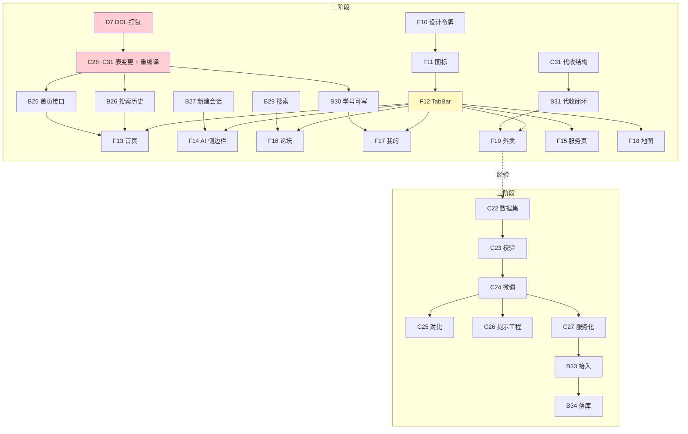

# 校捷通 · 任务总表（阶段重排版 · 2026-09-12）

> **排序原则**：① 一阶段已完成 → ② 一阶段需整改 → ③ 二阶段 → ④ 三阶段
> **编号规则**：**一阶段编号一律不动**（沿用既有 `B1~B24` / `F1~F9` / `C1~C27` / `D0~D6` 与审计编号 `SEC-/DATA-/FRONT-/CAC-`）；
> **二、三阶段编号按本表新顺序重新分配**（各自角色独立连续）。
> **配套**：`docs/二阶段整改方案-前端UI重构与后端支撑.md`（技术方案）· **跟踪议题**：[#43](https://github.com/asuperj1/xiaojietong-project/issues/43)
> **规则**：Git 协作以 `docs/团队Git合作协议.md` 为准（`main` 禁推、PR 一律 → `dev`）；「完成」= **真机/真数据可演示**；每个页面/接口**独立分支 + PR**

---

## 第 0 部分 · 编号总览（一眼看清）

| 部分 | 角色 | 编号区间 | 状态 |
|---|---|---|---|
| **① 一阶段已完成** | 后端 | `B1 ~ B24` | ✅ B1~B15 已合 `dev@bbb2ca9`；B16~B24 未做（见 ③；**遗漏汇总见 §2.4**） |
| | 前端 | `F1 ~ F9` | ✅ 已合 `dev` |
| | 数据层/AI | `C1 ~ C27` | ✅ C1~C13 已合；C14 已交付；C15~C27 未做（见 ③；**遗漏汇总见 §2.4**） |
| | DB/文档 | `D0 ~ D6` | ✅ 已完成 |
| **② 一阶段需整改** | 全部 | `SEC-xx` / `DATA-xx` / `FRONT-xx` / `CAC-xx` / `CON-xx` / `ENG-xx` | 🔧 **沿用审计编号，不占新序号** |
| **③ 二阶段** | 数据层 | `C28 ~ C33` | 🔵 待开工（关键路径） |
| | 后端 | `B25 ~ B31` | 🔵 待开工 |
| | 前端 | `F10 ~ F19` | 🔵 待开工 |
| | DB/文档 | `D7 ~ D11` | 🔵 待开工 |
| **④ 三阶段** | 数据/AI | `C22 ~ C27` | ⚪ 二阶段后（**沿用一阶段既有编号，不重排**） |
| | 后端 | `B32 ~ B34` | ⚪ |
| | DB/文档 | `D12 ~ D13` | ⚪ |
| | 前端 | `F20` | ⚪ 可选 |

---

## 第 1 部分 · 一阶段已完成（基线盘点，**编号不变**）

> 用途：新成员快速了解"已经有什么"，**不要重复开发**。以下均为**已实测**能力。

### 1.1 后端 `B1 ~ B15` ✅（已合 `dev@bbb2ca9`）

| 编号 | 内容 | 状态 |
|---|---|---|
| B1~B5 | 底座：13 表设计 + 统一响应/错误码 + JWT 登录 + 上传 + 分页 | ✅ |
| B6 | 内容审核闭环（词库规则 + 模型二次判定 + `audit_log` 留痕 + 轮询/批量审核） | ✅ |
| B7 | Agent 三级链路（Function Call → 规则兜底**真写库** → `status=3` 明确失败） | ✅ |
| B8 | 可观测性（`/health/detail`、`/health/selfcheck`） | ✅ |
| B9 | 二手 AI（三级定价回退 + 价格护栏 + `GET /items/{id}` + `POST /items/ai-price`） | ✅ |
| B10 | 通知精准推荐（标签+行为+年级+时效打分 + 投递懒生成 + 未读三接口） | ✅ |
| B11 | 帖子个性推荐（混合打分 + 逐条 score/reason + 冷启动回落热度榜） | ✅ |
| B12 | 工程化基线（`.env.example` 32 项 + pytest 骨架） | ✅ |
| B13 | 路网导航（网格 A\* + 绕行折线 + `straight_distance` + 8 个 POI 种子） | ✅ |
| B14 | 上传加固（HMAC 签名 URL + 存储抽象 + 篡改/过期 403 + **`storage.resign()` 闭环**） | ✅ |
| B15 | Celery + Redis 异步化（**默认 eager 降级**，无 Redis 亦可运行） | ✅ |

### 1.2 前端 `F1 ~ F9` ✅（29 页已合 `dev`）

`F1` 工程三件套 · `F2` 登录页 · `F3` 首页 · `F4` AI 对话（SSE） · `F5` 空教室 · `F6` 座位预约 · `F7` 论坛 · `F8` 我的 · `F9` 业务页（二手/兼职/地图/生活）

### 1.3 数据层 / AI `C1 ~ C14` ✅

`C1` 微调流水线骨架 · `C2` 训练数据 · `C3` 知识库 27 篇 · `C4/C5` QLoRA 试跑 + GGUF（产出 **`xjt-3b`**） · `C6` 性能压测素材 · **`C14` RAG 检索评估框架**（hit@1 92% / **hit@3 100%** / MRR 0.953）

### 1.4 DB / 文档 `D0 ~ D6` ✅

`D0` 明文密码清理 · `D1` 训练语料 · `D3` 需求说明书 · `D4` ER 图 · `D5` api.md 维护 · `D6` auto-sync 推广

---

## 第 2 部分 · 一阶段需整改（**沿用审计编号，不占新序号**）

> 来源：`docs/项目审计报告20260912序1.md`（59 项）+ PR #42 第三轮评测。**按"是否阻塞"分两档**。

### 2.1 🔴 封测前必修（阻塞项，必须先做）

| 编号 | 问题 | 级别 | 负责 | 修法 | 现状 |
|---|---|---|---|---|---|
| **`DATA-01`** | **二手待审内容对所有人可见**（审核"只写不读"） | **P0** | 成员3 | `secondhand_dao` 列表/详情加 `audit_status = 1`（论坛已有现成写法）→ **需重编译** | ❌ 实测确证：甲发含敏感词商品 → `audit_status=0` → 乙立即可见 |
| **`DATA-02`** | Agent 工具链发布二手**不过审** | **P0** | 成员2 | Agent 发布路径接入 `audit_content` | ❌ |
| **`FRONT-01`** | 前端 `BASE_URL` 写死 `http://127.0.0.1:8000` | **P0** | 成员1 | 改配置化（dev/prod 切换）→ **否则真机无法验收任何页面** | ❌ |
| **`PR42-N01`** | `auth.py:43` 头像**未重签名**（`_user_view` 重复实现导致漏改） | **P1** | 成员2 | 补 `resign(...)`，或**删掉 `auth.py:_user_view` 复用 `user.py:_view`**（推荐） | ❌ |
| **`SEC-17`** | 限流可被伪造 `X-Forwarded-For` 绕过 | **P0** | 成员2 | 仅信任可信代理 / 改读 `request.client.host`；登录加**按账号维度**第二把锁 | ❌ 实测 15/15 全 200 |
| **`SEC-18`** | dev 默认 JWT 密钥在仓库 + `env` 默认 `dev` | **P0** | 成员2 + 成员4 | 启动时若 `env != prod` 且用默认密钥 → **告警横幅**；文档标注上线必换 | ❌ |

### 2.2 🟡 二阶段期间顺手整改（不阻塞封测）

| 编号 | 问题 | 级别 | 负责 | 建议 |
|---|---|---|---|---|
| **`CAC-25`** | 中文关键词兜底**恒为空**（`[\s,，、;；/]+` 切词把整句当一个词） | P1 | 成员3 | jieba / 2-gram / ngram FULLTEXT（**与 `C33` 同批**） |
| — | `secondhand.py` 用未导入的 `err_server` → 创建订单失败路径 `NameError` | P1 | 成员2 | **一行 import**，顺手修 |
| **`DATA-06`** | 分页 `total` 填的是**本页条数**（9 处） | P2 | 成员2 | 改为真实总数 |
| — | 空 body → 返回 **422 `{"detail"}`** 非契约 | P2 | 成员2 | 加 `RequestValidationError` handler |
| **`FRONT` 系列** | **12 个列表页缺 `onReachBottom`**（长列表只能看第一页） | P1 | 成员1 | **随二阶段分页加载一起覆盖**（信息流/会话/搜索结果） |
| `library/seat.js:5` | `new Date()` 解析字符串（**iOS Invalid Date 风险**） | P2 | 成员1 | 改用字符串截断（项目已有先例） |
| **`SEC-07` / `SEC-08`** | 登出为空操作、refresh 不轮换 | P1 | 成员3 | 需改 `user` 表加 `token_version` → **并入 ③ 的 W1 打包变更** |
| `DATA-03/04/11/16` · `CON-09` | 审核过滤、座位时间比较、`from` 契约、并发项 | P1/P2 | 成员2/3 | 见审计报告对应条目 |
| **`ENG-01`** | 无 CI（`.github/workflows/` 为空） | P1 | 成员4 | 加最小 workflow（pytest + 冒烟脚本） |

> **说明**：`FRONT-02`（5 页分类 tab）已在 `dev` 上**修复** ✅，无需整改。

### 2.3 🧪 测试资产质量整改（来源：**PR #49 Code Review**，2026-09-12）

> **背景**：队友对 PR #49 提出 **13 条** Code Review（5 阻断 / 3 高 / 4 中 / 1 低）。
> **已在 PR #49 内当场修复的 11 项**：明文凭据脱敏 · `SEC-23` 归属更正 · PR #42 状态更正 · 硬编码路径便携化 ·
> RAG 结论补“负样本误命中 100%” · 冻结基线定义 · 4 份历史报告加“快照”横幅 · `99f` 安全闸门 + 回滚段 ·
> `audit_probe` 写副作用披露 · `baseline.json` 相对路径 · `ui/README` 补 `vendor/` 说明。
> **下列 2 项为工具能力增强**，不阻塞封测，排入本阶段：

| 编号 | 问题 | 级别 | 负责 | 验收标准 |
|---|---|---|---|---|
| **`T-01`** | 探针工具**缺收尾能力**：`audit_probe_260912.py` 仅“披露”会创建 `oXJT_DEV_*` 用户，**无自动清理**；且**始终 `return 0`**，CI 无法据退出码判定 | P2 | 成员3 | 新增 `--cleanup`（跑完自动清理自建数据）与 `--strict`（探针失败 → 非 0 退出码）；**同问题适用于 `pr39_*.py` / `ux_probe.py`** |
| **`T-02`** | 测试资产**未入流水线**：RAG 基线只是**人工跑一次的快照**，无回归守卫 | P1 | 成员4 | 随 `ENG-01` 的 workflow 一起入：`pytest` + `preflight_check.py` + `rag_bench.py --strict`；**hit@3 < 80% 即 CI 红** |

### 2.4 ⚠️ 一阶段遗留科研任务去向校正（**防重复立项**）

> **发现两个真缺口**（在重排时产生）：
> ① 第 0 部分写「`C15~C27` / `B16~B24` 未做（见 ③）」，但 **③ 的表格里一节都没列**；
> ② ③ 的新编号 `C34~C39` **与既有 `C22~C27` 同名同义** —— **重复立项**。现校正如下：

| 既有编号 | 内容 | 正确归属 | 与总表的关系 |
|---|---|---|---|
| `C15` | 切片策略可插拔（`chunker.py` `ChunkStrategy` 接口） | **③ 二阶段** | ❌ **总表漏列** |
| `C16` | 检索重排（`services/rerank.py`，Top-3 命中率 +≥ 5 个百分点） | **③ 二阶段** | ❌ **总表漏列** |
| `C17` / `C18` | 通知时间抽取 / 重要度打分（支撑 `B18`） | **③ 二阶段** | ❌ 总表漏列 |
| `C19` | 来源结构化返回（`sources.snippet/chunk_id/score`） | **③ 二阶段** | ❌ **总表漏列** |
| **`C20`** | **引用反向校验（`services/citation_check.py`，防编造引用）** | **③ 二阶段 · 升为 P1** | ❌ 总表漏列 · **正是 RAG「负样本误命中 100%」的**正解 —— 比调阈值更可靠可解释** |
| `C21` | 适配器配置结构（“一校一配置”：名称/校区/部门/术语映射/采集源） | **③ 二阶段**（与 `B30` 学号格式校验**同体系**） | ❌ **总表漏列** |
| `C22 ~ C27` | 数据集工具链 / 质检 / 微调 / 基线对比 / 提示工程 / 服务化 | **④ 三阶段** | ⚠️ 与总表 `C34~C39` **完全重复** → **以 `C22~C27` 为准** |
| `B16` / `B17` | HTML+PDF 解析器 / 批量导入 | **③ 二阶段** | ❌ 总表漏列 |
| `B18` | 通知抽取接入（依赖 `C17`/`C18`） | **③ 二阶段** | ❌ 总表漏列 |
| `B19 ~ B24` | 详见 `docs/成员2与3两阶段任务分工.md` §B | **③ 二阶段** | ❌ 总表漏列 |
| `B32 ~ B34` | 采集合规限速 / 通知解析接入抽取 / 抽取结果落库 | **③ 二阶段** | ⚠️ 与 `B16~B24` 有交集 → **去重后收编，不新增编号** |

> **处理决定（待全员确认）**：
> 1. **不改任何既有编号** —— `C15~C27`、`B16~B24` **原样保留**，补列进 ③ / ④ 的表格；
> 2. **总表 `C34~C39` 作废**，三阶段数据/AI **统一用 `C22~C27`**（下表仅作对照，不再引用新号）；
> 3. **`C20` 优先做** —— 它是负样本误命中 100% 的低成本正解，且能作为“防编造引用”的答辩亮点。

---

## 第 3 部分 · 二阶段任务（编号重排 · 🔵 待开工）

> 定位：**产品化整改** —— UI 液态玻璃重构 + 5 页重构 + 后端支撑 + 外卖裁剪。
> 排序：**按关键路径**（数据层 → 后端 → 前端 → 文档）。

### 3.1 二阶段 · 数据层 `C28 ~ C33`（**关键路径，最先做**）

| 编号 | 任务 | 产出 | 验收标准 | 依赖 |
|---|---|---|---|---|
| **C28** | `user.student_no` **可写** + **唯一索引** + **限频字段** | DAO 改造 + 重编译 `jt_db` | 重复学号被拒；**1 次/7 天**限频生效；`PUT /user/me` 可改并回读 | — |
| **C29** | **`user_search_history` 表 + DAO** | 建表 + DAO（增/查/单删/清空） | 写入自动去重；按 `(user_id, created_at)` 查询高效 | — |
| **C30** | **`home_banner` 表 + DAO** | 建表 + DAO（有效期/排序/启用筛选） | 支持 `enabled` + `start_at/end_at` 过滤 | — |
| **C31** | **代收闭环数据改造** ⭐ | `life_order` 加 `biz_type` + **`pickup_code`/`pickup_point_id`/`arrived_at`/`notified_at`**；**新增 `pickup_point` 表**；历史回填 | 历史订单不丢；新订单默认**代收**；取件码可生成与回查 | 产品决策 §9.1 |
| **C32** | 语音转文字**服务化（备选路线）** | 本地 `faster-whisper` 封装为 HTTP 服务或 Ollama 模型 | 后端可调用；**离线环境可用**（网络受限时兜底） | — |
| **C33** | **帖子搜索索引优化** | FULLTEXT 或 2-gram 方案 + 压测数据 | 1 万条帖子下关键词查询 **p95 < 200ms** | **与 `CAC-25` 同批** |

> ⚠️ **`C28 ~ C31` 必须打包成一批**：改表要**全员同步 + 重编译 C++**（成本高），一次做完；
> 与成员4 的 **`D7`**（DDL 脚本）**同批复审、同批提交**。`SEC-07/08` 的 `token_version` 字段**也建议并入本批**。

### 3.2 二阶段 · 后端 `B25 ~ B31`

| 编号 | 任务 | 产出 | 验收标准 | 依赖 |
|---|---|---|---|---|
| **B25** | **首页数据接口** | `GET /home/banners` + `GET /home/feed`（分页/排序） | 两接口 `code=0`；feed 支持排序 + 分页；有鉴权 | `C30` |
| **B26** | **搜索历史接口** | `GET / POST / DELETE /search/history` | 写入去重；倒序拉取；清空生效 | `C29` |
| **B27** | **显式新建会话** | `POST /chat/conversations`（+ 可选 `PATCH` 重命名/置顶） | 点新建即返回 `conversation_id`；空会话可正常对话 | — |
| **B28** | **语音转文字接口** | `POST /voice/transcribe` | 3~10 秒中文语音转写可用；**失败给明确错误码**（不静默） | `C32`（备选） |
| **B29** | **论坛关键词搜索** | `GET /topics?keyword=`（标题+正文，分页） | 关键词命中正确；空结果不报错 | `C33`（性能） |
| **B30** | **用户资料增强** | `PUT /user/me` 支持 `student_no`（唯一 + **限频** + **格式按学校配置校验**） | 重复学号被拒；**超频返回 3001 + 剩余天数**；格式校验规则**由适配器配置提供** | `C28` |
| **B31** | **代收业务闭环** ⭐ | 下线代买接口；下单 → **生成 6 位取件码** → 到件 → **站内通知** | 无代买入口；取件码可查；到件触发 `notice_delivery` 一条消息 | `C31` |

### 3.3 二阶段 · 前端 `F10 ~ F19`

| 编号 | 任务 | 产出 | 验收标准 | 依赖 |
|---|---|---|---|---|
| **F10** | **设计令牌 + 玻璃样式库** | `styles/tokens.wxss` + `styles/glass.wxss`（**三层降级**） | 套用后视觉一致；Android 低版本不糊 | — |
| **F11** | **苹果线性图标集** | `static/icons/*.svg`（本地导出，`stroke-width:1.5`），**补齐 `user-solid.svg`** | 全站无彩色/粗重图标 | — |
| **F12** | **自定义 TabBar** ⭐ | `custom-tab-bar/`：5 项 + **AI 居中凸起圆形** + **长按唤起语音** | 真机凸起位置正确；长按有震动并弹窗；全屏页正确隐藏 | **先做 POC** |
| **F13** | 首页重构（需求 1~4） | Logo 唯一置顶 · 轮播 · 搜索上拉+历史 · 精简入口 · 热点信息流 | 轮播可滑可点；搜索上拉置顶且主体清空；历史可增删；信息流上拉加载 | `B25`/`B26` |
| **F14** | AI 助手侧边栏（需求 6） | 左滑出侧边栏（历史 + 新建会话）· 长按语音 · 保留原 tab | 侧滑流畅；新建会话可对话；会话可删；语音可用 | `B27`/`B28` |
| **F15** | 服务页重构（需求 7） | 置顶**路线维保中心**吸顶卡 + 8 功能 **2×4** 玻璃宫格 | 吸顶生效；8 卡跳转正确 | `F10/F11` |
| **F16** | 论坛搜索 + 标签（需求 8） | 搜索框 + 7 标签栏（全部/学习/生活/闲置/活动/热点/我的帖子） | 搜索有结果；7 标签均生效（复用 `?category=`） | `B29` |
| **F17** | 我的 + 资料设置页（需求 9） | 头像/昵称/**学号**展示 + 设置页（上传头像、改昵称、绑学号） | 学号可绑定；**两类错误提示**（已被占用 / 修改过于频繁） | `B30` |
| **F18** | 校园地图容器（需求 10） | 大尺寸地图容器（≥60% 屏）+ 顶部导航 | POI 可显示；点击可导航 | — |
| **F19** | 外卖改革（需求 11） | 移除代买入口；**代收订单详情（取件码大字 + 驿站信息）** | 全站无"代买"字样；代收流程可用 | `B31` |

> **优先级**：`F10/F11/F12`（基建）> `F13/F14`（主页面）> `F15/F16/F17` > `F18/F19`
> ⚠️ **`FRONT-01`（`BASE_URL` 配置化）必须在本阶段第一步完成**，否则真机无法验收。

### 3.4 二阶段 · DB / 文档 `D7 ~ D11`

| 编号 | 任务 | 产出 | 验收标准 | 依赖 |
|---|---|---|---|---|
| **D7** | **DDL 打包脚本** | `14_home_banner.sql` · `15_search_history.sql` · `16_user_student_no.sql` · `17_life_biz_type_pickup.sql`（含 `pickup_point` 建表 + 种子） | **幂等可重跑**；与 `C28~C31` DAO 字段严格一致 | 与 `C28~C31` 同批 |
| **D8** | ER 图更新 | DataGrip 反向导出 → `docs/db/ER图.md` | 含新增表/字段，关系正确 | `D7` |
| **D9** | 需求说明书补 UI 规范 | `docs/需求说明书.md`：新增「UI 设计规范」+「需求 1~11 对照表」 | 11 条需求**逐条可追溯到任务编号** | — |
| **D10** | 外卖数据迁移脚本 | 代买订单归档 + `biz_type` 回填 | **可回滚**；迁移前后行数一致 | `D7` |
| **D11** | UI 设计规范落地文档 | `docs/UI设计规范.md`：色板/字号/圆角/阴影/玻璃参数/图标规范 | 前端可直接照做；含**降级策略** | 与 `F10` 对齐 |

---

## 第 4 部分 · 三阶段任务（编号重排 · ⚪ 二阶段后启动）

> 定位：**科研深化** —— 把二阶段的工程能力做成**可发表的科研贡献**。主线选**轻量信息抽取**。周期建议 **4 周**。

### 4.1 数据 / AI `C22 ~ C27`（成员3 · 科研核心）⚠️ 编号以本节为准，**总表原 `C34~C39` 作废**

> ⚠️ **本节 6 行即既有 `C22~C27`**（原 `C34`→`C22`、`C35`→`C23`、`C36`→`C24`、`C37`→`C25`、`C38`→`C26`、`C39`→`C27`）。
> **对外一律引用 `C22~C27`**；详情与验收标准以 `docs/成员2与3两阶段任务分工.md` §C 为准。

| 编号 | 任务 | 产出 | 验收标准 |
|---|---|---|---|
| **C22** | **数据集采集与标注工具链** ⭐ | `ai/dataset/`：采集 + 模型预标注 + 标准格式导出 | 可批量采集/预标注/导出；**数据集本身即成果**（可申软著） |
| **C23** | **数据集质量校验** | 双人标注一致性脚本 + 数据卡 | **Cohen's Kappa ≥ 0.8**；数据卡含规模/分布/划分 |
| **C24** | **抽取模型微调** | 复用 `ai/finetune/` QLoRA 流水线 | 微调 Qwen-1.5B/3B；产出训练报告 |
| **C25** | **基线对比实验** ⭐ | `ai/eval/extract_bench.py` | 对比①零样本 ②few-shot ③微调；**F1 提升 ≥ 15 个百分点** |
| **C26** | **提示工程优化实验** | prompt 模板对比实验 | 证明"优化 prompt 可减少标注需求"（100 条+优 prompt ≈ 300 条+朴素 prompt） |
| **C27** | **抽取服务化** ⭐ | 模型封装为 HTTP 服务或 Ollama 模型 | 后端可统一调用（与对话模型隔离） |

### 4.2 后端 `B32 ~ B34`（成员2 · 工程落地）

| 编号 | 任务 | 产出 | 验收标准 |
|---|---|---|---|
| **B32** | 采集合规与限速 | robots.txt 检查 + 限速模块 | 采集不违规；日志可追溯 |
| **B33** | 通知解析接入抽取服务 | `notice` 入库时自动调用抽取 | 入库后 `deadline`/`materials`/`target` **自动填充** |
| **B34** | 抽取结果落库与回填 | 写入 `notice` 扩展字段 | **抽取失败不阻塞入库**（降级为空值） |

### 4.3 DB / 文档 `D12 ~ D13`（成员4）

| 编号 | 任务 | 产出 | 验收标准 |
|---|---|---|---|
| **D12** | 标注协作与质检 | 组织双人标注 + 一致性复核 | Kappa ≥ 0.8；标注进度可追溯 |
| **D13** | 数据卡与论文素材 | 数据卡 + 实验记录归档 | 满足论文/答辩引用要求 |

### 4.4 前端 `F20`（成员1 · 可选）

| 编号 | 任务 | 产出 | 验收标准 |
|---|---|---|---|
| **F20** | 抽取结果展示 | 通知卡片展示 `deadline`/`materials` | 抽取结果可视；空值有兜底 |

---

## 第 5 部分 · 依赖与关键路径



**关键路径**（决定二阶段最短工期）：

```
D7(DDL) → C28~C31(改表 + 重编译) → B25/B26/B30/B31 → F13/F16/F17/F19 → 真机验收
         ↑ 红色 = 阻塞项，W1 第 1~2 天必须完成，全队其余任务都等它
```

---

## 第 6 部分 · 三周排期

| 周 | 成员1（前端） | 成员2（后端） | 成员3（数据/AI） | 成员4（DB/文档） |
|---|---|---|---|---|
| **W1** | F10 设计令牌 · F11 图标 · **F12 TabBar POC** · *（顺手 `FRONT-01`）* | B25 · B26 · B27 · *（顺手 `PR42-N01`/`ERR_SERVER`）* | **C28~C31 表变更（阻塞项）** · *（并入 `SEC-07/08`）* | **D7 DDL** · **D10 迁移** · api.md |
| **W2** | F13 首页 · F14 AI 侧边栏 · F15 服务页 | B28 语音 · B29 搜索 · B30 资料 | C32 语音服务 · **C33 + `CAC-25` 索引** | D8 ER 图 · D9 需求说明书 · D11 UI 规范 |
| **W3** | F16 论坛 · F17 我的 · F18 地图 · F19 外卖 | B31 代收闭环 · 全链路回归 | `DATA-01`/`DATA-02` 修复 · 数据层回归 | 二阶段验收材料归档 |
| **W4** | 真机兼容性抽测（iOS + Android 低版本） | 联调 + 文档 | RAG 指标复核（hit@3 不下降） | — |
| **W5~W8** | F20（可选） | B32~B34 | **C22~C27 科研主线** | D12~D13 |

**每日节奏**：
1. 群里一句话进度/卡点
2. 每个任务**独立分支 + PR → `dev`**；改接口**先改 `docs/api.md`**
3. 每天 `bash scripts/auto-sync/sync.sh dev` 同步
4. **验收 = 能演示真数据**

---

## 第 7 部分 · 验收与准出

| 阶段 | 准出条件 |
|---|---|
| **一阶段（封测）** | 见 `docs/验收测试/00-第一阶段验收测试方案.md` §5：P0 = 0、A 分册通过率 ≥ 95%、B-1/B-2/B-4 = 100%、RAG hit@3 ≥ 80%（当前 **100%**） |
| **二阶段** | 见 `docs/二阶段整改方案-前端UI重构与后端支撑.md` §7（12 项）：**UI 一致性 + 兼容性真机通过**、TabBar 长按语音可用、5 页重构达标记、外卖无代买入口、**一阶段功能无退化** |
| **三阶段** | 数据集（**Kappa ≥ 0.8**）+ 微调模型 + **F1 提升 ≥ 15 个百分点**的对比报告 + 服务化可用 |

---

## 第 8 部分 · 风险与卡点

| # | 风险 | 影响 | 对策 |
|---|---|---|---|
| 1 | **改表 + 重编译 C++ 是单点瓶颈** | 全队卡在成员3 | **W1 首两日集中打完**；DDL 与 DAO 同批评审；`SEC-07/08` 一并并入 |
| 2 | **`backdrop-filter` 低端机不兼容** | 视觉崩坏 | 三层降级 + 「减弱透明」开关 + W1 就抽真机验证 |
| 3 | **自定义 TabBar 改造面大** | 可能拖垮前端进度 | **先 POC（1 小时）**；不可行则退化为「普通 5 tab + 独立语音按钮」 |
| 4 | **语音转文字依赖微信配额** | 演示时可能不可用 | 双路：微信原生（主）+ 本地 Whisper（`C32` 备） |
| 5 | **外卖裁剪涉及历史数据** | 数据丢失 | 只归档不删（`biz_type`）+ **可回滚**迁移（`D10`） |
| 6 | **成员2 主线 + 整改项争工时** | 整改被无限延后 | 整改项**明确优先级**（§2.1 先于 §2.2） |
| 7 | **一阶段 P0 未修** | 污染 UI 验收 | `DATA-01`/`FRONT-01` 列为 **W1 必做**（§2.1） |

---

## 第 9 部分 · 附：产品方决策（2026-09-12 确认）

### 9.1 外卖「代收」需要 取件码 / 驿站 / 到件通知（本期最小可用 + 字段预留）

| 要素 | 本期最小可用 | 预留（下期） |
|---|---|---|
| 取件码 | 下单生成 **6 位取件码**，详情页大字展示 | 二维码/条形码核销 |
| 驿站 | **固定取件点单选**（`pickup_point` 表） | 多驿站、按距离推荐 |
| 到件通知 | **复用站内通知**（`notice_delivery`） | 微信订阅消息 / 短信 |

> ⚠️ **本期边界**：取件码 + 驿站单选 + 站内到件通知；**核销（扫码/输码）列入下期**。

### 9.2 学号允许学生自改，但**限频**

| 项 | 方案（产品方已确认） |
|---|---|
| 频率 | **1 次 / 7 天**（一周一次） |
| 唯一性 | `UNIQUE KEY uk_student_no` |
| **格式** | **不写死正则** —— **按学校配置**（不同学校学号规则不同）：新增 `student_no_pattern` 配置项，**与三阶段 `C21`（适配器配置结构）同体系**；默认放宽为 `^\S{4,20}$`（仅非空 + 长度） |
| 审计 | 写 `audit_log` |
| 超频 | `BizError(3001, "学号修改过于频繁，请 X 天后重试")` |

> 💡 **设计要点**：“格式因校而异”恰恰是可迁移引擎的典型场景 —— 代码侧**只做长度与非空**的通用校验，
> 具体正则放入**适配器配置**（`backend/app/adapters/<school>.yaml`）。这样换校时**无需改代码**。

### 9.3 已确认事项汇总（原 4 项待确认）

| # | 事项 | 决策 | 落地影响 |
|---|---|---|---|
| 1 | 学号限频周期 | **1 次 / 7 天** | `C28` 限频字段 + `B30` 校验 + `F17` 提示文案（剩余天数） |
| 2 | 学号格式规则 | **按学校配置**（不写死） | `B30` 读配置校验；与 `C21` 适配器同体系 |
| 3 | 驿站种子提供方 | **成员4 建种子，样式模仿“拼多多”（真实快递驿站/快递柜）** | `D7` 种子数据（菜鸟驿站/丰巢/京东/顺丰等 5~8 个取件点，含位置/营业时间） |
| 4 | 代收是否计费 | **不计费** | `B31` 不引入支付；字段仍预留金额位（便于后续扩展） |
