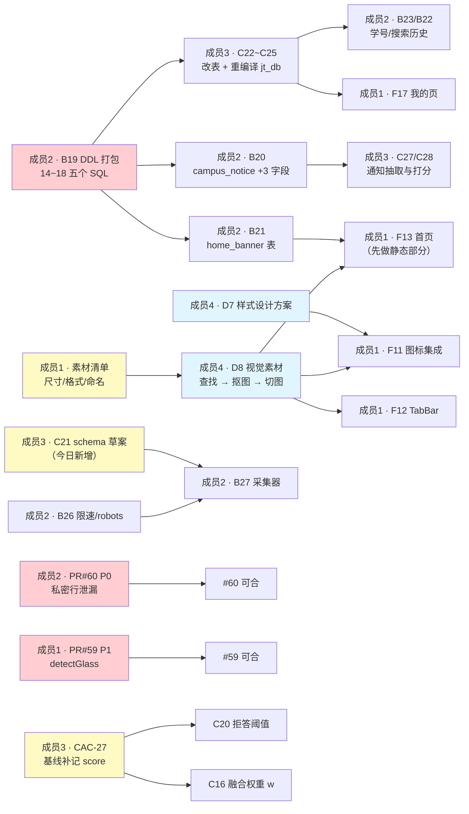

# 校捷通 · 成员任务单 **260914 序 1**（2026-09-14）

> **本单是什么**：把 09-13 的产出**核定**一遍（完成了什么 / 卡在哪 / 证据在哪），并给出**今天四个人各自要交什么**。
> **核定依据**（全部可复跑，非口头）：
> - 代码级审查：`docs/PR59-审查报告260913.md`（F10 玻璃基建）、`docs/PR60-审查报告260913.md`（B16/B17/B18）
> - 实测核查：`git` 分支/HTTP 状态、真实 MySQL 表与数据、真实 `jt_db` 复跑 `pytest`
> **开工第一件事**：`git fetch github` → 核对下表基线，若 `dev` 已前移，请**在群内喊一声**（本单的合并门禁依赖它）。
>
> 📝 **本版变更（260914 修订）**：
> ① **新增分工**：`F11`/`F12`/`F13` 的**具体图像绘制 + 素材查找 + 抠图切图**从成员1 **转给成员4**（总表新增条目：**前端视觉素材中心**，**已于 09-14 重排中定为 `D8`**）；成员1 只出**素材清单**并做**接入**。
> ② **新增今日任务**：成员2 = 通知表扩展 + 采集限速 + `sources` 契约 + 采集器骨架；成员1 = **`F11`~`F13`**；成员3 = **`C21` schema 草案**（解 `B27` 的卡）；成员4 = 视觉素材 + 样式方案。
> （**注**：②里的任务名是"重排前"叫法；**重排后的编号见下方 ④ 与 §2 各表**。）
> ③ 依赖图与收工清单已同步（见 §4 / §5）。
>
> 🔢 **【重要】任务编号已于 09-14 全员重排**（见总表 v3 文末**附录 A**）：
> **新编号 = 优先级顺序**（阻塞他人 > W1 结构 > 波次先后）；已交付任务保留原号。
> ⚠️ **本单已全面改用新编号**，尤其是这几个容易搞混的：
> **`B19` = DDL 打包脚本**（原 `D7`，从成员4 划入）· **`D7` = UI 设计规范+样式方案**（原 `D11`）·
> **`D8` = 视觉素材中心**（原 `D11a`）· **`B21`/`B22` = 首页/搜索历史接口**（原 `B25`/`B26`）·
> **`B26`/`B27`/`B28` = 采集限速/采集器/`sources` 契约**（原 `B22`/`B21`/`B20`）· **`B34` = CI**（原 `ENG-01`）。

---

## 0. 一页速览：今天四个人各交什么

| 成员 | 昨日核定（09-13） | 今日**必交**（阻断级） | 今日**应做** |
|---|---|---|---|
| **成员1**（前端） | PR #59 F10 代码完成 ✅ 但审查出 **1×P1**，**不满足合并条件** | ① 修 `detectGlass()` 的 P1（一行）② 跑工具到 **EXIT=0** ③ 把 `dev` 合进分支解冲突（**实测必然冲突**，见 §2.1） | ④ 修完 #59 后接 **`F11` 图标集成 → `F12` TabBar POC → `F13` 首页重构** ⑤ 先出**素材清单**（尺寸/格式/命名）交成员4 ⑥ P3-1 数值/注释择一 ⑦ 与成员4 对齐方案 §1.2 |
| **成员2**（后端+工程化） | PR #60 B16/B17/B18 代码完成 ✅ 但审查出 **1×P0 + 2×P1**，**不满足合并条件** | ① 修 `/life/notices` 私密行泄漏（**P0**）② 修两条**恒真空断言**（带**反向对照**）③ 修 `purge` 通配符护栏 | ④ 加 `admin_a` 夹具使 `pytest` 全绿 ⑤ **`B19` DDL 打包脚本**（🔴 关键路径，今日首交）⑥ **`B20`** 通知表字段契约 ⑦ **`B21`/`B22`** 首页/搜索历史接口（⛔ 卡 `B19`）⑧ **`B26`** 采集限速（不依赖他人）⑨ **`B28`** `sources` 契约 ⑩ **`B27`** 采集器骨架（等 `C21`）|
| **成员3**（数据/AI） | C15/C16/C20 **三分支已推送但未开 PR**；CAC-25 已合入 `dev` ✅ | ① 给 **C15/C16/C20** 开 3 个 PR 并请人 Approve ② `fix/data01-backport-to-dev` 开 PR（恢复 P0 到 `dev`） | ③ **`C21` 配置 schema 草案**（成员2 的 `B27` **卡在它**）④ **CAC-27** ⑤ **`C26`** 帖子搜索索引 |
| **成员4**（**仅文档 + 图片素材**） | **D7/D8/D9/D10/D11 全部未开始**，而 **DDL 脚本已划出**（现为成员2 的 `B19`） | ① **`D8` 首批视觉素材**（至少 `user-solid.svg`，`F11` 在等）② **`D7` UI 设计规范 + 具体前端样式设计方案** | ③ **`D8`** 继续交 Banner/Logo/凸起按钮 ④ `D9` ER 图 ⑤ `D11` 驿站视觉素材 |

> **今日最关键的人 = 成员2 与成员4**：**`B19`（DDL 脚本，成员2）** 卡住 `C22~C25`（成员3 改表）+ `B20/B21/B22/B23`（成员2 自己）；而 **`D8` 素材 + `D7` 样式方案（成员4）** 卡住 `F11`~`F13`。

---

## 1. 基线事实（已实测，别再猜）

| 项 | 实测值 | 怎么核查 |
|---|---|---|
| `dev` 头 | **`7047ebd`** | `git rev-parse --short github/dev` |
| 昨日合入 | **PR #58** = `fix/frontend-base-url-guard`（**#53 的 P1 修复**）✅ | `git log --oneline -1 github/dev` |
| 开放 PR | **只有 2 个**：`#59`（成员1）· `#60`（成员2） | GitHub `/pulls`，均为 `Review required before merging` |
| 知识库规模 | `knowledge_doc` = **27 篇**（`status=1` 全部已索引） | `SELECT COUNT(*) FROM knowledge_doc` |
| `D7` 的 SQL | `14_notice_extend.sql` / `15_home_banner.sql` / `16_search_history.sql` / `17_user_student_no.sql` / `18_takeaway_pickup.sql` —— **5 个全缺** | `git ls-files db/sql/` |
| 表存在性 | `takeaway_order` ✅ · `user` ✅ ｜ `user_search_history` ❌ · `home_banner` ❌ · `pickup_point` ❌ | `information_schema.tables` |
| `campus_notice` 扩展列 | `deadline` / `materials` / `importance` —— **全缺**（`B19` 未做） | `information_schema.columns` |
| 成员4 文档产物 | `docs/db/ER图.md` ❌ · `docs/需求说明书.md` ❌ · `docs/UI设计规范.md` ❌ · `.github/workflows/` ❌ | `git ls-files` |
| 待合分支（均落后 `dev` 2 个提交） | `feat/c15-chunk-strategy` `54a7818` · `feat/c20-citation-check` `f5a7a05` · `feat/c16-rerank` `670e6c7` · `fix/data01-backport-to-dev` `6df7984` | `git rev-list --left-right --count github/dev...<分支>` |

> ⚠️ 两个"看起来该合了其实还没合"的分支：`feat/two-stage-plan` 与 `fix/frontend-base-url-guard` 已 **0 个独有提交**（内容已全在 `dev`）→ **可以直接删**，别留在本地列表里误导人。

---

## 2. 逐个核定 + 今日任务

### 2.1 成员1（前端小程序）· PR #59 = `F10 设计令牌 + 玻璃样式库`

**核定：代码完成 ✅，但审查发现 1 个 P1 阻断 —— 现在不能合。**

#### 🔴 今日必交 ①：修 P1 —— `detectGlass()` 恒返回 `false`

`miniprogram/utils/glass.js` 用 `wx.getAppBaseInfo()` 取 `system`，而**官方文档里这个接口不返回 `system`**
（只有 `SDKVersion/enableDebug/host/language/version/theme/...`；`system` 在 `wx.getDeviceInfo()` 里）。

```diff
-    const info =
-      typeof wx.getAppBaseInfo === 'function' ? wx.getAppBaseInfo() : wx.getSystemInfoSync()
+    // system 字段在 getDeviceInfo / getSystemInfoSync 里；getAppBaseInfo 不返回 system
+    const info =
+      typeof wx.getDeviceInfo === 'function' ? wx.getDeviceInfo() : wx.getSystemInfoSync()
```

**为什么必须今天修**：基础库 ≥ 2.20.1 时 `system` 恒为 `''` ⇒ 探测恒 `false` ⇒
F11 之后所有页面会走 `.is-glass-fallback` ⇒ 全端退化成**纯白实底 + 无阴影**，F10 的毛玻璃**永远不会出现**（且不报错）。
实证：13 个场景里 S1/S2/S3（iOS / Android 12 / 开发者工具）**全部 FAIL**，反向对照 S4 证明根因就是取错了接口。

**怎么自证**（工具已在仓库）：
```powershell
node tools/verify_glass_probe.js --src .        # 期望 EXIT=0（0 = 缺陷已修，1 = 缺陷仍在）
```

#### 🔴 今日必交 ②：把 `dev` 合进分支解冲突（**这次不是"可能"，是"必然"**）

`#59` 现在**落后 `dev` 33 个提交**，而 `dev` 昨天刚合入 **PR #58**，它改了**同一个文件** `miniprogram/app.js`
（加了 `checkApiEnv()` 启动自检）。实测两边在**同样两个锚点**插入：

| 锚点 | `#59`（F10） | `dev` 已含（#58） |
|---|---|---|
| 文件顶部 | `require('./utils/glass')` | `require('./config/env')` |
| `onLaunch()` 内 | `this.globalData.glassSupported = ...` | `this.checkApiEnv()` |

⇒ **两个 `require` 都保留、`onLaunch` 里两行都保留**即可（不要二选一）。
合并前先 `git merge github/dev`，**在自己分支上解**，别留到 GitHub 上解。

**实测证据**（本机 `git merge-tree`，`dev = 7047ebd`）：
```
$ git merge-tree --write-tree --name-only github/dev github/feat/frontend-f10-design-tokens
miniprogram/app.js
Auto-merging miniprogram/app.js
CONFLICT (content): Merge conflict in miniprogram/app.js
```

#### 🟡 今日应做

- **P3-1**：`--xj-color-primary-strong: #3F82C7` 注释写「≈8%」，实际比 `#4A90D9` 深 **≈15%**；方案 §1.1 也写 8% → **注释 / 数值 / 方案三者择一**（建议改注释为实际值）。
- **与成员4 对齐方案文档 §1.2**：§1.2 规定「默认真玻璃 + `@supports not` 降级」，而你的实现是「**默认安全 + 正向增强**」（**你的方向更正确**，理由已写进代码注释）。按团队规则「现行方案文档必须与实现同步」，**由成员4 改 §1.2**，你提供一句话结论即可（避免下一个人照文档写出第二套竞争模式）。
- **合并后立刻开 F11**（图标集，需补 `user-solid.svg`）；F12（TabBar POC）是 W2 门禁。
- **F11 开工前定一件事**：`.is-glass-fallback` / `.is-glass-reduced` 是**祖先选择器**，而小程序**无法给 `page` 加 class** → 每个页面都得自己包一层。现在 `pages/` 下引用数 = **0**，`glassSupported` **只写不读**。建议先落一个 `behaviors/glass.js`（提供 `glassClass`）＋约定各页根节点挂它，否则 20+ 页面会各写一套、且大概率漏做降级。

#### 🟡 今日接着干：**`F11` → `F12` → `F13`**（#59 修完后立即开工）

> 🖼️ **分工变更（2026-09-14 定）：你不用再找图 / 画图 / 抠图了。**
> 「具体图像绘制 + 素材查找 + 抠图切图」**全部转给成员4**（新编号 **`D8` 前端视觉素材中心**）。
> **你的职责边界**：① 出**素材清单**（要哪些图、尺寸、格式、命名、留白规则）；② 拿到 `ui/assets/` 成品后做**接入与样式填充**。
> 🎨 **具体前端样式设计方案由成员4 出（`D7`）**；`F11`~`F19` 的视觉一律按 `D7` 执行，不要各页各写一套。

| 事项 | 你要做的 | 卡不卡 |
|---|---|---|
| **① 先出素材清单** | 列 `F11`/`F12`/`F13` 需要的全部图：图标名 + `stroke-width:1.5` + 尺寸；Logo / 轮播 Banner 尺寸与比例；TabBar AI 凸起按钮尺寸（`@2x`/`@3x`）；统一留白与命名规则 | ✅ **立刻可做，且是成员4 开工的前提** |
| **② `F11` 图标集成** | 拿到成员4 交的 `ui/assets/icons/*.svg` → 放进 `static/icons/`，全局替换旧的彩色/粗重图标；**补齐 `user-solid.svg`**（当前缺，`ui/` 里也没有） | ⛔ 等 `D11a` 首批（只等图，不等代码） |
| **③ `F12` TabBar POC** | `custom-tab-bar/`：5 项 + **AI 居中凸起圆形**（图片用 `D8`）+ 长按唤起语音；真机验凸起位置、全屏页隐藏 | ⛔ 凸起按钮图等 `D11a`；**骨架与逻辑可先写** |
| **④ `F13` 首页重构** | **先做静态部分**：Logo 置顶 · 轮播容器 · 搜索框上拉置顶 + 历史 · 入口精简 · 信息流容器（上拉加载） | ⛔ 数据接口等 `B25`/`B26`；而 `B25` 又卡 `home_banner` 表 → `D7` ⇒ **今天先把不依赖接口的静态部分做完** |

> ⚠️ `F13` 是「接口未就绪也能干一半」的任务，**别等**：先把布局与交互做出来，接口就绪后只接数据。

---

### 2.2 成员2（后端 + AI）· PR #60 = `B16 解析器 + B17 批量导入 + B18 分层推送`

**核定：代码完成 ✅（B16/B17 质量不错），但审查发现 1×P0 + 2×P1 —— 现在不能合。**

#### 🔴 今日必交 ①：修 **P0** —— `/life/notices` 私密推送行**全量泄漏**

```python
# routers/life.py 现状
rows = cpp_bridge.life_dao().page_notices(page, size, category, target_grade)
rows = [r for r in rows if not is_private_audience(r.get("target_grade"))]   # ← 空操作
```
`db/cpp_driver/src/dao/life_dao.cpp` 的 SELECT 是
`SELECT id, title, content, source, category, publish_time` —— **没有 `target_grade` 列**
⇒ `r.get("target_grade")` 恒 `None` ⇒ 判断恒 `False` ⇒ **一行都不会被剔除**。

实测（真实 `jt_db` + 真实 MySQL）：
```
DAO 返回列 = ['category','content','id','publish_time','source','title']   含 target_grade 吗 = False
对照：is_private_audience('__push:reminder:12:D7') = True    ← 函数是好的，是调用方拿不到列
```

**影响**：B18 一旦真实跑起来，个人待办推送（标题形如「【还有 7 天】截止 …」）会返回给**任何登录用户**
—— 与已修的 `DATA-01` 同级。

**修法（推荐，纯 Python，符合你"无需重编译 C++"的声明）**：不要在 Python 侧过滤，**把过滤下推到 SQL**
（照 `services/notice.py::_visible_notices` 的写法与同一个常量 `_PRIVATE_LIKE`），并**同时用同条件 `COUNT(*)` 算出正确的 `total`**：

```python
where = ("WHERE (? = '' OR category = ?) "
         "AND (? = '' OR target_grade = ? OR target_grade = '') "
         "AND target_grade NOT LIKE ? ")
params = [category, category, target_grade, target_grade, _PRIVATE_LIKE]
total = cpp_bridge.query(f"SELECT COUNT(*) AS c FROM campus_notice {where}", params)[0]["c"]
rows  = cpp_bridge.query(f"SELECT id, title, content, source, category, publish_time "
                         f"FROM campus_notice {where} ORDER BY publish_time DESC LIMIT ? OFFSET ?",
                         params + [size, (page - 1) * size])
```
> 为什么不能只在 Python 侧修：① 拿不到列；② 过滤放在**分页之后**会让 `total` 失真、且被私密行占掉的窗口位置**不会被公共行补位**（DAO 不补位）→ 量大时 `page=1` 可能几乎为空。**一次把"泄漏 + 计数 + 分页"三件事一起解决。**
> 给 DAO 加参数需重编译 C++，与你的声明冲突 → 建议并入**下一批 C++ 改动**单独排期。

#### 🔴 今日必交 ②：修两条**恒真空断言**（这就是你"实测零泄漏"没抓到问题的原因）

```python
# tests/test_notice_push.py:68  —— item 来自 API 响应，而响应里没有 target_grade
assert not notice_scheduler.is_private_audience(item.get("target_grade"))   # → 恒 None → 恒通过
```
```powershell
# tests/verify_b16_b18.ps1:192  —— $_.target_grade 不存在
$leak = @($pub.data.items | Where-Object { $_.target_grade -like "__push:*" })  # → 恒 0 条 → 恒通过
```

**两个原因叠加**：断言依赖的字段不存在（恒真）＋ 当时 `campus_notice` 私密行恰好 **= 0**（已回收）。
⇒ **"零泄漏"从未被真正验证过。**

**改成"能失败"的写法（任选，建议 ①+② 一起）**：
1. **标题比对**：把私密行的标题当已知字符串，断言它**不出现**在公共列表里；
2. **前后差量**：记录调度前 `/life/notices` 的 **id 集合**，调度后再取一次，断言**集合不变**；
3. **字段存在性前置**：`assert "target_grade" in public.json()["data"]["items"][0]` —— 先保证"要检查的字段真的在"。

**必须做反向对照**：临时把过滤去掉，断言必须**变红**；不然等于没测。
> 📌 这条建议同步进团队规约：**断言必须依赖一个「有缺陷时必然为真」的可观测事实**。
> 与本仓既有的「`jt_db` 字符串化 → `"39" == 39` 恒 False → 假通过」是**同一族问题：断言依赖的东西不存在**。

#### 🔴 今日必交 ③：修 P1 —— `POST /admin/knowledge/purge` 通配符未转义

`source_url LIKE ?` + `f"{prefix}%"`，`prefix` **未转义 `%` / `_`** ⇒ 传 `"%"` → `LIKE '%%'` **匹配全库**
⇒ 一条管理端调用删光 `knowledge_doc` + `knowledge_chunk` + 向量，**无强制 `dry_run`、无二次确认、不可回滚**；
CLI 的 `--purge-source-prefix` 同样。**建议全做**：① 拒绝含 `%`/`_`/`\` 的前缀；② 最小长度 ≥4；
③ 加 `confirm`（未确认时只返回 `matched` + 候选 id 预览，CLI 加 `--yes`）；④ 用 `ESCAPE` 或 `LOCATE(?, source_url)=1`。

#### 🟡 今日应做

- **加 `admin_a` 夹具使 `pytest` 全绿**：现状实测 **`2 failed / 66 passed`**（不是描述里的 45 passed —— 那个数字也已过期，当前共 68 个用例）。两个失败用例用**普通用户** `hdr_a` 调 `GET /admin/notices/pending`、`POST /admin/notices/purge-private` → **403 `2003 需要管理员权限`**（`get_current_admin` 判 `role >= 1`，拦截是**对的**，是用例缺管理员身份）→ **干净环境 / CI 上必挂**。
- **B17 验收口径要拍板**：验收标准是 **「≥120 篇可批量入库」**，但实测现在 `knowledge_doc` **只有 27 篇**（你测完用 `--purge-source-prefix bench/` 把 120 篇清掉了）。管线通了 ✅，但**成果没留下**。二选一并写进 `docs/api.md`/任务表：**① 保留 120 篇正式语料（推荐，否则验收是空的）**；② 把验收改写成"管线能在 X 秒内导入 ≥120 篇"，并把 120 篇夹具语料随 `docs/kb_samples/` 一起提交。
- **上传解析通道改流式限读**：`_ingest_upload` 用 `await upload.read()` **整包进内存**后才判 32MB；而同仓 `upload.py:51` 的注释**恰好写明了这个坑**并有 `_read_limited()` —— 新通道没复用。建议把 `_read_limited` 提到 `core/` 共用。
- **PDF 解压改流式**：上限在 `zlib.decompress()` **之后**才判 ⇒ 解压炸弹在判之前就吃掉了内存。容错分支已在用 `decompressobj()`，主路径也传 `max_length=_MAX_STREAM_BYTES` 即可。（其余护栏都对：`_MAX_STREAMS=512`、**无 XML/DTD 解析 ⇒ 无 XXE 面**。）
#### 🟡 今日接着干：**`B19` ~ `B22` + 可先行项**（#60 修完后立即开工）

> ⚠️ **编号已重排**，今日目标对应如下（括号内为**老编号**，便于对照）：
> **`B19`**=DDL 打包脚本（原 `D7`）· **`B20`**=通知表扩展（原 `B19`）·
> **`B21`**=首页接口（原 `B25`）· **`B22`**=搜索历史接口（原 `B26`）。
> 你原本的“采集限速/采集器/契约”三项在新号里是 **`B26`/`B27`/`B28`**（仍列在下方，可先行）。

| 编号（新） | 今天能做到什么 | 卡点 | 建议顺序 |
|---|---|---|---|
| **`B19`** DDL 打包脚本 | **五个 SQL 全写 + 幂等可重跑**：`14_notice_extend` · `15_home_banner` · `16_search_history` · `17_user_student_no` · `18_takeaway_pickup`（+ `pickup_point` 建表 + 种子） | 无（**你不依赖别人**） | **① 最优先·全队卡点** |
| **`B20`** 通知表结构扩展 | 等 `B19` 的 `14_` 落地 → 改表 + 写 DAO/Pydantic；今日先定**字段契约** | ⛔ 卡 `B19`（是你自己的） | **②** |
| **`B21`** 首页数据接口 | `GET /home/banners` + `GET /home/feed`（分页/排序/鉴权） | ⛔ 卡 `B19`（`home_banner` 表） | **③** |
| **`B22`** 搜索历史接口 | `GET`/`POST`/`DELETE /search/history`（写入去重、倒序、清空） | ⛔ 卡 `B19`（`search_history` 表） | **④** |
| **`B26`** 采集合规与限速 | `robots.txt` 检查 + **限速模块** + 日志可追溯 | 无 | **⑤ 穿插着做**（`B27` 的地基，先做不浪费） |
| **`B28`** `sources` 事件契约扩展 | SSE `sources` 加 `snippet`/`chunk_id`/`score`（**旧字段全保留**）+ 更新 `docs/api.md` | 无（与 `C29` 同源） | **⑥** |
| **`B27`** 配置驱动采集器 | 先做**采集器骨架**（读配置 → 抓取 → 解析 → 入库/去重）+ 复用 `B26` 限速 | ⛔ **卡 `C21`**（成员3 今日先出草案） | **⑦** |

⚠️ **字段名/类型必须与 `B19` 的 `14_notice_extend.sql` 逐字一致**（含可空性与默认值），否则改表后 DAO 直接报错。
⚠️ `17_user_student_no.sql` 里：**先 `UPDATE user SET student_no=NULL WHERE student_no=''`（实测 **63 行空串**），再加唯一索引**，否则 `ERROR 1062`。

---

### 2.3 成员3（数据/AI · 本单核定人）· `C15 / C16 / C20 / C33`

**核定：C15 ✅ 完成、C16 🟡 机制+负结论、C20 🟡 部分完成 —— 三个分支都已推送，但（我的）PR 还没开。**

#### 🔴 今日必交 ①：给 3 个分支开 PR 并请人 Approve

| 分支 | commit | 内容 | 证据 |
|---|---|---|---|
| `feat/c15-chunk-strategy` | `54a7818` | 切片策略可插拔（`fixed` 默认 / `semantic`） | 40 组 golden 逐字节一致 + **153 单测** |
| `feat/c20-citation-check` | `f5a7a05` | 引用真实性闸门 + 拒答改造 + SSE 接入 | **47 单测**；`tools/verify_citation_check.py` EXIT=0 |
| `feat/c16-rerank` | `670e6c7` | 重排机制 +（诚实的）**负实测结论** | **24 单测**；`tools/eval_rerank.py` EXIT=1（预期） |

⚠️ **我自己不能批自己的 PR** → 需请成员1/2/4 任一人点 **Approve**。
⚠️ 三个分支都**落后 `dev` 2 个提交** → 合并前先 `git merge github/dev`。
⚠️ **每合一个，`dev` 就前移，其它 PR 的批准会作废**（规则集 `Dismiss stale approvals`）→ 顺序：**对齐 → 批准 → 立刻合**，一个一个来。

#### 🔴 今日必交 ②：`fix/data01-backport-to-dev` 开 PR（恢复 **P0** 到 `dev`）

`#52` 当年**合错分支进了 `main`**，导致 `dev` 上「待审/被拒内容仍可被他人读取」这个 P0 **至今未修**。
分支 `6df7984` 已备好（6 文件与 `main` **逐字节一致**，DATA-01 **11/11 通过**）。今天必须开 PR 合进 `dev`。

#### 🟡 今日应做

- **`C21` 配置 schema **草案**（今天新增·优先级高）**：成员2 的 **`B21` 采集器卡在这里**。
  你今天**不需要**把 `C21` 全量做完（原排 W5），只需给出**最小可用的 schema 形状 + 一份示例配置**：
  学校名称 / 校区 / 部门 / **术语映射** / **采集源列表**（URL + 选择器 + 分类）/ 学号格式正则。
  给到成员2，他就能把 `B21` 的接线写完（配置内容后续再填）。
- **`CAC-27`（最高价值）**：`ai/eval/rag_bench.py` 每行增记 `scores: [float]`（与 `got_titles` 同序）+ `top_score` → 重跑一次 C14 基线。
  它**同时卡住两件事**：`C20` 的拒答阈值、`C16` 的分数融合权重（`w`）。需要 Ollama 可用。
- **`C33` 帖子搜索索引优化**（W2 剩余项，可离线推进）：FULLTEXT / ngram + `EXPLAIN` 实测 `p95 < 200ms`。
- 顺带：`CAC-26`（`chunk_size<=0` 死循环）的 `Settings` 侧 `gt=0` 校验。

#### ⛔ 今日卡点

- **`C22~C25`（学号唯一 + 限频 + `token_version` / 搜索历史表 / banner 表 / 代收闭环表）今天开不了工** —— 全部依赖**成员2 的 `B19`（DDL 脚本）**，且改表后要**全员 SQL 同步 + 重编译 `jt_db`**。`SEC-07/08` 的 `token_version` 也并在这批。

---

### 2.4 成员4（**仅两个方向：文档 + 图片素材**）· **今天前端全在等你的素材与方案**

**核定：`D7`~`D11` 全部未开始。**
> ⚠️ **职责已收缩**：原属你的「DDL / 迁移 / CI 脚本」**已全部划给成员2**（→ `B19` / `B33` / `B34`）——
> 你今天**不再承担任何脚本**，只做 **① 文档方向 ② 图片素材方向**。

#### 🔴 今日必交 ①：`D8` 首批视觉素材（`F11` 在等它）

| 你要交付 | 内容 | 交付位置 |
|---|---|---|
| **图标（第一批·最优先）** | 苹果**线性图标** SVG（`stroke-width:1.5`，统一线宽/尺寸/留白）；**必须含 `user-solid.svg`**（当前缺，`ui/` 里也没有） | `ui/assets/icons/` |
| **图片** | Logo · 首页轮播 Banner · 首页入口图：**查找原图 → 抠图 → 切图 → 统一留白与背景** | `ui/assets/images/` |
| **按钮/按键** | TabBar **AI 居中凸起按钮**等，含 `@2x` / `@3x` | `ui/assets/buttons/` |

**验收口径**：成员1 **拿到即可直接替换**，不需要再做任何图像处理。
**工作方式**：先等成员1 的**素材清单**（尺寸/格式/命名/留白）——有单再抠；
没有真图时先用**占位图 + 同尺寸**顶上，**保证成员1 不阻工**。
> 💡 顺序建议：**`user-solid.svg` 先交**（`F11` 硬缺口）→ TabBar 凸起按钮（`F12`）→ 首页 Banner/Logo（`F13`）。

#### 🔴 今日必交 ②：`D7` UI 设计规范 + **具体前端样式设计方案**

- `docs/UI设计规范.md`：色板（`#4A90D9` 体系）/字号/圆角/阴影/**玻璃参数**/图标规范 + **降级策略**；
- **逐页样式稿**：首页 / 服务页 / 我的 / 论坛 / 外卖 —— 让成员1 **可直接照做**；
- 可直接从成员1 已交付的 `styles/tokens.wxss`（PR #59）**反推**，**不要另起一套变量**。

> 这是 `F11`~`F19` 的**视觉总纲** —— 成员1 的所有页面都等它。
> ⚠️ `D7` 与 `D8` **今天同步起步，不要串行**：成员1 **两个都在等**。

#### 🟡 今日应做

- **`D9` ER 图**：DataGrip 反向导出 → `docs/db/ER图.md`（含新增表/字段；评审与结题刚需）。
- **`D11` 驿站视觉素材与样式参考**：驿站卡片/列表样式参考（**模仿拼多多样式**）+ 真实驿站/快递柜图（5~8 个）切图 → 供 `F21` 套用。
- **同步方案文档 §1.2**：把「默认真玻璃 + `@supports not` 降级」改成成员1 实现的
  「**默认安全 + 正向增强**」（方向更正确，理由见 `docs/PR59-审查报告260913.md` §2-3）。

> ⚠️ **你已不再负责**：`db/sql/14~18` 五个 DDL 脚本（→ 成员2 的 **`B19`**）· 外卖迁移脚本（→ **`B33`**）· CI（→ **`B34`**）。
> 其中 `17_user_student_no.sql` 的「**63 行空串必须先转 `NULL`**」这个坑已交给成员2，你无需处理。

---

## 3. 今日合并门禁（谁批 / 什么顺序）

> 规则集 `team-branch-protect`：`main` + `dev` 都要求 **1 个批准**；
> **新提交会作废批准**，**`dev` 前移也会作废批准**（`Dismiss stale approvals`）；
> **作者不能批自己的 PR**；允许 Merge / Squash（无 Rebase）。

**今日建议顺序**（每步 = 对齐 `dev` → 请人 Approve → **立刻合**）：

| 序 | PR / 分支 | 谁开 | 谁批 | 前置 |
|---|---|---|---|---|
| 1 | `fix/data01-backport-to-dev` | 成员3 | 成员1/2/4 | 落后 `dev` 2，先 merge |
| 2 | `#60`（成员2）→ **先修 P0+断言+P1** | 已是 `yl-love` | 成员3 | P0/P1 修完 + `pytest` 全绿 |
| 3 | `#59`（成员1）→ **先修 P1 + merge dev** | 已是 `dream-facing` | 成员3 | P1 修完 + 工具 EXIT=0 + 解 `app.js` 冲突 |
| 4 | `feat/c15-chunk-strategy` | 成员3 | 成员1/2/4 | 落后 2，先 merge |
| 5 | `feat/c20-citation-check` | 成员3 | 同上 | 同上 |
| 6 | `feat/c16-rerank` | 成员3 | 同上 | 同上 |
| 7 | `test/beta-assets`（审查报告 + 本单） | 成员3 | 同上 | 可最后合 |

> ⚠️ **第 2 与第 3 步互不影响**：`#60` 只改 `backend/`（实测 vs `dev` **无冲突**），
> `#59` 只改 `miniprogram/`。两者之间不存在冲突，可以并行推进。

**今日冲突实测矩阵**（`git merge-tree`，基线 `dev = 7047ebd`）：

| PR / 分支 | vs `dev` | 处理 |
|---|---|---|
| `#59`（成员1 F10） | 🔴 **`CONFLICT: miniprogram/app.js`** | 先 `git merge github/dev`，两个 `require` + `onLaunch` 两行都保留 |
| `#60`（成员2 B16/B17/B18） | ✅ 无冲突 | 直接合并 |
| `feat/c15-chunk-strategy` | ✅ 无冲突（落后 2） | 先 `merge dev` |
| `feat/c20-citation-check` | ✅ 无冲突（落后 2） | 先 `merge dev` |
| `feat/c16-rerank` | ✅ 无冲突（落后 2） | 先 `merge dev` |
| `fix/data01-backport-to-dev` | ✅ 无冲突（落后 2） | 先 `merge dev` |

---

## 4. 依赖与卡点（今天谁在等谁）



**今天的四条硬卡点**：
1. 🔴 **`B19` DDL 脚本（成员2）** —— 卡住 4 个人：成员3 的 `C22~C25`、成员2 自己的 `B20/B21/B22`、成员1 的 `F17`。
   （**已从成员4 划给成员2** —— 今天成员2 必须首交它。）
2. 🔴 **`#60` 的 P0（成员2）** —— 不修就不能合，而它挡着 `B17` 的验收与后续 `B18` 上线。
3. 🔴 **`#59` 的 P1（成员1）** —— 不修则 F10 白做（毛玻璃永不出现），且 F11 会建在错的地基上。
4. 🟠 **`C21` 草案（成员3）+ `D8` 素材 + `D7` 样式方案（成员4）** —— 分别解锁成员2 的 `B27` 与成员1 的 `F11`~`F13`。

---

## 5. 今日收工验收清单（逐条打勾）

**成员1**
- [ ] `node tools/verify_glass_probe.js --src .` → **EXIT=0**
- [ ] `#59` 已 `merge github/dev`，`miniprogram/app.js` 两个 `require` + `onLaunch` 两行都在
- [ ] `--xj-color-primary-strong` 的注释与数值一致（P3-1）
- [ ] `#59` 已合并 / 或已请人 Approve 待合
- [ ] **素材清单已交成员4**（图标名/尺寸/命名/留白规则）
- [ ] `F13` 首页**静态部分**已动工（不依赖接口那半）

**成员2**
- [ ] `/life/notices` 用 **SQL 侧过滤**，且 `is_private_audience` 的 Python 调用已删
- [ ] 两条断言改成"能失败"写法 + **反向对照**（去掉过滤必须变红）
- [ ] `purge` 至少加「拒绝 `%`/`_`」+ 最小长度
- [ ] `pytest tests` → **全绿**（当前 `2 failed / 66 passed`）
- [ ] **`B19` DDL 五个 SQL 已交且幂等**（🔴 全队卡点，今日首交）
- [ ] `17_user_student_no.sql` 里**已先 `UPDATE user SET student_no=NULL WHERE student_no=''`**（实测 **63 行空串**）
- [ ] **`B20`** 字段清单已定（供自己后续改表）；`B21`/`B22` 接口随表就绪推进
- [ ] **`B26`** 限速/`robots` 有可运行模块；**`B28`** 契约扩展已改 `docs/api.md`（旧字段全保留）
- [ ] B17 语料口径拍板并写入任务表（保留 120 篇 / 还是改验收口径）

**成员3**
- [ ] 4 个 PR 已开（3 个 C 系列 + data01-backport），并已请人 Approve
- [ ] 至少 1 个 PR 已合入 `dev`
- [ ] **`C21` schema 草案 + 示例配置已交成员2**（解 `B27` 的卡）
- [ ] `CAC-27` 有进展（脚本改动 or 明确阻塞说明）
- [ ] **`C26`** 有进展（`EXPLAIN` 数据）

**成员4**
- [ ] **`D8` 首批素材已交**（至少 `user-solid.svg`，`F11` 在等它）
- [ ] **`D7` 样式设计方案已开局**（色板/字号/圆角/玻璃参数 + 逐页稿）
- [ ] `D9` ER 图有初稿
- [ ] `D11` 驿站视觉素材有初稿
- [ ] 已确认**自己不再负责** `db/sql/14~18`、迁移脚本、CI（已给成员2）

---

## 6. 本单与总表的关系

- 本单是 **`docs/成员任务单-二阶段整改260912.md`（v2 总表）的"日切片"**，不改总表结构；
  总表里 `C15 / C16 / C20 / B16 / B17 / B18 / F10` 的**核查状态**应由各自分支在合并时同步更新。
- 波次定位（沿用总表 §3.0）：**当前实际进度 = W1 尾部 / W2 开头**。
  已完成：`W0 封版`（`FRONT-01`/`DATA-01`/`PR42-N01`）✅ ；`CAC-25` ✅ ；`F10` ✅（待修 P1）；`B16`/`B17` ✅（待修 P0）。
  **未完成：`D7`（W1 关键路径）尚未开始 → `W1 结构冻结` 未达成。**
- 本单不重复总表已列的历史编号（`DATA-01`/`SEC-17`…），只做**当日增量**与**评审修复**。

> **一句话总结今天**：三个人的代码都已经"写完"，今天的活**全是把写完的东西改对**——
> 成员1 修 1 个 P1，成员2 修 1 个 P0 + 2 个 P1，成员3 把三个分支送进 `dev`；
> 而**成员4 的 `D7` 是唯一一个"从零开始"的任务，也是全队的路**。
