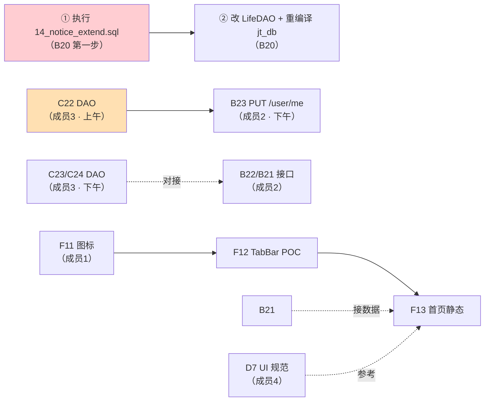

# 成员任务单 · 2026-09-15 · 序1

> **基线**：`dev = 7423913`（**#60 已合入**）｜`main = ef57504`
> **所有"现状"均为 2026-09-15 实测**（本地库 + 远端 git），不依赖记忆。
> **今日总目标**：**成员2 干完 `B20`~`B23`**；成员3 交付 `C22`~`C25` 并清干净 PR 队列；成员1/4 各推一项可见成果。

---

## 0 · 全队今日铁律（3 条，违反即返工）

1. **先对齐 `dev` 再开发** —— `dev` 昨天从 `a0fd208` 前进到 `7423913`（跨了 #73、#60）。所有在等合并的分支都大幅落后（见 §3）。**不先对齐就提交，PR 会带一堆旧 diff，评审看不懂、冲突成倍。**
2. **脚本进 `dev` ≠ 生效** —— `14_notice_extend.sql` 已在 `dev` 里，但**库里 `campus_notice` 三列仍不存在**（实测）。DDL 必须**真的执行**才算完。
3. **一个 PR 一件事** —— 禁止把 DDL、接口、前端混在一个 PR 里（#60 就是因此反复过不了审）。

---

## 1 · 成员1（前端）· 今日任务

| # | 任务 | 现状（实测） | 今天做什么 | 验收 | 依赖 |
|---|---|---|---|---|---|
| **F11** | **图标补齐** ⭐ | `ui/icons/` 共 43 个 svg；`navigation/` 有 `home.svg`/`home-solid.svg`/`user.svg`/`user-group.svg`/`user-group-solid.svg`，**但缺 `user-solid.svg`** | 补 `ui/icons/navigation/user-solid.svg`（与 `home-solid.svg` 同风格）；顺手核对 tab 用到的图标是否齐全 | 4 个 tab 图标（含选中态）齐全；`node tools/verify_frontend_base_url_guard.js` 等既有校验脚本仍过 | — |
| **F12** | **TabBar POC** | `miniprogram/custom-tab-bar/` **不存在** | 搭 `custom-tab-bar/`（`index.js/json/wxml/wxss`），先做**静态可切换**，不接接口 | 4 个 tab 可切换、选中态正确；真机/开发者工具无报错 | `F11` 图标 |
| **F13** | **首页重构** | `miniprogram/pages/index/index.js` 已在 `dev`；`styles/design-tokens.wxss` **不在 `dev`** | 本次**只做静态部分**（布局 / 轮播 / 搜索上拉置顶 / 精简入口），**不接数据** | 轮播可滑可点；搜索上拉置顶且主体清空；版式与设计稿一致 | `F12`；接口等 `B21`/`B22` 就绪后再接 |
| **F22** | **小程序静态检查** | 未做 | 加一条小程序侧静态检查（`node scripts/...` 形式），可挂 CI | 本地能跑、退出码语义正确 | — |

> ⚠️ **F10 已合并的部分别重复做**：`miniprogram/utils/glass.js` **已在 `dev`**（这是 #59 合入的）。
> ⚠️ `miniprogram/utils/base-url.js` 不在 `dev` —— 若你在用，先确认它是否在你自己分支里、别丢。
> 📌 **接口先别接**：`B21`/`B22` 今天才做（成员2），F13 先做静态；接数据时用 `docs/api.md` 的契约。

---

## 2 · 成员2（后端）· 今日任务：**`B20` → `B21` → `B22` → `B23` 全干完**

> **建议节奏**：`B20` 上午（顺序最讲究）→ `B21`+`B22` 中午~下午两点（表已就绪，出成果最快）→ `B23` 下午（等成员3 上午交付 `C22`）。

| # | 任务 | 现状（实测） | 今天做什么 | 验收 | 坑 |
|---|---|---|---|---|---|
| **B20** | 通知表结构扩展 ⭐ | `14_notice_extend.sql` ✅**已在 dev**；❌ **库里三列与 `idx_deadline` 都不存在** | ①**执行 DDL**（跑两遍，第二遍应全 `[skip]`）并贴输出 ② 改 `LifeDAO::page_notices` SELECT 加 3 列 → 重编译 `jt_db` → 补 `test_all_dao.py` 断言 ③ **删掉** `routers/life.py:130` 的 `attach_extended_fields(items)` ④ `notice_scheduler.notice_extended_columns()` 探测失败补 `logger.warning` | `information_schema` 查到 3 列 + `idx_deadline`；`/health/detail` 的 `notice_deadline_supported` = **true**；`pytest tests -q` 全绿 | 🔴 **顺序不能反**：必须先执行 DDL 再改 DAO。反了 `/life/notices` **直接 SQL 报错** |
| **B21** | 首页接口 | `routers/home.py` **不存在**；`home_banner` 表 ✅**已在库里**（3 条种子） | 新建 `routers/home.py`：`GET /home/banners`（`enabled=1` + `start_at`/`end_at` 有效期 + `ORDER BY sort DESC`）、`GET /home/feed`（排序+分页+鉴权）；`docs/api.md` 登记；补测试 | 两接口 `code=0`；feed 支持排序+分页；有鉴权 | `sort` 方向须与 `15_home_banner.sql` 的「**越大越前**」一致 |
| **B22** | 搜索历史接口 | `routers/search.py` **不存在**；`user_search_history` 表 ✅**已在库里**（含 `uk_user_keyword`） | 新建 `routers/search.py`：增（去重）/ 倒序拉取 / 单删 / 清空；`docs/api.md` 登记；补测试 | 写入**自动去重**；倒序拉取；清空生效 | 🔴 **必须用 `ON DUPLICATE KEY UPDATE created_at = CURRENT_TIMESTAMP`**，否则同人同词踩 `ERROR 1062` |
| **B23** | 用户资料增强 | 列已就绪：`student_no` **可空** + **`uk_student_no` 唯一** + `student_no_updated_at` + `token_version` | 改 `routers/user.py`：① 支持写 `student_no`，重复学号**拒**（捕获 1062 转业务错误）② **限频 1 次/7 天**，超频返回 **`3001` + 剩余天数** ③ 格式校验**调 `app/adapters`**（C21 已在 dev），不写死规则 ④ `docs/api.md` 登记两类错误 | 重复学号被拒；超频 `3001` + 剩余天数；格式规则**由适配器配置提供** | 🔴 老 token 无 `token_version` ⇒ **缺省按 0**，否则**全站用户被踢下线**；⏳ 依赖成员3 上午的 `C22` |

---

## 3 · 成员3（数据/AI/DB）· 今日任务：`C22`~`C25` + 清 PR 队列

### 3.1 代码任务

| # | 任务 | 现状（实测） | 今天做什么 | 验收 | 依赖 |
|---|---|---|---|---|---|
| **C22** | 学号唯一 + 限频 + `token_version` ⭐**上午优先** | 表结构 ✅**已完成**（`student_no` 可空、`uk_student_no` 唯一、`student_no_updated_at`、`token_version` 都在；空串学号已清洗 **64 行**） | ① `user_dao`：`update_student_no(user_id, student_no)`（同时写 `student_no_updated_at`）、`bump_token_version(user_id)`、读 `token_version` ② `core/deps.get_current_user` 接入 `token_version` 校验（老 token 缺字段按 0） ③ 重编译 `jt_db`；补 `test_all_dao.py` 断言 | 重复学号被 DB 唯一键拒；限频时间戳可读；登出后旧 token 失效 | **做完立刻通知成员2**（他等着做 B23） |
| **C23** | `user_search_history` DAO | 表 ✅**已在库里** | DAO：增（`ON DUPLICATE KEY UPDATE` 去重）/ 查（按 `(user_id, created_at)` 倒序）/ 单删 / 清空 | 写入去重；`EXPLAIN` 走 `idx_user_created` 无全表扫 | 与 B22 **接口归成员2**，先定方法签名避免重复实现 |
| **C24** | `home_banner` DAO | 表 ✅**已在库里**（11 列 + `idx_enabled_sort` + 3 种子） | DAO：list（`enabled` + 有效期 + `sort DESC`）/ 增删改 | 支持 `enabled` + `start_at`/`end_at` 过滤；排序正确 | 与 B21 的边界同上 |
| **C25** | 代收闭环改造 | `pickup_point` ✅表在库（3 驿站种子）；`takeaway_order` ✅已加 5 列；✅**历史回填已完成**（3 行全 `biz_type=1` 代买，代收 0 行） | DAO：`pickup_point` 增查；取件码生成与回查；到件标记；**新订单默认代收**（DB 默认值已设 `2`）；重编译 | 历史订单不丢（3 行仍为代买）；新订单默认代收；取件码可生成回查 | 「代收**不计费**」——金额字段保留但不引入支付流程 |

### 3.2 PR 队列对齐（**今早第一件事**）

`dev` 昨天前进了一大截，我的分支全部落后，**必须先对齐**：

| 分支 | PR | 落后/领先 dev | 与 dev 冲突 | 对齐动作 |
|---|---|---|---|---|
| `feat/b19-ddl-pack` | **#74** | 9 / 1 | ⚠️ `db/sql/README.md` | merge `dev` → 解 README 冲突 → 跑两遍 DDL 复验 → 推 |
| `feat/c15-chunk-strategy` | **#63** | 13 / 4 | ✅ 0 | merge `dev` → 跑 `test_chunker.py` → 推 → 找 Approve |
| `feat/c20-citation-check` | **#65** | 13 / 4 | ✅ 0 | merge `dev` → 跑 `test_citation_check.py` + doctest → 推 → 找 Approve |
| `test/beta-assets` | **#69** | 26 / 8 | ⚠️ `docs/成员任务单-二阶段整改260912.md` | merge `dev` → 解任务单冲突 → 推 |
| `fix/guard-sandbox-utils` | **#70** | 13 / 1 | ✅ 0 | merge `dev` → 跑 guard 脚本自检 → 推 |

- [ ] **`#69` / `#70` 的 base 从 `main` 改成 `dev`**（已错 4 次的老问题；base 不改，合了也进不了主干）
- [ ] 全部推完后本地 `dev` 同步到 `7423913`，并提醒全员重新对齐

---

## 4 · 成员4（文档/素材）· 今日任务

| # | 任务 | 现状（实测） | 今天做什么 | 验收 |
|---|---|---|---|---|
| **D7** | **UI 设计规范 + 样式方案** ⭐ | `docs/UI设计规范.md` **不在 dev** | 产出 `docs/UI设计规范.md`：液态玻璃参数（模糊/透明/描边/阴影）、字号与间距阶梯、颜色令牌 —— **要与成员1 已合的 `utils/glass.js` 对得上** | 成员1 能照着实现；令牌与 `glass.js` 的取值一致 |
| **D8** | **视觉素材中心** | `ui/assets/icons/` **不在 dev** | 建 `ui/assets/icons/` 与索引 README，说明素材来源/规格/用途 | 成员1 找图有据可依 |
| **D9** | **ER 图** | `docs/db/ER图.md` **不在 dev** | 画 ER 图，**必须反映 B19 的新结构**（`home_banner`、`user_search_history`、`pickup_point`、`user` 新列、`takeaway_order` 5 列） | 与 `db/sql/01~19` 实际表结构一致 |
| **D10** | 需求说明书 | `docs/需求说明书.md` **不在 dev** | 汇总 `docs/成员任务单-二阶段整改260912.md` + 方案文档为正式说明书 | 可作省级评审材料 |
| — | **接 `15_`/`16_` 的 Review** 🆕 | `15~18` 在 **PR #74** 里 | 以 **Review 身份**接 `15_home_banner.sql`（尤其 `sort` 排序方向要与 B21 对齐）与 `16_search_history.sql`（去重语义） | 给出明确的通过/打回意见 |

> 📌 成员4 已**不再承担** SQL/DDL/迁移/CI（已划给成员2）；`15_`/`16_` 原本是成员4 的分工，这次由成员3 代做，**请以 Review 身份接手**。

---

## 5 · 今日关键路径与依赖

- **硬依赖 1**：`C22 → B23`（成员3 上午不做完，成员2 下午的 B23 就得拖到明天）
- **硬依赖 2**：`B20 的 DDL → DAO`（顺序反了接口直接挂）
- **软依赖**：`B21/B22 → F13 接数据`（F13 先做静态，不阻塞）
- **`PR #74` 优先合**：`15~18` 不进 `dev`，`C22~C25`/`B21~B23` 的交付物就没有对应脚本可追溯

---

## 6 · 今日总闸（收工时逐条勾）

### 全队
- [ ] 所有人已把分支从 `dev`（`7423913`）重新对齐
- [ ] `#74` 已对齐并合入 → `15~18` 进 `dev`
- [ ] `#69`/`#70` 的 base 已改 `dev`

### 成员1
- [ ] `ui/icons/navigation/user-solid.svg` 已补；`custom-tab-bar/` 可切换；`F13` 静态部分可演示

### 成员2（B20~B23）
- [ ] `campus_notice` 3 列 + `idx_deadline` 存在；`notice_deadline_supported` = **true**
- [ ] `LifeDAO` SELECT 含 3 列；`jt_db` 已重编译；`pytest tests -q` 全绿
- [ ] `/home/banners`、`/home/feed` 返回 `code=0`、有鉴权、`api.md` 已登记
- [ ] `/search/history` 去重生效、倒序、清空生效
- [ ] `PUT /user/me` 重复学号被拒、超频 `3001`、格式走适配器

### 成员3
- [ ] `C22` DAO + `token_version` 校验 + 重编译 + `test_all_dao.py` 断言（**上午已通知成员2**）
- [ ] `C23`/`C24`/`C25` DAO 完成且 `pytest` 全绿
- [ ] 5 个 PR 分支全部对齐 `dev` 并推送

### 成员4
- [ ] `docs/UI设计规范.md` / `ui/assets/icons/` / `docs/db/ER图.md` 至少交付 2 项
- [ ] `15_`/`16_` 已给出 Review 意见

---

## 7 · 已知风险

| 风险 | 影响 | 预案 |
|---|---|---|
| `B20` 顺序做反（先改 DAO 后跑 DDL） | `/life/notices` **直接 SQL 报错**，接口全挂 | 严格按 §2-B20 的 ①→④；DDL 跑完先查 `information_schema` 再动 C++ |
| `B22` 忘写 `ON DUPLICATE KEY UPDATE` | 重复搜索报 `1062`，验收直接不过 | 加一条「同人同词搜两次」的测试 |
| `B23` 老 token 不按 0 处理 | **全站用户被踢下线** | 加一条「旧 token 无该字段仍可登录」的测试 |
| `C22` 晚于中午 | 连带 `B23` 拖到明天 | 成员3 **上午只做 C22**，做完立刻通知 |
| 多人同时改 `routers/user.py` | 冲突 | 约定：**成员3 只改 `user_dao`/`deps`，成员2 只改 `routers/user.py`** |
| `dev` 再次快速前进 | 对齐白做 | 每次合并前 `git fetch`，**批完立刻合** |
| 代理再次挂掉 | 交不了代码 | 先本地 commit 攒着；恢复后批量推 |
